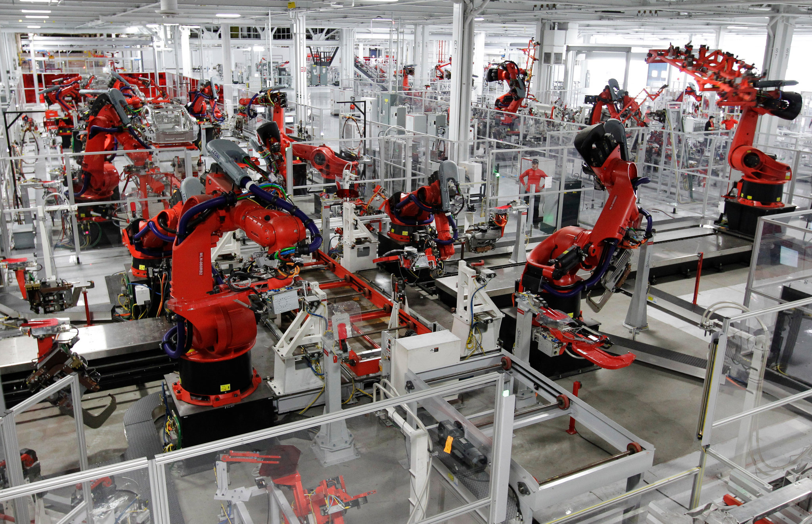
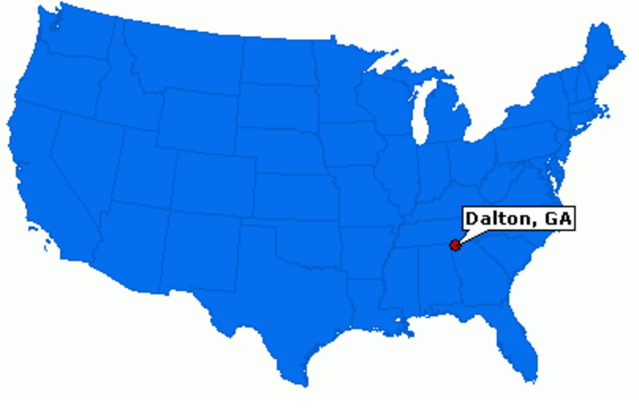

```{r setup, include=FALSE}
options(htmltools.dir.version = FALSE)
knitr::opts_chunk$set(echo=F,
                      message=F,
                      warning=F)
library(tidyverse)
library(ggrepel)
library(ggthemes)
set.seed(256)
update_geom_defaults("label", list(family = "Fira Sans Condensed"))
```

class: title-slide

# 3.5 — Marshallian Economics: Supply

## ECON 452 • History of Economic Thought • Fall 2022

### Ryan Safner<br> Associate Professor of Economics <br> <a href="mailto:safner@hood.edu"><i class="fa fa-paper-plane fa-fw"></i>safner@hood.edu</a> <br> <a href="https://github.com/ryansafner/thoughtF22"><i class="fa fa-github fa-fw"></i>ryansafner/thoughtF22</a><br> <a href="https://thoughtF22.classes.ryansafner.com"> <i class="fa fa-globe fa-fw"></i>thoughtF22.classes.ryansafner.com</a><br>

---

class: inverse

# Outline

## [The Time Periods of Production](#7)

## [Quasi-Rents](#18)

## [Types of Industries & External Economies](#34)

## [Money and Economic Fluctuations](#64)

---

# Theory of the Firm

.left-column[
.center[


.smaller[
Antoine Augustin Cournot

1801-1877
]
]
]

.right-column[

- It was Cournot who (in 1838!) devised the $MR=MC$ rule for profit-maximization

$$R'(p)=f(p)+pf'(p)$$

- Marshall adopted Cournot’s approach but focused on equilibrium in terms of total revenues and total costs rather than marginal conditions
  - Marginal revenue would have to be “rediscovered” in 1920s with “imperfect competition”

$$\pi=R(q)-C(q)$$

]

---

# Alfred Marshall: Contributions to Supply

.left-column[
.center[


.smallest[
Alfred Marshall

1842-1924
]
]
]

.right-column[

- Marshall made two key contributions:
  1. Theory of the firm and industrial organization
  2. The role of *“time”* in determining supply and cost in production
]

---

# Alfred Marshall: Representative Firm

.left-column[
.center[


.smallest[
Alfred Marshall

1842-1924
]
]
]

.right-column[

.quitesmall[
> “But here we may read a lesson from the young trees of the forest as they struggle upwards through the benumbing shade of their older rivals. Many succumb on the way, and a few only survive; those few become stronger with every year...and at last in their turn they tower above their neighbours...but sooner or later age tells on them all. Though the taller ones have a better access to light and air than their rivals, they gradually lose vitality; and one after another they give place to others, which, though of less material strength, have on their side the vigour of youth,” (p.506 in *Reader*).

> “When therefore we are considering the broad results which the growth of wealth and population exert on the economies of production...our conclusions [are] not very much affected by the fact that many of these economies depend directly on the size of the individual establishments engaged in the production, and that in almost every trade there is a constant rise and fall of large businesses, at any one moment some firms being in the ascending phase and others in the descending” (p.506 in *Reader*).

]
]
---

# Alfred Marshall: Representative Firm

.left-column[
.center[


.smallest[
Alfred Marshall

1842-1924
]
]
]

.right-column[
.quitesmall[
> “These results will be of great importance when we come to discuss the causes which govern the supply price of a commodity. We shall have to analyse carefully the normal cost of producing a commodity, relatively to a given aggregate volume of production; and for this purpose we shall have to study *the expenses of a representative producer* for that aggregate volume...our representative firm must be one which has had a fairly long life, and fair success, which is managed with normal ability, and which has normal access to the economies, external and internal, which belong to that aggregate volume of production...,” (p.507 in *Reader*).

> “We cannot see this by looking at one or two firms taken at random: but we can see it fairly well by selecting, after a broad survey, a firm, whether in private or joint-stock management...that represents, to the best of our judgment, this particular average, (ibid).”

]

]

---

class: inverse, center, middle

# The Time Periods of Production

---

# Alfred Marshall: On Time

.left-column[
.center[


.smallest[
Alfred Marshall

1842-1924
]
]
]

.right-column[

.smallest[
> “The element of time is a chief cause of those difficulties in economic investigations which make it necessary for man with his limited powers to go step by step...in breaking it up, he segregates those disturbing causes, whose wanderings happen to be inconvenient, for the time in a pound called *Ceteris Paribus*. The study of some group of tendencies is isolated by the assumption *other things being equal*: the existence of other tendencies is not denied, but their disturbing effect is neglected for a time. The more the issue is thus narrowed, the more exactly can it be handled: but also the less closely does it correspond to real life.,” (p.516 in *Reader*).

]

.source[Marshall, Alfred, 1890, *Principles of Economics*]

]

---

# Alfred Marshall: On Time and Production Periods

.left-column[
.center[


.smallest[
Alfred Marshall

1842-1924
]
]
]

.right-column[

.smallest[
> “To go over the ground in another way. Market values are governed by the relation of demand to stocks actually in the market; with more or less reference to ‘future’ supplies...the current supply is in itself partly due to the action of producers in the past; and this action has been determined on as the result of a comparison of the prices which they expect to get for their goods with the expenses to which they will be put in producing them,” (pp.516-517 in *Reader*).

> “For short periods people take the stock of appliances for production as practically fixed; and they are governed by their expectations of demand...in long periods they set themselves to adjust the flow of these appliances to their expectations of demand,” (pp.517 in *Reader*).

]

.source[Marshall, Alfred, 1890, *Principles of Economics*]

]

---

# Alfred Marshall: On Time and Production Periods

.left-column[
.center[


.smallest[
Alfred Marshall

1842-1924
]
]
]

.right-column[

.smallest[
> “To sum up them as regards short periods. The supply of specialized skills and ability, of suitable machinery and other material capital, and of the appropriate industrial organization has not time to be fully adapted to demand; but the producers have to adjust their supply to the demand as best they can with the appliances already at their disposal...In long periods on the other hand all investments of capital and effort in providing the material plant and the organization of business, and in acquiring trade knowledge and specialized ability, have time to be adjusted to the incomes which are expected to be earned by them: and the estimates of those incomes therefore directly govern supply, and are the true long-period normal supply price of the commodities produced.”  (pp.519-5207 in *Reader*)

]

.source[Marshall, Alfred, 1890, *Principles of Economics*]

]

---

# Alfred Marshall: On Time and Production Periods

.left-column[
.center[


.smallest[
Alfred Marshall

1842-1924
]
]
]

.right-column[

.smallest[

> “Of course there is no hard and sharp line of division between ‘long’ and ‘short’ periods. Nature has drawn no such lines in th eeconomic conditions of actual life...”

> “Four classes stand out. In each, price is governed by the relations between demand and supply.” (p.520 in *Reader*)

1. The market period
2. The short period
3. The long period
4. The secular period

.source[Marshall, Alfred, 1890, *Principles of Economics*]

]
]

---

# The Market Period

.pull-left[

- .hi[Market period]

- .red[Supply] is perfectly inelastic

- .hi-green[Example]: a farmers’ market, a farmer shows up with a fixed stock of goods to sell
]

.pull-right[
```{r}
demand=function(x){10-x}
supply=function(x){x}

market<-ggplot(data.frame(x=c(0,10)), aes(x=x))+
  stat_function(fun=demand, geom="line", size=2, color="blue")+
  geom_vline(xintercept = 5, size = 2, color = "red")+
  geom_segment(x=5,y=0,xend=5,yend=5,linetype=3)+
  geom_segment(x=0,y=5,xend=5,yend=5,linetype=3)+
  annotate(geom = "label", x = 8, y = demand(8), label = "Demand",
           color = "blue") +
  annotate(geom = "label", x = 5, y = 9, label = "Supply",
           color = "red") +
  scale_y_continuous(breaks = seq(0,10,1),
                     labels = scales::dollar,
                     limits = c(0,10),
                     expand=c(0,0))+
  scale_x_continuous(breaks = seq(0,10,1),
                     limits = c(0,10),
                     expand=c(0,0))+
    labs(x = "Quantity (q)",
       y = "Price (p)",
       title = "Market Period")+
  theme_classic(base_family = "Fira Sans Condensed", base_size=16)
market
```

]

---

# The Short Run

.pull-left[
.smaller[
- .hi[Short-run]: some factors of production treated as fixed

- .red[Supply] of both firm and industry is determined by diminishing returns

- Divide firm costs into .hi-purple[fixed costs] and .hi-purple[variable costs] (“prime costs”)
  - Some factors of production are fixed (we often assume capital), others are variable
  - Gives rise to fixed costs: payments to unchangeable fixed factors
]
]
.pull-right[
```{r}
tc=function(x){x^3-4*x^2+9*x+10}

demand<-function(x){10-x}
supply<-function(x){x}
demand_firm<-function(x){10}
mc_cc<-function(x){3*x^2-8*x+9}
ac_cc<-function(x){x^2-4*x+10+10/x}
avc_cc<-function(x){x^2-4*x+9}

sr_firm<-ggplot(data.frame(x=c(0,10)), aes(x=x))+
    stat_function(fun=mc_cc, geom="line", size=2, color = "red")+
  geom_label(aes(x=3.5,y=mc_cc(3.5)), color = "red", label="MC(q)", size = 5)+
    stat_function(fun=ac_cc, geom="line", size=2, color = "orange")+
  geom_label(aes(x=4.5,y=ac_cc(4.5)), color = "orange", label="AC(q)", size = 5)+
  stat_function(fun=avc_cc, geom="line", size=2, color = "brown")+
  geom_label(aes(x=3.5,y=avc_cc(3.5)), color = "brown", label="AVC(q)", size = 5)+
    scale_x_continuous(breaks=NULL,
                     limits=c(0,5),
                     expand=expand_scale(mult=c(0,0.1)))+
  scale_y_continuous(breaks=NULL,
                     limits=c(0,20),
                     expand=expand_scale(mult=c(0,0.1)))+
  guides(fill=F)+
  labs(title = "Representative Firm",
       x = "Quantity",
       y = "Price")+
  theme_classic(base_family = "Fira Sans Condensed", base_size=20)
sr_firm
```

]

---

# The Short Run

.pull-left[
.smallest[
- .red[Supply] of both firm and industry is determined by diminishing returns

- Firms will operate at a loss in the short run if they can cover their variable costs
  - $p>AVC(q*)$

- Firms will *shut down* production in short-run if they cannot cover their variable costs
  - $p<AVC(q*)$
]
]
.pull-right[
```{r}
sr_firm
```

]

---

# The Short Run

.pull-left[
.smallest[
- .red[Supply] of both firm and industry is determined by diminishing returns

- Firms will operate at a loss in the short run if they can cover their variable costs
  - $p>AVC(q*)$

- Firms will *shut down* production in short-run if they cannot cover their variable costs
  - $p<AVC(q*)$

- .red[Firm’s supply curve] is its marginal cost curve above the average variable cost curve
]
]
.pull-right[
```{r}
sr_firm_supply<-sr_firm+stat_function(fun=mc_cc, geom="line", size=4, xlim=c(2,5), color = "red")+
  geom_segment(x=0, y=0, xend=0, yend=avc_cc(2), size=4, color = "red")+
  geom_segment(x=0, y=avc_cc(2), xend=2, yend=avc_cc(2), size = 4, color = "red")+
  geom_label(x=3.5,y=mc_cc(3.5), color = "red", label="SR Supply", size = 5)
sr_firm_supply
```

]

---

# The Short Run

.pull-left[
```{r, fig.height=4.5}
sr_firm_supply
```
]

.pull-right[
```{r, fig.height=4.5}
supply_industry=function(x){1.5*x+5}

ggplot(data.frame(x=c(0,10)), aes(x=x))+
  stat_function(fun=supply_industry, geom="line", size=2, color = "red")+
  annotate(geom = "label", x = 4, y = supply_industry(4), label = expression(Supply == sum(MC[i], i==1, n)), color = "red")+
    scale_x_continuous(breaks=NULL,
                     limits=c(0,5),
                     expand=expand_scale(mult=c(0,0.1)))+
  scale_y_continuous(breaks=NULL,
                     limits=c(0,20),
                     expand=expand_scale(mult=c(0,0.1)))+
  guides(fill=F)+
  labs(title = "Industry (Short Run)",
       x = "Quantity",
       y = "Price")+
  theme_classic(base_family = "Fira Sans Condensed", base_size=20)
```

]

.smallest[
- Industry supply curve is the horizontal firm of firm’s supply curves (above shut down price)
]

---

# The Long Run

.pull-left[

- Firms can change all of their inputs (i.e. capital)

- More resources will flow in if representative firm is profitable (entry)

- Resources will flow out if representative firm is unprofitable (exit)

- Marshall would not correctly derive long run (AC, MC, etc.) curves for firms, discovered in 1920s-1930s
]

.pull-right[
```{r}
sr_firm+stat_function(fun=mc_cc, geom="line", size=4, xlim=c(2.8,5), color = "red")+
  geom_segment(x=0, y=0, xend=0, yend=ac_cc(2.8), size=4, color = "red")+
  geom_segment(x=0, y=ac_cc(2.8), xend=2.8, yend=ac_cc(2.8), size = 4, color = "red")+
  geom_label(x=3.5,y=mc_cc(3.5), color = "red", label="LR Supply", size = 5)
```
]

---

class: inverse, center, middle

# Quasi-Rents

---

# *Quasi*-Rents

.left-column[
.center[


]
]

.right-column[
.smallest[
- Ricardo: land rents are .hi-purple[price-determined] (by demand), not price-determining (part of cost) (“rent is high because the price of corn is high”)
  - assumed the supply of land is fixed
  - land on (extensive) margin is free (no rent), no opportunity cost
  - land rents adjust to equalize all profit opportunities on different grades of land to 0

- Mill & others: land does have opportunity cost, an upward-sloping supply curve
  - to a firm, rent is price-determining, a cost that firm must pay to landowner for use
  - in long run, rental payment is equal to its opportunity cost
]
]
---

# *Quasi*-Rents

.left-column[
.center[


.smallest[
Alfred Marshall

1842-1924
]
]
]

.right-column[

- Points out that whether a payment to a factor of production is price-determined or price-determining .hi-purple[depends on the *time* period under consideration]!
  - Which affects the .hi-turquoise[elasticity of factor supply]: longer (shorter) run $\implies$ more (less) elastic supply

]

---

# *Quasi*-Rents

.left-column[
.center[


.smallest[
Alfred Marshall

1842-1924
]
]
]

.right-column[

- Also depends on analytical perspective

- .hi-purple[From the perspective of a *firm*]:
  - Rents are always price-determining
  - A .hi-turquoise[cost of production], payment that firm has to make to a factor owner, enough to pull the factor out of other uses (i.e. opportunity cost)

]

---

# *Quasi*-Rents

.left-column[
.center[


.smallest[
Alfred Marshall

1842-1924
]
]
]

.right-column[
.smallest[
- .hi-purple[From the perspective of *society*]:

- .hi-turquoise[Rents *may* be price-determined (by demand-side)]
  - if the supply of the factor is indeed fixed in long run (e.g. scarce talent, *prime* real estate, intellectual property, etc.)
  - a perfectly inelastic supply, demand sets the market price

- .hi-turquouise[Rents *may* be price-determining (part of costs)]
  - if the supply is not fixed
  - e.g. early United States with free unclaimed land (vs. country where land is all settled)
  - upward-sloping supply, higher (expected) land values cause people to explore & cultivate more land
]
]

---

# *Quasi*-Rents

.left-column[
.center[


.smallest[
Alfred Marshall

1842-1924
]
]
]

.right-column[

> “[I]t is *wisest* not to say that ‘Rent does not enter into cost of production’: for that will confuse many people. But it is *wicked* to say ‘Rent *does* enter into cost of production,’ because that is *sure* to be applied in such a way as to lead to the denial of subtle truths.” — Letter to Francis Edgeworth

]

---

# Key Difference: Price Elasticity of Supply

.pull-left[
```{r}
demand_up=function(x){12-x}
demand_down=function(x){8-x}

ggplot(data.frame(x=c(0,10)), aes(x=x))+
  stat_function(fun=demand, geom="line", size=2, color="blue")+
  stat_function(fun=demand_up, geom="line", size=2, color="darkblue")+
  stat_function(fun=demand_down, geom="line", size=2, color="lightblue")+
  geom_vline(xintercept=5, size=2, color = "red")+
  annotate(geom = "label", x = 4, y = supply_industry(4), label = expression(Supply == sum(MC[i], i==1, n)), color = "red")+
  geom_segment(x=0,y=3,xend=5,yend=3,size=1,linetype="dotted")+
  geom_segment(x=0,y=5,xend=5,yend=5,size=1,linetype="dotted")+
  geom_segment(x=0,y=7,xend=5,yend=7,size=1,linetype="dotted")+
    scale_x_continuous(breaks=NULL,
                     limits=c(0,10),
                     expand=expand_scale(mult=c(0,0.1)))+
  scale_y_continuous(breaks=NULL,
                     limits=c(0,10),
                     expand=expand_scale(mult=c(0,0.1)))+
  guides(fill=F)+
  labs(title = "Perfectly Inelastic Supply: Price-Determined",
       x = "Quantity",
       y = "Price")+
  theme_classic(base_family = "Fira Sans Condensed", base_size=16)
```
]

.pull-right[
```{r}
ggplot(data.frame(x=c(0,10)), aes(x=x))+
  stat_function(fun=supply, geom="line", size=2, color="red")+
  stat_function(fun=demand, geom="line", size=2, color="blue")+
  stat_function(fun=demand_up, geom="line", size=2, color="darkblue")+
  stat_function(fun=demand_down, geom="line", size=2, color="lightblue")+
  annotate(geom = "label", x = 4, y = supply_industry(4), label = expression(Supply == sum(MC[i], i==1, n)), color = "red")+
  geom_segment(x=0,y=4,xend=4,yend=4,size=1,linetype="dotted")+
  geom_segment(x=4,y=4,xend=4,yend=0,size=1,linetype="dotted")+

  geom_segment(x=0,y=5,xend=5,yend=5,size=1,linetype="dotted")+
  geom_segment(x=5,y=5,xend=5,yend=0,size=1,linetype="dotted")+
  
  geom_segment(x=0,y=6,xend=6,yend=6,size=1,linetype="dotted")+
  geom_segment(x=6,y=6,xend=6,yend=0,size=1,linetype="dotted")+
  
    scale_x_continuous(breaks=NULL,
                     limits=c(0,10),
                     expand=expand_scale(mult=c(0,0.1)))+
  scale_y_continuous(breaks=NULL,
                     limits=c(0,10),
                     expand=expand_scale(mult=c(0,0.1)))+
  guides(fill=F)+
  labs(title = "Elastic Supply: Price-Determining",
       x = "Quantity",
       y = "Price")+
  theme_classic(base_family = "Fira Sans Condensed", base_size=16)
```
]

---

# *Quasi*-Rents

.left-column[
.center[


.smallest[
Alfred Marshall

1842-1924
]
]
]

.right-column[

- In the short run (or market period), when supply of *any* particular factor is inelastic, changes in demand may cause above-normal returns

- .hi[“Quasi-rents”] paid to fixed factor in short run


> “And thus even the rent of land is seen, not as a thing by itself, but as the leading species of a large genus.”

]

---

# *Quasi*-Rents

.pull-left[
```{r,fig.height=4.5}
sr_firm+
  geom_rect(xmin=0,xmax=3,ymin=ac_cc(3),ymax=12,fill="green",alpha=0.5)+
  geom_hline(yintercept=12, geom="line", size=2, color = "blue")+
  geom_label(x=5.125, y=12, color = "blue", label = "Demand", size =5)+
  geom_segment(x=3, xend=3, y=0, yend=12, size=1, linetype="dotted")+
  geom_segment(x=0, xend=3, y=ac_cc(3), yend=ac_cc(3), size=1, linetype="dotted")
```

]

.pull-right[
```{r,fig.height=4.5}
industry<-ggplot(data.frame(x=c(0,10)), aes(x=x))+
  stat_function(fun=demand, geom="line", size=2, color="blue")+
  annotate(geom = "label", x = 9, y = demand(9), label = "Demand", color = "blue")+

    scale_x_continuous(breaks=NULL,
                     limits=c(0,10),
                     expand=expand_scale(mult=c(0,0.1)))+
  scale_y_continuous(breaks=NULL,
                     limits=c(0,10),
                     expand=expand_scale(mult=c(0,0.1)))+
  guides(fill=F)+
  labs(title = "Industry",
       x = "Quantity",
       y = "Price")+
  theme_classic(base_family = "Fira Sans Condensed", base_size=16)

supply_up<-function(x){x+2}

industry+stat_function(fun=supply_up, geom="line", size=2, color="darkred")+
  annotate(geom = "label", x = 7, y = supply_up(7), label = "Supply", color = "darkred")+
  geom_segment(x=0,y=6,xend=4,yend=6,size=1,linetype="dotted")+
  geom_segment(x=4,y=6,xend=4,yend=0,size=1,linetype="dotted")
```
]

.smallest[

- If firms earn profit in short-run...
]

---

# *Quasi*-Rents

.pull-left[
```{r,fig.height=4.5}
sr_firm+
  geom_hline(yintercept=10, geom="line", size=2, color = "blue")+
  geom_label(aes(x=4.75,y=demand_firm(4.75)), color = "blue", label="Demand", size = 5)+
  geom_segment(x=2.8, xend=2.8, y=0, yend=10, size=1, linetype="dotted")
```

]

.pull-right[
```{r,fig.height=4.5}
industry+stat_function(fun=supply_up, geom="line", size=2, color="darkred")+
  annotate(geom = "label", x = 7, y = supply_up(7), label = "Supply", color = "darkred")+
  geom_segment(x=0,y=6,xend=4,yend=6,size=1,linetype="dotted")+
  geom_segment(x=4,y=6,xend=4,yend=0,size=1,linetype="dotted")+
  stat_function(fun = supply, geom = "line", size = 2, color = "red")+
  annotate(geom = "label", x = 9, y = supply(9), label = "Supply 2", color = "red")+
  geom_segment(x=0,y=5,xend=5,yend=5,size=1,linetype="dotted")+
  geom_segment(x=5,y=5,xend=5,yend=0,size=1,linetype="dotted")
```
]

.smallest[

- If firms earn profit in short-run...

- More capital will flow into firm over long run, pushing profits to 0
  - Also, more firms enter, pushing market price down
]

---


# *Quasi*-Rents

.pull-left[
```{r,fig.height=4.5}
sr_firm+
  geom_rect(xmin=0,xmax=2.53,ymin=8,ymax=ac_cc(2.53),fill="black",alpha=0.5)+
  geom_hline(yintercept=8, geom="line", size=2, color = "blue")+
  geom_label(x=4.75, y=8, color = "blue", label = "Demand", size =5)+
  geom_segment(x=2.53, xend=2.53, y=0, yend=ac_cc(2.53), size=1, linetype="dotted")+
  geom_segment(x=0, xend=2.53, y=ac_cc(2.53), yend=ac_cc(2.53), size=1, linetype="dotted")
```

]

.pull-right[
```{r,fig.height=4.5}
supply_down<-function(x){x-2}

industry+stat_function(fun=supply_down, geom="line", size=2, color="darkred")+
  annotate(geom = "label", x = 9, y = supply_down(9), label = "Supply", color = "darkred")+
  geom_segment(x=0,y=4,xend=6,yend=4,size=1,linetype="dotted")+
  geom_segment(x=6,y=4,xend=6,yend=0,size=1,linetype="dotted")
```
]

.smallest[

- If firms earn losses in short-run...
]

---

# *Quasi*-Rents

.pull-left[
```{r,fig.height=4.5}
sr_firm+
  geom_hline(yintercept=10, geom="line", size=2, color = "blue")+
  geom_label(aes(x=4.75,y=demand_firm(4.75)), color = "blue", label="Demand", size = 5)+
  geom_segment(x=2.8, xend=2.8, y=0, yend=10, size=1, linetype="dotted")
```

]

.pull-right[
```{r,fig.height=4.5}
industry+stat_function(fun=supply_down, geom="line", size=2, color="darkred")+
  annotate(geom = "label", x = 9, y = supply_down(9), label = "Supply", color = "darkred")+
  geom_segment(x=0,y=4,xend=6,yend=4,size=1,linetype="dotted")+
  geom_segment(x=6,y=4,xend=6,yend=0,size=1,linetype="dotted")+
  stat_function(fun = supply, geom = "line", size = 2, color = "red")+
  annotate(geom = "label", x = 9, y = supply(9), label = "Supply 2", color = "red")+
  geom_segment(x=0,y=5,xend=5,yend=5,size=1,linetype="dotted")+
  geom_segment(x=5,y=5,xend=5,yend=0,size=1,linetype="dotted")
```
]

.smallest[

- If firms earn losses in short-run...

- Capital will flow out of firm over long run in pursuit of normal profits, pushing losses to 0
  - Also, firms will exit, pushing market price up
]

---

# *Quasi*-Rents

.pull-left[
.smallest[
- Competitive industry in the long run: firms earn “normal profit”
  - economic profit of zero: all factors of production paid their opportunity cost
  - full product exhaustion $R(q)=C(q)$

- Firms earn normal profits, the opportunity cost of holding capital in firm (versus other investment opportunities)
  - Profits are price-determining (adjust to 0)
]
]
.pull-right[
```{r}
sr_firm+
  geom_hline(yintercept=10, geom="line", size=2, color = "blue")+
  geom_label(aes(x=4.75,y=demand_firm(4.75)), color = "blue", label="Demand", size = 5)+
  geom_segment(x=2.8, xend=2.8, y=0, yend=10, size=1, linetype="dotted")
```
]

---

# *Quasi*-Rents

.pull-left[
.quitesmall[
- But in short run, when some factors are fixed (i.e. capital), if price $>$ average cost:

- Firm must pay its variable factors (variable costs) or else they will leave the firm

- Revenues leftover go to fixed factors (fixed costs) i.e. K
  - In SR, these are fixed (perfectly inelastic supply)
  - Capital earns .hi[“quasi-rents”] *because* it is fixed
  - Returns higher than its long-run equilibrium price (opportunity cost)
  - price-determined

> “[I]n a sense all rents are scarcity rents, and all rents are differential rent.”

- But these quasi-rents will be eroded away in the long run
  - Firms bid for the scarce factors, raising its price to opportunity cost
]
]

.pull-right[
```{r,}
sr_firm+
  geom_rect(xmin=0,xmax=3,ymin=ac_cc(3),ymax=12,fill="green",alpha=0.5)+
  geom_hline(yintercept=12, geom="line", size=2, color = "blue")+
  geom_label(x=5.125, y=12, color = "blue", label = "Demand", size =5)+
  geom_segment(x=3, xend=3, y=0, yend=12, size=1, linetype="dotted")+
  geom_segment(x=0, xend=3, y=ac_cc(3), yend=ac_cc(3), size=1, linetype="dotted")
```

]

---

# *Quasi*-Rents

.pull-left[
.smallest[
- We often assume in neoclassical economics that capital is fixed in the short run

- But Marshall’s quasi-rents can apply to *any* factor that is fixed in the short run!
  - In short run, inelastic supply of factor, price-determined (by demand), can earn quasi-rents *because* it’s fixed
  - In long run, elastic supply of factor, price-determining, will be paid its opportunity cost (as firms compete for the factor over the long run)
]
]
.pull-right[
```{r,}
sr_firm+
  geom_rect(xmin=0,xmax=3,ymin=ac_cc(3),ymax=12,fill="green",alpha=0.5)+
  geom_hline(yintercept=12, geom="line", size=2, color = "blue")+
  geom_label(x=5.125, y=12, color = "blue", label = "Demand", size =5)+
  geom_segment(x=3, xend=3, y=0, yend=12, size=1, linetype="dotted")+
  geom_segment(x=0, xend=3, y=ac_cc(3), yend=ac_cc(3), size=1, linetype="dotted")
```

]

---

# *Quasi*-Rents

.pull-left[
.smallest[
- Marshall thought these returns look more like economic rent in the short run, but more like interest in the long run, hence “quasi-rents”
  - Rate of return on capital approximates the interest rate in long run
]
]
.pull-right[
```{r,}
sr_firm+
  geom_rect(xmin=0,xmax=3,ymin=ac_cc(3),ymax=12,fill="green",alpha=0.5)+
  geom_hline(yintercept=12, geom="line", size=2, color = "blue")+
  geom_label(x=5.125, y=12, color = "blue", label = "Demand", size =5)+
  geom_segment(x=3, xend=3, y=0, yend=12, size=1, linetype="dotted")+
  geom_segment(x=0, xend=3, y=ac_cc(3), yend=ac_cc(3), size=1, linetype="dotted")
```

]

---

class: inverse, center, middle

# Types of Industries & External Economies

---

# Economies of Scale

.pull-left[
.smallest[
- Economies of scale come in two flavors:

- .hi-purple[*Internal* economies]: firm-level features that improve a **firm's** productivity, often leading to market power for that firm 
  - e.g. firm produces more and lowers its *average* costs

- .hi-purple[*External* economies]: industry-wide features that spill over to the productivity **all** firms in the industry
  - e.g. more firms producing more lowers **all firms'** *total* costs

]
]

.pull-right[
.center[

]
]

---

# Recall: (Internal) Economies of Scale I

.pull-left[

- .hi[Minimum Efficient Scale]: $q$ with the lowest $AC(q)$
  - “optimal firm size”

]

.pull-right[

```{r, fig.retina=3}
ac_mes<-function(x){(x-5)^2+4}
fills <- tibble(x = seq(0,10,0.01),
                y = ac_mes(x))

ggplot(data.frame(x=c(0,10)), aes(x=x))+
  #geom_ribbon(data = fills %>% filter(x < 5), aes(ymax = y, ymin = 0), fill = "green", alpha = 0.5)+
  #geom_ribbon(data = fills %>% filter(x > 5), aes(ymax = y, ymin = 0), fill = "red", alpha = 0.5)+
  stat_function(fun=ac_mes, geom="line", size=2, color="orange")+
  geom_label(x=8, y=ac_mes(8), color="orange", size=6, label="AC(q)")+
  geom_segment(x=5, xend=5, y=0, yend=4, linetype="dotted", size =1)+
    scale_x_continuous(breaks=NULL,
                     limits=c(0,10),
                     expand=expand_scale(mult=c(0,0.1)))+
  scale_y_continuous(breaks=NULL,
                     limits=c(0,20),
                     expand=expand_scale(mult=c(0,0.1)),
                     labels = scales::dollar)+
  #geom_text(x=3, y=4, size=6, label="Economies \n of Scale", color="white")+
  #geom_text(x=7.5, y=4, size=6, label="Diseconomies \n of Scale", color="white")+
  scale_x_continuous(breaks = c(5),
                     labels = c("MES"),
                     limits = c(1.5, 8.5),
                     expand = c(0,0))+
  labs(x = "Output, q",
       y = "Costs per Unit")+
  theme_classic(base_family = "Fira Sans Condensed", base_size=16)+
  theme(legend.position = "bottom",
        axis.title.x = element_text(hjust = 1))
```
]

---

# Recall: (Internal) Economies of Scale I

.pull-left[

- .hi[Minimum Efficient Scale]: $q$ with the lowest $AC(q)$
  - “optimal firm size”

- .hi-green[Economies of Scale]: $\uparrow q$, $\downarrow AC(q)$

]

.pull-right[

```{r, fig.retina=3}
ggplot(data.frame(x=c(0,10)), aes(x=x))+
  geom_ribbon(data = fills %>% filter(x < 5), aes(ymax = y, ymin = 0), fill = "green", alpha = 0.5)+
 # geom_ribbon(data = fills %>% filter(x > 5), aes(ymax = y, ymin = 0), fill = "red", alpha = 0.5)+
  stat_function(fun=ac_mes, geom="line", size=2, color="orange")+
  geom_label(x=8, y=ac_mes(8), color="orange", size=6, label="AC(q)")+
  geom_segment(x=5, xend=5, y=0, yend=4, linetype="dotted", size =1)+
    scale_x_continuous(breaks=NULL,
                     limits=c(0,10),
                     expand=expand_scale(mult=c(0,0.1)))+
  scale_y_continuous(breaks=NULL,
                     limits=c(0,20),
                     expand=expand_scale(mult=c(0,0.1)),
                     labels = scales::dollar)+
  geom_text(x=3, y=4, size=6, label="Economies \n of Scale", color="white")+

  #geom_text(x=7.5, y=4, size=6, label="Diseconomies \n of Scale", color="white")+
  scale_x_continuous(breaks = c(5),
                     labels = c("MES"),
                     limits = c(1.5, 8.5),
                     expand = c(0,0))+
  labs(x = "Output, q",
       y = "Costs per Unit")+
  theme_classic(base_family = "Fira Sans Condensed", base_size=16)+
  theme(legend.position = "bottom",
        axis.title.x = element_text(hjust = 1))
```
]

---

# Recall: (Internal) Economies of Scale I

.pull-left[

- .hi[Minimum Efficient Scale]: $q$ with the lowest $AC(q)$
  - “optimal firm size”

- .hi-green[Economies of Scale]: $\uparrow q$, $\downarrow AC(q)$

- .hi-red[Diseconomies of Scale]: $\uparrow q$, $\uparrow AC(q)$

]

.pull-right[

```{r, fig.retina=3}
ggplot(data.frame(x=c(0,10)), aes(x=x))+
  geom_ribbon(data = fills %>% filter(x < 5), aes(ymax = y, ymin = 0), fill = "green", alpha = 0.5)+
  geom_ribbon(data = fills %>% filter(x > 5), aes(ymax = y, ymin = 0), fill = "red", alpha = 0.5)+
  stat_function(fun=ac_mes, geom="line", size=2, color="orange")+
  geom_label(x=8, y=ac_mes(8), color="orange", size=6, label="AC(q)")+
  geom_segment(x=5, xend=5, y=0, yend=4, linetype="dotted", size =1)+
    scale_x_continuous(breaks=NULL,
                     limits=c(0,10),
                     expand=expand_scale(mult=c(0,0.1)))+
  scale_y_continuous(breaks=NULL,
                     limits=c(0,20),
                     expand=expand_scale(mult=c(0,0.1)),
                     labels = scales::dollar)+
  geom_text(x=3, y=4, size=6, label="Economies \n of Scale", color="white")+

  geom_text(x=7.5, y=4, size=6, label="Diseconomies \n of Scale", color="white")+
  scale_x_continuous(breaks = c(5),
                     labels = c("MES"),
                     limits = c(1.5, 8.5),
                     expand = c(0,0))+
  labs(x = "Output, q",
       y = "Costs per Unit")+
  theme_classic(base_family = "Fira Sans Condensed", base_size=16)+
  theme(legend.position = "bottom",
        axis.title.x = element_text(hjust = 1))
```
]

---

# Recall: (Internal) Economies of Scale II

.pull-left[

- Recall: .hi-purple[economies of scale]: as $\uparrow q$, $\downarrow AC(q)$

- .hi-purple[Minimum Efficient Scale (MES)]: $q$ with the lowest $AC(q)$

- If MES is small relative to market demand...
  - .orange[AC] hits .blue[Market demand] during **diseconomies of scale**...

]

.pull-right[

```{r, fig.retina=3}
tiny_mes<-function(x){(4*x-2)^(2)+12}

mes_plot+
  stat_function(fun=tiny_mes, geom="line", size=2, color="orange")+
  geom_segment(x=0, xend=4, y=12, yend=12, size=1, linetype="dashed")+
  geom_segment(x=4, xend=4, y=12, yend=0, size=1, linetype="dashed")+
  geom_label(x=2.5, y=12, label="MES (Competitive)", color="orange", size=5)+
  geom_segment(x=0.5, xend=0.5, y=12, yend=0, linetype = "dotted", size = 1)+
  scale_x_continuous(breaks = c(4),
                     labels = c(expression(q[c])),
                     limits=c(0,10),
                     expand=expand_scale(mult=c(0,0.1)))+
  scale_y_continuous(breaks = c(12),
                     labels = c(expression(p[c])),
                     limits=c(0,20),
                     expand=expand_scale(mult=c(0,0.1)))
```
]

---

# Recall: (Internal) Economies of Scale II

.pull-left[

- Recall: .hi-purple[economies of scale]: as $\uparrow q$, $\downarrow AC(q)$

- .hi-purple[Minimum Efficient Scale (MES)]: $q$ with the lowest $AC(q)$

- If MES is small relative to market demand...
  - .orange[AC] hits .blue[Market demand] during **diseconomies of scale**...
  - .hi-purple[...can fit more identical firms into the industry!]

]

.pull-right[

```{r, fig.retina=3}
tiny_mes_2<-function(x){(4*x-4)^(2)+12}
tiny_mes_3<-function(x){(4*x-6)^(2)+12}
tiny_mes_4<-function(x){(4*x-8)^(2)+12}
tiny_mes_5<-function(x){(4*x-10)^(2)+12}
tiny_mes_6<-function(x){(4*x-12)^(2)+12}
tiny_mes_7<-function(x){(4*x-14)^(2)+12}
tiny_mes_8<-function(x){(4*x-16)^(2)+12}

mes_plot+
  stat_function(fun=tiny_mes, geom="line", size=2, color="orange")+
  stat_function(fun=tiny_mes_2, geom="line", size=2, color="orange")+
  stat_function(fun=tiny_mes_3, geom="line", size=2, color="orange")+
  stat_function(fun=tiny_mes_4, geom="line", size=2, color="orange")+
  stat_function(fun=tiny_mes_5, geom="line", size=2, color="orange")+
  stat_function(fun=tiny_mes_6, geom="line", size=2, color="orange")+
  stat_function(fun=tiny_mes_7, geom="line", size=2, color="orange")+
  stat_function(fun=tiny_mes_8, geom="line", size=2, color="orange")+
  geom_segment(x=0, xend=4, y=12, yend=12, size=1, linetype="dashed")+
  geom_segment(x=4, xend=4, y=12, yend=0, size=1, linetype="dashed")+
  
  geom_rect(xmin=0, xmax=0.5, ymin=0, ymax=12, alpha = 0.5, fill = "#F0F921FF")+
  geom_rect(xmin=0.5, xmax=1, ymin=0, ymax=12, alpha = 0.5, fill = "#FCA636FF")+
  geom_rect(xmin=1, xmax=1.5, ymin=0, ymax=12, alpha = 0.5, fill = "#E16462FF")+
  geom_rect(xmin=1.5, xmax=2, ymin=0, ymax=12, alpha = 0.5, fill = "#B12A90FF")+
  geom_rect(xmin=2.0, xmax=2.5, ymin=0, ymax=12, alpha = 0.5, fill = "#6A00A8FF")+
  geom_rect(xmin=2.5, xmax=3, ymin=0, ymax=12, alpha = 0.5, fill = "#0D0887FF")+
  geom_rect(xmin=3, xmax=3.5, ymin=0, ymax=12, alpha = 0.5, fill = "#7AD151FF")+
  geom_rect(xmin=3.5, xmax=4, ymin=0, ymax=12, alpha = 0.5, fill = "#2A788EFF")+
  
  geom_segment(x=0.5, xend=0.5, y=12, yend=0, linetype = "dotted", size = 1)+
  geom_segment(x=1.0, xend=1.0, y=12, yend=0, linetype = "dotted", size = 1)+
  geom_segment(x=1.5, xend=1.5, y=12, yend=0, linetype = "dotted", size = 1)+
  geom_segment(x=2.0, xend=2.0, y=12, yend=0, linetype = "dotted", size = 1)+
  geom_segment(x=2.5, xend=2.5, y=12, yend=0, linetype = "dotted", size = 1)+
  geom_segment(x=3.0, xend=3.0, y=12, yend=0, linetype = "dotted", size = 1)+
  geom_segment(x=3.5, xend=3.5, y=12, yend=0, linetype = "dotted", size = 1)+
  
  geom_text(x = 0.25, y = 5, label = "Firm 1", angle = 90, color = "white")+
  geom_text(x = 0.75, y = 5, label = "Firm 2", angle = 90, color = "white")+
  geom_text(x = 1.25, y = 5, label = "Firm 3", angle = 90, color = "white")+
  geom_text(x = 1.75, y = 5, label = "Firm 4", angle = 90, color = "white")+
  geom_text(x = 2.25, y = 5, label = "Firm 5", angle = 90, color = "white")+
  geom_text(x = 2.75, y = 5, label = "Firm 6", angle = 90, color = "white")+
  geom_text(x = 3.25, y = 5, label = "Firm 7", angle = 90, color = "white")+
  geom_text(x = 3.75, y = 5, label = "Firm 8", angle = 90, color = "white")+
  geom_label(x=2.5, y=12, label="MES (Competitive)", color="orange", size=5)+
  scale_x_continuous(breaks = c(4),
                     labels = c(expression(q[c])),
                     limits=c(0,10),
                     expand=expand_scale(mult=c(0,0.1)))+
  scale_y_continuous(breaks = c(12),
                     labels = c(expression(p[c])),
                     limits=c(0,20),
                     expand=expand_scale(mult=c(0,0.1)))
```
]

---

# Recall: (Internal) Economies of Scale II

.pull-left[

- If MES is *large* relative to market demand...
  - .red[AC] hits .blue[Market demand] during **_economies_ of scale**...
  - .hi-purple[likely to be a single firm in the industry!]

]

.pull-right[

```{r, fig.retina=3}
big_mes<-function(x){(0.25*x-2)^(2)+4}

mes_plot+
  stat_function(fun=tiny_mes, geom="line", size=2, color="orange")+
  stat_function(fun=tiny_mes_2, geom="line", size=2, color="orange")+
  stat_function(fun=tiny_mes_3, geom="line", size=2, color="orange")+
  stat_function(fun=tiny_mes_4, geom="line", size=2, color="orange")+
  stat_function(fun=tiny_mes_5, geom="line", size=2, color="orange")+
  stat_function(fun=tiny_mes_6, geom="line", size=2, color="orange")+
  stat_function(fun=tiny_mes_7, geom="line", size=2, color="orange")+
  stat_function(fun=tiny_mes_8, geom="line", size=2, color="orange")+
  geom_segment(x=0, xend=4, y=12, yend=12, size=1, linetype="dashed")+
  geom_segment(x=4, xend=4, y=12, yend=0, size=1, linetype="dashed")+
  geom_label(x=2.5, y=12, label="MES (Competitive)", color="orange", size=5)+
  stat_function(fun=big_mes, geom="line", size=2, color="red")+
  geom_segment(x=0, xend=8, y=4, yend=4, size=1, linetype="dashed")+
  geom_segment(x=8, xend=8, y=4, yend=0, size=1, linetype="dashed")+
  geom_label(x=2.5, y=4, label="MES (Monopoly)", color="red", size=5)+
  scale_x_continuous(breaks = c(4, 8),
                     labels = c(expression(q[c]),expression(q[m])),
                     limits=c(0,10),
                     expand=expand_scale(mult=c(0,0.1)))+
  scale_y_continuous(breaks = c(4,12),
                     labels = c(expression(p[m]),expression(p[c])),
                     limits=c(0,20),
                     expand=expand_scale(mult=c(0,0.1)))
```
]


---

# Recall: (Internal) Economies of Scale II

.pull-left[

- If MES is *large* relative to market demand...
  - .red[AC] hits .blue[Market demand] during **_economies_ of scale**...
  - .hi-purple[likely to be a single firm in the industry!]

- A .hi[natural monopoly] that can produce higher $q^*$ and lower $p^*$ than a competitive industry!

]

.pull-right[

```{r, fig.retina=3}
mes_plot+
  stat_function(fun=tiny_mes, geom="line", size=2, color="orange")+
  stat_function(fun=tiny_mes_2, geom="line", size=2, color="orange")+
  stat_function(fun=tiny_mes_3, geom="line", size=2, color="orange")+
  stat_function(fun=tiny_mes_4, geom="line", size=2, color="orange")+
  stat_function(fun=tiny_mes_5, geom="line", size=2, color="orange")+
  stat_function(fun=tiny_mes_6, geom="line", size=2, color="orange")+
  stat_function(fun=tiny_mes_7, geom="line", size=2, color="orange")+
  stat_function(fun=tiny_mes_8, geom="line", size=2, color="orange")+
  geom_segment(x=0, xend=4, y=12, yend=12, size=1, linetype="dashed")+
  geom_segment(x=4, xend=4, y=12, yend=0, size=1, linetype="dashed")+
  geom_label(x=2.5, y=12, label="MES (Competitive)", color="orange", size=5)+
  stat_function(fun=big_mes, geom="line", size=2, color="red")+
  geom_segment(x=0, xend=8, y=4, yend=4, size=1, linetype="dashed")+
  geom_segment(x=8, xend=8, y=4, yend=0, size=1, linetype="dashed")+
  geom_label(x=2.5, y=4, label="MES (Monopoly)", color="red", size=5)+
  scale_x_continuous(breaks = c(4, 8),
                     labels = c(expression(q[c]),expression(q[m])),
                     limits=c(0,10),
                     expand=expand_scale(mult=c(0,0.1)))+
  scale_y_continuous(breaks = c(4,12),
                     labels = c(expression(p[m]),expression(p[c])),
                     limits=c(0,20),
                     expand=expand_scale(mult=c(0,0.1)))
```
]

---

# Entry/Exit Effects on Market Price

.pull-left[
.smallest[
- When **all firms produce more/less**; or **firms enter or exit** an industry, this .hi-purple[affects the equilibrium market price]

- Think about basic supply & demand graphs:
  - .hi-purple[Entry]: $\color{red}{\uparrow}$ .red[industry supply] $\implies$ $\uparrow q, \downarrow p$
  - .hi-purple[Exit]: $\color{red}{\downarrow}$ .red[industry supply] $\implies$ $\downarrow q, \uparrow p$

- If the size of the entire industry affects all individual firm’s costs, then there are .hi[*external* economies] effects
  - Cost externalities that spill over across all firms in an industry
]
]

.pull-right[
```{r}
demand_1=function(x){10-x}
supply_1=function(x){x}

changes<-ggplot(data.frame(x=c(0,10)), aes(x=x))+
  stat_function(fun=demand_1, geom="line", size=2, color = "blue")+
    geom_label(aes(x=9,y=demand_1(9)), color = "blue", label="Demand 1", size = 5)+
  stat_function(fun=supply_1, geom="line", size=2, color = "red")+
    geom_label(aes(x=9,y=supply_1(9)), color = "red", label="Supply 1", size = 5)+
  geom_segment(x=0, xend=5, y=5, yend=5, size=1, linetype="dotted")+
  geom_segment(x=5, xend=5, y=0, yend=5, size=1, linetype="dotted")+
    scale_x_continuous(breaks=seq(0,10,1),
                     limits=c(0,10),
                     expand=expand_scale(mult=c(0,0.1)))+
  scale_y_continuous(breaks=seq(0,10,1),
                     limits=c(0,10),
                     expand=expand_scale(mult=c(0,0.1)),
                     labels = function(x){paste("$", x, sep="")})+
  labs(x = "Quantity (q)",
       y = "Price (p)",
       title = "Industry")+
  theme_classic(base_family = "Fira Sans Condensed", base_size=20)

supply_up=function(x){-2+x}
supply_down=function(x){x+2}

changes+
  stat_function(fun=supply_up, geom="line", size=2, color = "pink")+
    geom_label(aes(x=9,y=supply_up(9)), color = "pink", label="Supply 2", size = 5)+
  stat_function(fun=supply_down, geom="line", size=2, color = "darkred")+
    geom_label(aes(x=7,y=supply_down(7)), color = "darkred", label="Supply 3", size = 5)
```

]

---

# Constant Cost Industry (No External Economies) I

.pull-left[
.smallest[
- .hi[Constant cost industry] has _**no** external economies_, no change in costs as industry output increases (firms enter & incumbents produce more)

- A .red[perfectly elastic long-run industry supply curve]!

- Determinants:
  - Industry's purchases are not a large share of input markets
  - Often constant marginal costs, insignificant fixed costs

- Examples: toothpicks, domain name registration, waitstaff

]
]
.pull-right[
.center[


]
]

---

# Constant Cost Industry (No External Economies) II

.pull-left[
```{r, fig.retina=3, fig.height=5}
demand<-function(x){10-x}
supply<-function(x){x}
demand_firm<-function(x){10}
mc_cc<-function(x){3*x^2-8*x+9}
ac_cc<-function(x){x^2-4*x+10+10/x}

ggplot(data.frame(x=c(0,10)), aes(x=x))+
  stat_function(fun=demand_firm, geom="line", size=2, color = "blue")+
  geom_label(aes(x=4.5,y=demand_firm(4.5)), color = "blue", label="Demand", size = 5)+
    stat_function(fun=mc_cc, geom="line", size=2, color = "red")+
  geom_label(aes(x=3.5,y=mc_cc(3.5)), color = "red", label="MC(q)", size = 5)+
    stat_function(fun=ac_cc, geom="line", size=2, color = "orange")+
  geom_label(aes(x=4.5,y=ac_cc(4.5)), color = "orange", label="MC(q)", size = 5)+
  geom_segment(x=2.8, xend=2.8, y=0, yend=10, size=1, linetype="dotted")+
    scale_x_continuous(breaks=NULL,
                     limits=c(0,5),
                     expand=expand_scale(mult=c(0,0.1)))+
  scale_y_continuous(breaks=NULL,
                     limits=c(0,20),
                     expand=expand_scale(mult=c(0,0.1)))+
  guides(fill=F)+
  labs(title = "Representative Firm",
       x = "Quantity",
       y = "Price")+
  theme_classic(base_family = "Fira Sans Condensed", base_size=20)
```
]

.pull-right[
```{r, fig.retina=3, fig.height=5}
ggplot(data.frame(x=c(0,10)), aes(x=x))+
  stat_function(fun=demand, geom="line", size=2, color = "blue")+
    geom_label(aes(x=9,y=demand(9)), color = "blue", label="Demand", size = 5)+
  stat_function(fun=supply, geom="line", size=2, color = "red")+
    geom_label(aes(x=9,y=supply(9)), color = "red", label="Supply", size = 5)+
  geom_segment(x=5, xend=5, y=0, yend=5, size=1, linetype="dotted")+
  geom_segment(x=0, xend=5, y=5, yend=5, size=1, linetype="dotted")+
  
  # point A
  geom_point(x = 5, y = 5, size=3)+
  geom_text(x = 5, y = 5.5, label = "A", size=5)+
  
    scale_x_continuous(breaks=NULL,
                     limits=c(0,10),
                     expand=expand_scale(mult=c(0,0.1)))+
  scale_y_continuous(breaks=NULL,
                     limits=c(0,10),
                     expand=expand_scale(mult=c(0,0.1)))+
  guides(fill=F)+
  labs(title = "Industry",
       x = "Quantity",
       y = "Price")+
  theme_classic(base_family = "Fira Sans Condensed", base_size=20)
```
]

- Industry equilibrium: firms earning normal $\pi=0, p=MC(q)=AC(q)$


---

# Constant Cost Industry (No External Economies) III

.pull-left[
```{r, fig.retina=3, fig.height=5}
demand<-function(x){10-x}
supply<-function(x){x}
demand_firm<-function(x){10}
mc_cc<-function(x){3*x^2-8*x+9}
ac_cc<-function(x){x^2-4*x+10+10/x}

ggplot(data.frame(x=c(0,10)), aes(x=x))+
  stat_function(fun=demand_firm, geom="line", size=2, color = "blue")+
  geom_label(aes(x=4.5,y=demand_firm(4.5)), color = "blue", label="Demand", size = 5)+
    stat_function(fun=mc_cc, geom="line", size=2, color = "red")+
  geom_label(aes(x=3.5,y=mc_cc(3.5)), color = "red", label="MC(q)", size = 5)+
    stat_function(fun=ac_cc, geom="line", size=2, color = "orange")+
  geom_label(aes(x=4.5,y=ac_cc(4.5)), color = "orange", label="MC(q)", size = 5)+
  geom_segment(x=2.8, xend=2.8, y=0, yend=10, size=1, linetype="dotted")+
    scale_x_continuous(breaks=NULL,
                     limits=c(0,5),
                     expand=expand_scale(mult=c(0,0.1)))+
  scale_y_continuous(breaks=NULL,
                     limits=c(0,20),
                     expand=expand_scale(mult=c(0,0.1)))+
  guides(fill=F)+
  labs(title = "Representative Firm",
       x = "Quantity",
       y = "Price")+
  theme_classic(base_family = "Fira Sans Condensed", base_size=20)
```
]

.pull-right[
```{r, fig.retina=3, fig.height=5}
demand_new<-function(x){14-x}

ggplot(data.frame(x=c(0,10)), aes(x=x))+
  stat_function(fun=demand, geom="line", size=2, color = "blue")+
    geom_label(aes(x=9,y=demand(9)), color = "blue", label="Demand", size = 5)+
  stat_function(fun=demand_new, geom="line", size=2, color = "blue")+
    geom_label(aes(x=5,y=demand_new(5)), color = "blue", label="New Demand", size = 5)+
  stat_function(fun=supply, geom="line", size=2, color = "red")+
    geom_label(aes(x=9,y=supply(9)), color = "red", label="Supply", size = 5)+
  geom_segment(x=5, xend=5, y=0, yend=5, size=1, linetype="dotted")+
  geom_segment(x=0, xend=5, y=5, yend=5, size=1, linetype="dotted")+
  
  # new lines
  geom_segment(x=7, xend=7, y=0, yend=7, size=1, linetype="dotted")+
  geom_segment(x=0, xend=7, y=7, yend=7, size=1, linetype="dotted")+
  
  # point A
  geom_point(x = 5, y = 5, size=3)+
  geom_text(x = 5, y = 5.5, label = "A", size=5)+
  
  # point B
  geom_point(x = 7, y = 7, size=3)+
  geom_text(x = 7, y = 7.5, label = "B", size=5)+
    scale_x_continuous(breaks=NULL,
                     limits=c(0,10),
                     expand=expand_scale(mult=c(0,0.1)))+
  scale_y_continuous(breaks=NULL,
                     limits=c(0,10),
                     expand=expand_scale(mult=c(0,0.1)))+
  guides(fill=F)+
  labs(title = "Industry",
       x = "Quantity",
       y = "Price")+
  theme_classic(base_family = "Fira Sans Condensed", base_size=20)
```
]

- Industry equilibrium: firms earning normal $\pi=0, p=MC(q)=AC(q)$

- Exogenous increase in market demand

---

# Constant Cost Industry (No External Economies) IV

.pull-left[
```{r, fig.retina=3, fig.height=5}
demand_firm_new=function(x){14}

ggplot(data.frame(x=c(0,10)), aes(x=x))+
  
  # profit
  geom_rect(xmin=0, xmax=3.225,ymin=10.75,ymax=14,fill="green",alpha=0.25)+

  
  stat_function(fun=demand_firm, geom="line", size=2, color = "blue")+
  geom_label(aes(x=4.5,y=demand_firm(4.5)), color = "blue", label="Demand", size = 5)+
  geom_segment(x=3.225, xend=3.225, y=0, yend=14, size=1, linetype="dotted")+

  # new demand
  stat_function(fun=demand_firm_new, geom="line", size=2, color = "blue")+
  geom_label(aes(x=2,y=demand_firm_new(2)), color = "blue", label="New Demand", size = 5)+
  geom_segment(x=2.8, xend=2.8, y=0, yend=10, size=1, linetype="dotted")+

    stat_function(fun=mc_cc, geom="line", size=2, color = "red")+
  geom_label(aes(x=3.5,y=mc_cc(3.5)), color = "red", label="MC(q)", size = 5)+
    stat_function(fun=ac_cc, geom="line", size=2, color = "orange")+
  geom_label(aes(x=4.5,y=ac_cc(4.5)), color = "orange", label="MC(q)", size = 5)+
  annotate("segment", x = 2.8, xend = 3.225, y = 3, yend = 3, color = "purple", size=2, alpha=0.9, arrow=arrow(length=unit(0.5,"cm"), ends="last", type="closed"))+
    scale_x_continuous(breaks=NULL,
                     limits=c(0,5),
                     expand=expand_scale(mult=c(0,0.1)))+
  scale_y_continuous(breaks=NULL,
                     limits=c(0,20),
                     expand=expand_scale(mult=c(0,0.1)))+
  guides(fill=F)+
  labs(title = "Representative Firm",
       x = "Quantity",
       y = "Price")+
  theme_classic(base_family = "Fira Sans Condensed", base_size=20)
```
]

.pull-right[
```{r, fig.retina=3, fig.height=5}
ggplot(data.frame(x=c(0,10)), aes(x=x))+
  stat_function(fun=demand, geom="line", size=2, color = "blue")+
    geom_label(aes(x=9,y=demand(9)), color = "blue", label="Demand", size = 5)+
  stat_function(fun=demand_new, geom="line", size=2, color = "blue")+
    geom_label(aes(x=5,y=demand_new(5)), color = "blue", label="New Demand", size = 5)+
  stat_function(fun=supply, geom="line", size=2, color = "red")+
    geom_label(aes(x=9,y=supply(9)), color = "red", label="Supply", size = 5)+
  geom_segment(x=5, xend=5, y=0, yend=5, size=1, linetype="dotted")+
  geom_segment(x=0, xend=5, y=5, yend=5, size=1, linetype="dotted")+
  
  # new lines
  geom_segment(x=7, xend=7, y=0, yend=7, size=1, linetype="dotted")+
  geom_segment(x=0, xend=7, y=7, yend=7, size=1, linetype="dotted")+
  
  # point A
  geom_point(x = 5, y = 5, size=3)+
  geom_text(x = 5, y = 5.5, label = "A", size=5)+
  
  # point B
  geom_point(x = 7, y = 7, size=3)+
  geom_text(x = 7, y = 7.5, label = "B", size=5)+
    scale_x_continuous(breaks=NULL,
                     limits=c(0,10),
                     expand=expand_scale(mult=c(0,0.1)))+
  scale_y_continuous(breaks=NULL,
                     limits=c(0,10),
                     expand=expand_scale(mult=c(0,0.1)))+
  guides(fill=F)+
  labs(title = "Industry",
       x = "Quantity",
       y = "Price")+
  theme_classic(base_family = "Fira Sans Condensed", base_size=20)
```
]

- **Short run $(A \rightarrow B)$**: industry reaches new equilibrium

- Firms charge higher $p^*$, produce more $q^*$, earn $\pi$

---

# Constant Cost Industry (No External Economies) V

.pull-left[
```{r, fig.retina=3, fig.height=5}
demand_firm_new=function(x){14}

ggplot(data.frame(x=c(0,10)), aes(x=x))+
  
  # profit
  geom_rect(xmin=0, xmax=3.225,ymin=10.75,ymax=14,fill="green",alpha=0.25)+

  
  stat_function(fun=demand_firm, geom="line", size=2, color = "blue")+
  geom_label(aes(x=4.5,y=demand_firm(4.5)), color = "blue", label="Demand", size = 5)+
  geom_segment(x=3.225, xend=3.225, y=0, yend=14, size=1, linetype="dotted")+

  # new demand
  stat_function(fun=demand_firm_new, geom="line", size=2, color = "blue")+
  geom_label(aes(x=2,y=demand_firm_new(2)), color = "blue", label="New Demand", size = 5)+
  geom_segment(x=2.8, xend=2.8, y=0, yend=10, size=1, linetype="dotted")+
  geom_segment(x=0, xend=3.225, y=10.75, yend=10.75, size=1, linetype="dotted")+
  
    stat_function(fun=mc_cc, geom="line", size=2, color = "red")+
  geom_label(aes(x=3.5,y=mc_cc(3.5)), color = "red", label="MC(q)", size = 5)+
    stat_function(fun=ac_cc, geom="line", size=2, color = "orange")+
  geom_label(aes(x=4.5,y=ac_cc(4.5)), color = "orange", label="MC(q)", size = 5)+
  annotate("segment", x = 3.225, xend = 2.8, y = 3, yend = 3, color = "purple", size=2, alpha=0.9, arrow=arrow(length=unit(0.5,"cm"), ends="last", type="closed"))+
    scale_x_continuous(breaks=NULL,
                     limits=c(0,5),
                     expand=expand_scale(mult=c(0,0.1)))+
  scale_y_continuous(breaks=NULL,
                     limits=c(0,20),
                     expand=expand_scale(mult=c(0,0.1)))+
  guides(fill=F)+
  labs(title = "Representative Firm",
       x = "Quantity",
       y = "Price")+
  theme_classic(base_family = "Fira Sans Condensed", base_size=20)
```
]

.pull-right[
```{r, fig.retina=3, fig.height=5}
supply_new=function(x){x-4}
ggplot(data.frame(x=c(0,10)), aes(x=x))+
  stat_function(fun=demand, geom="line", size=2, color = "blue")+
    geom_label(aes(x=9,y=demand(9)), color = "blue", label="Demand", size = 5)+
  stat_function(fun=demand_new, geom="line", size=2, color = "blue")+
    geom_label(aes(x=5,y=demand_new(5)), color = "blue", label="New Demand", size = 5)+
  stat_function(fun=supply, geom="line", size=2, color = "red")+
    geom_label(aes(x=9,y=supply(9)), color = "red", label="Supply", size = 5)+
  stat_function(fun=supply_new, geom="line", size=2, color = "red")+
    geom_label(aes(x=8,y=supply_new(8)), color = "red", label="New Supply", size = 5)+
  geom_segment(x=5, xend=5, y=0, yend=5, size=1, linetype="dotted")+
  geom_segment(x=0, xend=5, y=5, yend=5, size=1, linetype="dotted")+
  
  # new lines
  geom_segment(x=7, xend=7, y=0, yend=7, size=1, linetype="dotted")+
  geom_segment(x=0, xend=7, y=7, yend=7, size=1, linetype="dotted")+
  
  # point A
  geom_point(x = 5, y = 5, size=3)+
  geom_text(x = 5, y = 5.5, label = "A", size=5)+
  
  # point B
  geom_point(x = 7, y = 7, size=3)+
  geom_text(x = 7, y = 7.5, label = "B", size=5)+
  
  # point C
  geom_point(x = 9, y = 5, size=3)+
  geom_text(x = 9, y = 5.5, label = "C", size=5)+
  
  # new lines C
  geom_segment(x=9, xend=9, y=0, yend=5, size=1, linetype="dotted")+
  geom_segment(x=0, xend=9, y=5, yend=5, size=1, linetype="dotted")+
  
    scale_x_continuous(breaks=NULL,
                     limits=c(0,10),
                     expand=expand_scale(mult=c(0,0.1)))+
  scale_y_continuous(breaks=NULL,
                     limits=c(0,10),
                     expand=expand_scale(mult=c(0,0.1)))+
  guides(fill=F)+
  labs(title = "Industry",
       x = "Quantity",
       y = "Price")+
  theme_classic(base_family = "Fira Sans Condensed", base_size=20)
```
]

- **Long run $(B \rightarrow C)$**: profit attracts entry $\implies$ industry supply increases

- No change in costs to firms in industry, firms enter until $\pi=0$ at $p=AC(q)$

- Firms must charge original $p^*$, return to original $q^*$, earn $\pi=0$

---

# Constant Cost Industry (No External Economies) VI

.pull-left[
```{r, fig.retina=3, fig.height=5}
demand_firm_new=function(x){14}

ggplot(data.frame(x=c(0,10)), aes(x=x))+
  
  # profit
  geom_rect(xmin=0, xmax=3.225,ymin=10.75,ymax=14,fill="green",alpha=0.25)+

  
  stat_function(fun=demand_firm, geom="line", size=2, color = "blue")+
  geom_label(aes(x=4.5,y=demand_firm(4.5)), color = "blue", label="Demand", size = 5)+
  geom_segment(x=3.225, xend=3.225, y=0, yend=14, size=1, linetype="dotted")+

  # new demand
  stat_function(fun=demand_firm_new, geom="line", size=2, color = "blue")+
  geom_label(aes(x=2,y=demand_firm_new(2)), color = "blue", label="New Demand", size = 5)+
  geom_segment(x=2.8, xend=2.8, y=0, yend=10, size=1, linetype="dotted")+
  geom_segment(x=0, xend=3.225, y=10.75, yend=10.75, size=1, linetype="dotted")+
  
    stat_function(fun=mc_cc, geom="line", size=2, color = "red")+
  geom_label(aes(x=3.5,y=mc_cc(3.5)), color = "red", label="MC(q)", size = 5)+
    stat_function(fun=ac_cc, geom="line", size=2, color = "orange")+
  geom_label(aes(x=4.5,y=ac_cc(4.5)), color = "orange", label="MC(q)", size = 5)+
    scale_x_continuous(breaks=NULL,
                     limits=c(0,5),
                     expand=expand_scale(mult=c(0,0.1)))+
  scale_y_continuous(breaks=NULL,
                     limits=c(0,20),
                     expand=expand_scale(mult=c(0,0.1)))+
  guides(fill=F)+
  labs(title = "Representative Firm",
       x = "Quantity",
       y = "Price")+
  theme_classic(base_family = "Fira Sans Condensed", base_size=20)
```
]

.pull-right[
```{r, fig.retina=3, fig.height=5}
supply_new=function(x){x-4}
ggplot(data.frame(x=c(0,10)), aes(x=x))+
  stat_function(fun=demand, geom="line", size=2, color = "blue")+
    geom_label(aes(x=9,y=demand(9)), color = "blue", label="Demand", size = 5)+
  stat_function(fun=demand_new, geom="line", size=2, color = "blue")+
    geom_label(aes(x=5,y=demand_new(5)), color = "blue", label="New Demand", size = 5)+
  stat_function(fun=supply, geom="line", size=2, color = "red")+
    geom_label(aes(x=9,y=supply(9)), color = "red", label="Supply", size = 5)+
  stat_function(fun=supply_new, geom="line", size=2, color = "red")+
    geom_label(aes(x=8,y=supply_new(8)), color = "red", label="New Supply", size = 5)+
  geom_segment(x=5, xend=5, y=0, yend=5, size=1, linetype="dotted")+
  geom_segment(x=0, xend=5, y=5, yend=5, size=1, linetype="dotted")+
  
  # new lines
  geom_segment(x=7, xend=7, y=0, yend=7, size=1, linetype="dotted")+
  geom_segment(x=0, xend=7, y=7, yend=7, size=1, linetype="dotted")+
  
  # point A
  geom_point(x = 5, y = 5, size=3)+
  geom_text(x = 5, y = 5.5, label = "A", size=5)+
  
  # point B
  geom_point(x = 7, y = 7, size=3)+
  geom_text(x = 7, y = 7.5, label = "B", size=5)+
  
  # point C
  geom_point(x = 9, y = 5, size=3)+
  geom_text(x = 9, y = 5.5, label = "C", size=5)+
  
  # new lines C
  geom_segment(x=9, xend=9, y=0, yend=5, size=1, linetype="dotted")+
  geom_segment(x=0, xend=9, y=5, yend=5, size=1, linetype="dotted")+
  
  geom_hline(yintercept=5, size = 4, color = "red")+
  geom_label(x=2,y=5, color="red", label = "Long Run Supply", size =5)+
    scale_x_continuous(breaks=NULL,
                     limits=c(0,10),
                     expand=expand_scale(mult=c(0,0.1)))+
  scale_y_continuous(breaks=NULL,
                     limits=c(0,10),
                     expand=expand_scale(mult=c(0,0.1)))+
  guides(fill=F)+
  labs(title = "Industry",
       x = "Quantity",
       y = "Price")+
  theme_classic(base_family = "Fira Sans Condensed", base_size=20)
```
]

- .red[Long Run Industry Supply] is perfectly elastic

---

# Increasing Cost Industry (External Diseconomies) I

.pull-left[
.smallest[
- .hi[Increasing cost industry] has **external diseconomies**, costs rise for all firms in the industry as industry output increases (firms enter & incumbents produce more)

- An .red[upward sloping long-run industry supply curve]!

- Determinants:
  - Finding more resources in harder-to-reach places
  - Diminishing marginal products
  - Greater complexity and administrative costs at larger scales

- Examples: oil, mining, particle physics
]
]

.pull-right[
.center[


]
]

---

# Increasing Cost Industry (External Diseconomies) II

.pull-left[
```{r, fig.retina=3, fig.height=5}
demand<-function(x){10-x}
supply<-function(x){x}
demand_firm<-function(x){10}
mc_cc<-function(x){3*x^2-8*x+9}
ac_cc<-function(x){x^2-4*x+10+10/x}

ggplot(data.frame(x=c(0,10)), aes(x=x))+
  stat_function(fun=demand_firm, geom="line", size=2, color = "blue")+
  geom_label(aes(x=4.5,y=demand_firm(4.5)), color = "blue", label="Demand", size = 5)+
    stat_function(fun=mc_cc, geom="line", size=2, color = "red")+
  geom_label(aes(x=3.5,y=mc_cc(3.5)), color = "red", label="MC(q)", size = 5)+
    stat_function(fun=ac_cc, geom="line", size=2, color = "orange")+
  geom_label(aes(x=4.5,y=ac_cc(4.5)), color = "orange", label="MC(q)", size = 5)+
  geom_segment(x=2.8, xend=2.8, y=0, yend=10, size=1, linetype="dotted")+
    scale_x_continuous(breaks=NULL,
                     limits=c(0,5),
                     expand=expand_scale(mult=c(0,0.1)))+
  scale_y_continuous(breaks=NULL,
                     limits=c(0,20),
                     expand=expand_scale(mult=c(0,0.1)))+
  guides(fill=F)+
  labs(title = "Representative Firm",
       x = "Quantity",
       y = "Price")+
  theme_classic(base_family = "Fira Sans Condensed", base_size=20)
```
]

.pull-right[
```{r, fig.retina=3, fig.height=5}
ggplot(data.frame(x=c(0,10)), aes(x=x))+
  stat_function(fun=demand, geom="line", size=2, color = "blue")+
    geom_label(aes(x=9,y=demand(9)), color = "blue", label="Demand", size = 5)+
  stat_function(fun=supply, geom="line", size=2, color = "red")+
    geom_label(aes(x=9,y=supply(9)), color = "red", label="Supply", size = 5)+
  geom_segment(x=5, xend=5, y=0, yend=5, size=1, linetype="dotted")+
  geom_segment(x=0, xend=5, y=5, yend=5, size=1, linetype="dotted")+
  
  # point A
  geom_point(x = 5, y = 5, size=3)+
  geom_text(x = 5, y = 5.5, label = "A", size=5)+
  
    scale_x_continuous(breaks=NULL,
                     limits=c(0,10),
                     expand=expand_scale(mult=c(0,0.1)))+
  scale_y_continuous(breaks=NULL,
                     limits=c(0,10),
                     expand=expand_scale(mult=c(0,0.1)))+
  guides(fill=F)+
  labs(title = "Industry",
       x = "Quantity",
       y = "Price")+
  theme_classic(base_family = "Fira Sans Condensed", base_size=20)
```
]

- Industry equilibrium: firms earning normal $\pi=0, p=MC(q)=AC(q)$


---

# Increasing Cost Industry (External Diseconomies) III

.pull-left[
```{r, fig.retina=3, fig.height=5}
demand<-function(x){10-x}
supply<-function(x){x}
demand_firm<-function(x){10}
mc_cc<-function(x){3*x^2-8*x+9}
ac_cc<-function(x){x^2-4*x+10+10/x}

ggplot(data.frame(x=c(0,10)), aes(x=x))+
  stat_function(fun=demand_firm, geom="line", size=2, color = "blue")+
  geom_label(aes(x=4.5,y=demand_firm(4.5)), color = "blue", label="Demand", size = 5)+
    stat_function(fun=mc_cc, geom="line", size=2, color = "red")+
  geom_label(aes(x=3.5,y=mc_cc(3.5)), color = "red", label="MC(q)", size = 5)+
    stat_function(fun=ac_cc, geom="line", size=2, color = "orange")+
  geom_label(aes(x=4.5,y=ac_cc(4.5)), color = "orange", label="MC(q)", size = 5)+
  geom_segment(x=2.8, xend=2.8, y=0, yend=10, size=1, linetype="dotted")+
    scale_x_continuous(breaks=NULL,
                     limits=c(0,5),
                     expand=expand_scale(mult=c(0,0.1)))+
  scale_y_continuous(breaks=NULL,
                     limits=c(0,20),
                     expand=expand_scale(mult=c(0,0.1)))+
  guides(fill=F)+
  labs(title = "Representative Firm",
       x = "Quantity",
       y = "Price")+
  theme_classic(base_family = "Fira Sans Condensed", base_size=20)
```
]

.pull-right[
```{r, fig.retina=3, fig.height=5}
demand_new<-function(x){14-x}

ggplot(data.frame(x=c(0,10)), aes(x=x))+
  stat_function(fun=demand, geom="line", size=2, color = "blue")+
    geom_label(aes(x=9,y=demand(9)), color = "blue", label="Demand", size = 5)+
  stat_function(fun=demand_new, geom="line", size=2, color = "blue")+
    geom_label(aes(x=5,y=demand_new(5)), color = "blue", label="New Demand", size = 5)+
  stat_function(fun=supply, geom="line", size=2, color = "red")+
    geom_label(aes(x=9,y=supply(9)), color = "red", label="Supply", size = 5)+
  geom_segment(x=5, xend=5, y=0, yend=5, size=1, linetype="dotted")+
  geom_segment(x=0, xend=5, y=5, yend=5, size=1, linetype="dotted")+
  
  # new lines
  geom_segment(x=7, xend=7, y=0, yend=7, size=1, linetype="dotted")+
  geom_segment(x=0, xend=7, y=7, yend=7, size=1, linetype="dotted")+
  
  # point A
  geom_point(x = 5, y = 5, size=3)+
  geom_text(x = 5, y = 5.5, label = "A", size=5)+
  
  # point B
  geom_point(x = 7, y = 7, size=3)+
  geom_text(x = 7, y = 7.5, label = "B", size=5)+
    scale_x_continuous(breaks=NULL,
                     limits=c(0,10),
                     expand=expand_scale(mult=c(0,0.1)))+
  scale_y_continuous(breaks=NULL,
                     limits=c(0,10),
                     expand=expand_scale(mult=c(0,0.1)))+
  guides(fill=F)+
  labs(title = "Industry",
       x = "Quantity",
       y = "Price")+
  theme_classic(base_family = "Fira Sans Condensed", base_size=20)
```
]

- Industry equilibrium: firms earning normal $\pi=0, p=MC(q)=AC(q)$

- Exogenous increase in market demand

---

# Increasing Cost Industry (External Diseconomies) IV

.pull-left[
```{r, fig.retina=3, fig.height=5}
demand_firm_new=function(x){14}

ggplot(data.frame(x=c(0,10)), aes(x=x))+
  
  # profit
  geom_rect(xmin=0, xmax=3.225,ymin=10.75,ymax=14,fill="green",alpha=0.25)+

  
  stat_function(fun=demand_firm, geom="line", size=2, color = "blue")+
  geom_label(aes(x=4.5,y=demand_firm(4.5)), color = "blue", label="Demand", size = 5)+
  geom_segment(x=3.225, xend=3.225, y=0, yend=14, size=1, linetype="dotted")+

  # new demand
  stat_function(fun=demand_firm_new, geom="line", size=2, color = "blue")+
  geom_label(aes(x=2,y=demand_firm_new(2)), color = "blue", label="New Demand", size = 5)+
  geom_segment(x=2.8, xend=2.8, y=0, yend=10, size=1, linetype="dotted")+

    stat_function(fun=mc_cc, geom="line", size=2, color = "red")+
  geom_label(aes(x=3.5,y=mc_cc(3.5)), color = "red", label="MC(q)", size = 5)+
    stat_function(fun=ac_cc, geom="line", size=2, color = "orange")+
  geom_label(aes(x=4.5,y=ac_cc(4.5)), color = "orange", label="MC(q)", size = 5)+
  annotate("segment", x = 2.8, xend = 3.225, y = 3, yend = 3, color = "purple", size=2, alpha=0.9, arrow=arrow(length=unit(0.5,"cm"), ends="last", type="closed"))+
    scale_x_continuous(breaks=NULL,
                     limits=c(0,5),
                     expand=expand_scale(mult=c(0,0.1)))+
  scale_y_continuous(breaks=NULL,
                     limits=c(0,20),
                     expand=expand_scale(mult=c(0,0.1)))+
  guides(fill=F)+
  labs(title = "Representative Firm",
       x = "Quantity",
       y = "Price")+
  theme_classic(base_family = "Fira Sans Condensed", base_size=20)
```
]

.pull-right[
```{r, fig.retina=3, fig.height=5}
ggplot(data.frame(x=c(0,10)), aes(x=x))+
  stat_function(fun=demand, geom="line", size=2, color = "blue")+
    geom_label(aes(x=9,y=demand(9)), color = "blue", label="Demand", size = 5)+
  stat_function(fun=demand_new, geom="line", size=2, color = "blue")+
    geom_label(aes(x=5,y=demand_new(5)), color = "blue", label="New Demand", size = 5)+
  stat_function(fun=supply, geom="line", size=2, color = "red")+
    geom_label(aes(x=9,y=supply(9)), color = "red", label="Supply", size = 5)+
  geom_segment(x=5, xend=5, y=0, yend=5, size=1, linetype="dotted")+
  geom_segment(x=0, xend=5, y=5, yend=5, size=1, linetype="dotted")+
  
  # new lines
  geom_segment(x=7, xend=7, y=0, yend=7, size=1, linetype="dotted")+
  geom_segment(x=0, xend=7, y=7, yend=7, size=1, linetype="dotted")+
  
  # point A
  geom_point(x = 5, y = 5, size=3)+
  geom_text(x = 5, y = 5.5, label = "A", size=5)+
  
  # point B
  geom_point(x = 7, y = 7, size=3)+
  geom_text(x = 7, y = 7.5, label = "B", size=5)+
    scale_x_continuous(breaks=NULL,
                     limits=c(0,10),
                     expand=expand_scale(mult=c(0,0.1)))+
  scale_y_continuous(breaks=NULL,
                     limits=c(0,10),
                     expand=expand_scale(mult=c(0,0.1)))+
  guides(fill=F)+
  labs(title = "Industry",
       x = "Quantity",
       y = "Price")+
  theme_classic(base_family = "Fira Sans Condensed", base_size=20)
```
]

- **Short run $(A \rightarrow B)$**: industry reaches new equilibrium

- Firms charge higher $p^*$, produce more $q^*$, earn $\pi$

---

# Increasing Cost Industry (External Diseconomies) V

.pull-left[
```{r, fig.retina=3, fig.height=5}
increased_mc=function(x){3*x^2-8*x+12}
increased_ac=function(x){x^2-4*x+12+10/x}

ggplot(data.frame(x=c(0,10)), aes(x=x))+
  
  stat_function(fun=demand_firm, geom="line", size=2, color = "blue")+
  geom_label(aes(x=4.5,y=demand_firm(4.5)), color = "blue", label="Demand", size = 5)+
  geom_segment(x=3.225, xend=3.225, y=0, yend=14, size=1, linetype="dotted")+

  # new demand
  stat_function(fun=demand_firm_new, geom="line", size=2, color = "blue")+
  geom_label(aes(x=2,y=demand_firm_new(2)), color = "blue", label="New Demand", size = 5)+
  geom_segment(x=2.8, xend=2.8, y=0, yend=10, size=1, linetype="dotted")+
  geom_segment(x=0, xend=3.225, y=10.75, yend=10.75, size=1, linetype="dotted")+
  
    stat_function(fun=mc_cc, geom="line", size=2, color = "red")+
  geom_label(aes(x=3.5,y=mc_cc(3.5)), color = "red", label="MC(q)", size = 5)+
    stat_function(fun=ac_cc, geom="line", size=2, color = "orange")+
  geom_label(aes(x=4.5,y=ac_cc(4.5)), color = "orange", label="MC(q)", size = 5)+
  
  # increased costs
    stat_function(fun=increased_mc, geom="line", size=2, color = "red", linetype="dashed")+
    stat_function(fun=increased_ac, geom="line", size=2, color = "orange", linetype="dashed")+

      scale_x_continuous(breaks=NULL,
                     limits=c(0,5),
                     expand=expand_scale(mult=c(0,0.1)))+
  scale_y_continuous(breaks=NULL,
                     limits=c(0,20),
                     expand=expand_scale(mult=c(0,0.1)))+
  guides(fill=F)+
  labs(title = "Representative Firm",
       x = "Quantity",
       y = "Price")+
  theme_classic(base_family = "Fira Sans Condensed", base_size=20)
```
]

.pull-right[
```{r, fig.retina=3, fig.height=5}
supply_new=function(x){x-4}
ggplot(data.frame(x=c(0,10)), aes(x=x))+
  stat_function(fun=demand, geom="line", size=2, color = "blue")+
    geom_label(aes(x=9,y=demand(9)), color = "blue", label="Demand", size = 5)+
  stat_function(fun=demand_new, geom="line", size=2, color = "blue")+
    geom_label(aes(x=5,y=demand_new(5)), color = "blue", label="New Demand", size = 5)+
  stat_function(fun=supply, geom="line", size=2, color = "red")+
    geom_label(aes(x=9,y=supply(9)), color = "red", label="Supply", size = 5)+
  geom_segment(x=5, xend=5, y=0, yend=5, size=1, linetype="dotted")+
  geom_segment(x=0, xend=5, y=5, yend=5, size=1, linetype="dotted")+
  
  # new lines
  geom_segment(x=7, xend=7, y=0, yend=7, size=1, linetype="dotted")+
  geom_segment(x=0, xend=7, y=7, yend=7, size=1, linetype="dotted")+
  
  # point A
  geom_point(x = 5, y = 5, size=3)+
  geom_text(x = 5, y = 5.5, label = "A", size=5)+
  
  # point B
  geom_point(x = 7, y = 7, size=3)+
  geom_text(x = 7, y = 7.5, label = "B", size=5)+
  
    scale_x_continuous(breaks=NULL,
                     limits=c(0,10),
                     expand=expand_scale(mult=c(0,0.1)))+
  scale_y_continuous(breaks=NULL,
                     limits=c(0,10),
                     expand=expand_scale(mult=c(0,0.1)))+
  guides(fill=F)+
  labs(title = "Industry",
       x = "Quantity",
       y = "Price")+
  theme_classic(base_family = "Fira Sans Condensed", base_size=20)
```
]

- **Long run**: profit attracts entry $\implies$ industry supply will increase

- **But more production increases costs $(MC, AC)$ for all firms in industry**

---

# Increasing Cost Industry (External Diseconomies) VI

.pull-left[
```{r, fig.retina=3, fig.height=5}
increased_mc=function(x){3*x^2-8*x+12}
increased_ac=function(x){x^2-4*x+12+10/x}
final_demand=function(x){12}

ggplot(data.frame(x=c(0,10)), aes(x=x))+
  
  stat_function(fun=demand_firm, geom="line", size=2, color = "blue")+
  geom_label(aes(x=4.5,y=demand_firm(4.5)), color = "blue", label="Demand", size = 5)+
  geom_segment(x=3.225, xend=3.225, y=0, yend=14, size=1, linetype="dotted")+

  # new demand
  stat_function(fun=demand_firm_new, geom="line", size=2, color = "blue")+
  geom_label(aes(x=2,y=demand_firm_new(2)), color = "blue", label="New Demand", size = 5)+
  geom_segment(x=2.8, xend=2.8, y=0, yend=10, size=1, linetype="dotted")+
  geom_segment(x=0, xend=3.225, y=10.75, yend=10.75, size=1, linetype="dotted")+
  
    stat_function(fun=mc_cc, geom="line", size=2, color = "red")+
  geom_label(aes(x=3.5,y=mc_cc(3.5)), color = "red", label="MC(q)", size = 5)+
    stat_function(fun=ac_cc, geom="line", size=2, color = "orange")+
  geom_label(aes(x=4.5,y=ac_cc(4.5)), color = "orange", label="MC(q)", size = 5)+
  
  # increased costs
    stat_function(fun=increased_mc, geom="line", size=2, color = "red", linetype="dashed")+
    stat_function(fun=increased_ac, geom="line", size=2, color = "orange", linetype="dashed")+

  # final demand
  stat_function(fun=final_demand, geom="line", size=2, color = "blue", linetype="dashed")+
  geom_label(aes(x=1,y=final_demand(1)), color = "blue", label="Final Demand", size = 5)+
  geom_segment(x=2.6, xend=2.6, y=0, yend=12, size=1, linetype="dotted")+
  annotate("segment", x = 3.225, xend = 2.6, y = 3, yend = 3, color = "purple", size=2, alpha=0.9, arrow=arrow(length=unit(0.5,"cm"), ends="last", type="closed"))+
      scale_x_continuous(breaks=NULL,
                     limits=c(0,5),
                     expand=expand_scale(mult=c(0,0.1)))+
  scale_y_continuous(breaks=NULL,
                     limits=c(0,20),
                     expand=expand_scale(mult=c(0,0.1)))+
  guides(fill=F)+
  labs(title = "Representative Firm",
       x = "Quantity",
       y = "Price")+
  theme_classic(base_family = "Fira Sans Condensed", base_size=20)
```
]

.pull-right[
```{r, fig.retina=3, fig.height=5}
supply_new_inc=function(x){x-2}

ggplot(data.frame(x=c(0,10)), aes(x=x))+
  stat_function(fun=demand, geom="line", size=2, color = "blue")+
    geom_label(aes(x=9,y=demand(9)), color = "blue", label="Demand", size = 5)+
  stat_function(fun=demand_new, geom="line", size=2, color = "blue")+
    geom_label(aes(x=5,y=demand_new(5)), color = "blue", label="New Demand", size = 5)+
  stat_function(fun=supply, geom="line", size=2, color = "red")+
    geom_label(aes(x=9,y=supply(9)), color = "red", label="Supply", size = 5)+
  stat_function(fun=supply_new_inc, geom="line", size=2, color = "red")+
    geom_label(aes(x=9,y=supply_new_inc(9)), color = "red", label="New Supply", size = 5)+
  geom_segment(x=5, xend=5, y=0, yend=5, size=1, linetype="dotted")+
  geom_segment(x=0, xend=5, y=5, yend=5, size=1, linetype="dotted")+
  
  # new lines
  geom_segment(x=7, xend=7, y=0, yend=7, size=1, linetype="dotted")+
  geom_segment(x=0, xend=7, y=7, yend=7, size=1, linetype="dotted")+
  
  # point A
  geom_point(x = 5, y = 5, size=3)+
  geom_text(x = 5, y = 5.5, label = "A", size=5)+
  
  # point B
  geom_point(x = 7, y = 7, size=3)+
  geom_text(x = 7, y = 7.5, label = "B", size=5)+
  
  # point C
  geom_point(x = 8, y = 6, size=3)+
  geom_text(x = 8, y = 6.5, label = "C", size=5)+
  
  # new lines C
  geom_segment(x=8, xend=8, y=0, yend=6, size=1, linetype="dotted")+
  geom_segment(x=0, xend=8, y=6, yend=6, size=1, linetype="dotted")+
  
    scale_x_continuous(breaks=NULL,
                     limits=c(0,10),
                     expand=expand_scale(mult=c(0,0.1)))+
  scale_y_continuous(breaks=NULL,
                     limits=c(0,10),
                     expand=expand_scale(mult=c(0,0.1)))+
  guides(fill=F)+
  labs(title = "Industry",
       x = "Quantity",
       y = "Price")+
  theme_classic(base_family = "Fira Sans Condensed", base_size=20)
```
]

- **Long run $(B \rightarrow C)$**: firms enter until $\pi=0$ at $p=AC(q)$

- Firms charge higher $p^*$, producer lower $q^*$, earn $\pi=0$

---

# Increasing Cost Industry (External Diseconomies) VII

.pull-left[
```{r, fig.retina=3, fig.height=5}
increased_mc=function(x){3*x^2-8*x+12}
increased_ac=function(x){x^2-4*x+12+10/x}
final_demand=function(x){12}

ggplot(data.frame(x=c(0,10)), aes(x=x))+
  
  stat_function(fun=demand_firm, geom="line", size=2, color = "blue")+
  geom_label(aes(x=4.5,y=demand_firm(4.5)), color = "blue", label="Demand", size = 5)+
  geom_segment(x=3.225, xend=3.225, y=0, yend=14, size=1, linetype="dotted")+

  # new demand
  stat_function(fun=demand_firm_new, geom="line", size=2, color = "blue")+
  geom_label(aes(x=2,y=demand_firm_new(2)), color = "blue", label="New Demand", size = 5)+
  geom_segment(x=2.8, xend=2.8, y=0, yend=10, size=1, linetype="dotted")+
  geom_segment(x=0, xend=3.225, y=10.75, yend=10.75, size=1, linetype="dotted")+
  
    stat_function(fun=mc_cc, geom="line", size=2, color = "red")+
  geom_label(aes(x=3.5,y=mc_cc(3.5)), color = "red", label="MC(q)", size = 5)+
    stat_function(fun=ac_cc, geom="line", size=2, color = "orange")+
  geom_label(aes(x=4.5,y=ac_cc(4.5)), color = "orange", label="MC(q)", size = 5)+
  
  # increased costs
    stat_function(fun=increased_mc, geom="line", size=2, color = "red", linetype="dashed")+
    stat_function(fun=increased_ac, geom="line", size=2, color = "orange", linetype="dashed")+

  # final demand
  stat_function(fun=final_demand, geom="line", size=2, color = "blue", linetype="dashed")+
  geom_label(aes(x=1,y=final_demand(1)), color = "blue", label="Final Demand", size = 5)+
  geom_segment(x=2.6, xend=2.6, y=0, yend=12, size=1, linetype="dotted")+
  annotate("segment", x = 3.225, xend = 2.6, y = 3, yend = 3, color = "purple", size=2, alpha=0.9, arrow=arrow(length=unit(0.5,"cm"), ends="last", type="closed"))+
      scale_x_continuous(breaks=NULL,
                     limits=c(0,5),
                     expand=expand_scale(mult=c(0,0.1)))+
  scale_y_continuous(breaks=NULL,
                     limits=c(0,20),
                     expand=expand_scale(mult=c(0,0.1)))+
  guides(fill=F)+
  labs(title = "Representative Firm",
       x = "Quantity",
       y = "Price")+
  theme_classic(base_family = "Fira Sans Condensed", base_size=20)
```
]

.pull-right[
```{r, fig.retina=3, fig.height=5}
supply_new_inc=function(x){x-2}
lrs_inc=function(x){3.333+0.333*x}

ggplot(data.frame(x=c(0,10)), aes(x=x))+
  stat_function(fun=demand, geom="line", size=2, color = "blue")+
    geom_label(aes(x=9,y=demand(9)), color = "blue", label="Demand", size = 5)+
  stat_function(fun=demand_new, geom="line", size=2, color = "blue")+
    geom_label(aes(x=5,y=demand_new(5)), color = "blue", label="New Demand", size = 5)+
  stat_function(fun=supply, geom="line", size=2, color = "red")+
    geom_label(aes(x=9,y=supply(9)), color = "red", label="Supply", size = 5)+
  stat_function(fun=supply_new_inc, geom="line", size=2, color = "red")+
    geom_label(aes(x=9,y=supply_new_inc(9)), color = "red", label="New Supply", size = 5)+
  geom_segment(x=5, xend=5, y=0, yend=5, size=1, linetype="dotted")+
  geom_segment(x=0, xend=5, y=5, yend=5, size=1, linetype="dotted")+
  
  # new lines
  geom_segment(x=7, xend=7, y=0, yend=7, size=1, linetype="dotted")+
  geom_segment(x=0, xend=7, y=7, yend=7, size=1, linetype="dotted")+
  
  # point A
  geom_point(x = 5, y = 5, size=3)+
  geom_text(x = 5, y = 5.5, label = "A", size=5)+
  
  # point B
  geom_point(x = 7, y = 7, size=3)+
  geom_text(x = 7, y = 7.5, label = "B", size=5)+
  
  # point C
  geom_point(x = 8, y = 6, size=3)+
  geom_text(x = 8, y = 6.5, label = "C", size=5)+
  
  # new lines C
  geom_segment(x=8, xend=8, y=0, yend=6, size=1, linetype="dotted")+
  geom_segment(x=0, xend=8, y=6, yend=6, size=1, linetype="dotted")+
  
  stat_function(fun=lrs_inc, geom="line", size=4, color = "red")+
  geom_label(aes(x=2,y=lrs_inc(2)), color = "red", label="Long Run Supply", size = 5)+
  
    scale_x_continuous(breaks=NULL,
                     limits=c(0,10),
                     expand=expand_scale(mult=c(0,0.1)))+
  scale_y_continuous(breaks=NULL,
                     limits=c(0,10),
                     expand=expand_scale(mult=c(0,0.1)))+
  guides(fill=F)+
  labs(title = "Industry",
       x = "Quantity",
       y = "Price")+
  theme_classic(base_family = "Fira Sans Condensed", base_size=20)
```
]

- .red[Long run industry supply curve] is upward sloping


---

# Decreasing Cost Industry (External Economies) I

.pull-left[
.smallest[
- .hi[Decreasing cost industry] has **external economies**, costs fall for all firms in the industry as industry output increases (firms enter & incumbents produce more)

- A *downward sloping long-run industry supply curve*!

- Determinants:
  - High fixed costs, low marginal costs
  - Economies of scale

- Examples: geographic clusters, public utilities, infrastructure, entertainment

- **Tends towards "natural" monopoly**

]
]

.pull-right[
.center[


]
]

---

# Decreasing Cost Industry (External Economies) II

.pull-left[
```{r, fig.retina=3, fig.height=5}
demand<-function(x){10-x}
supply<-function(x){x}
demand_firm<-function(x){10}
mc_cc<-function(x){3*x^2-8*x+9}
ac_cc<-function(x){x^2-4*x+10+10/x}

ggplot(data.frame(x=c(0,10)), aes(x=x))+
  stat_function(fun=demand_firm, geom="line", size=2, color = "blue")+
  geom_label(aes(x=4.5,y=demand_firm(4.5)), color = "blue", label="Demand", size = 5)+
    stat_function(fun=mc_cc, geom="line", size=2, color = "red")+
  geom_label(aes(x=3.5,y=mc_cc(3.5)), color = "red", label="MC(q)", size = 5)+
    stat_function(fun=ac_cc, geom="line", size=2, color = "orange")+
  geom_label(aes(x=4.5,y=ac_cc(4.5)), color = "orange", label="MC(q)", size = 5)+
  geom_segment(x=2.8, xend=2.8, y=0, yend=10, size=1, linetype="dotted")+
    scale_x_continuous(breaks=NULL,
                     limits=c(0,5),
                     expand=expand_scale(mult=c(0,0.1)))+
  scale_y_continuous(breaks=NULL,
                     limits=c(0,20),
                     expand=expand_scale(mult=c(0,0.1)))+
  guides(fill=F)+
  labs(title = "Representative Firm",
       x = "Quantity",
       y = "Price")+
  theme_classic(base_family = "Fira Sans Condensed", base_size=20)
```
]

.pull-right[
```{r, fig.retina=3, fig.height=5}
ggplot(data.frame(x=c(0,10)), aes(x=x))+
  stat_function(fun=demand, geom="line", size=2, color = "blue")+
    geom_label(aes(x=9,y=demand(9)), color = "blue", label="Demand", size = 5)+
  stat_function(fun=supply, geom="line", size=2, color = "red")+
    geom_label(aes(x=9,y=supply(9)), color = "red", label="Supply", size = 5)+
  geom_segment(x=5, xend=5, y=0, yend=5, size=1, linetype="dotted")+
  geom_segment(x=0, xend=5, y=5, yend=5, size=1, linetype="dotted")+
  
  # point A
  geom_point(x = 5, y = 5, size=3)+
  geom_text(x = 5, y = 5.5, label = "A", size=5)+
  
    scale_x_continuous(breaks=NULL,
                     limits=c(0,10),
                     expand=expand_scale(mult=c(0,0.1)))+
  scale_y_continuous(breaks=NULL,
                     limits=c(0,10),
                     expand=expand_scale(mult=c(0,0.1)))+
  guides(fill=F)+
  labs(title = "Industry",
       x = "Quantity",
       y = "Price")+
  theme_classic(base_family = "Fira Sans Condensed", base_size=20)
```
]

- Industry equilibrium: firms earning normal $\pi=0, p=MC(q)=AC(q)$

---

# Decreasing Cost Industry (External Economies) III

.pull-left[
```{r, fig.retina=3, fig.height=5}
demand<-function(x){10-x}
supply<-function(x){x}
demand_firm<-function(x){10}
mc_cc<-function(x){3*x^2-8*x+9}
ac_cc<-function(x){x^2-4*x+10+10/x}

ggplot(data.frame(x=c(0,10)), aes(x=x))+
  stat_function(fun=demand_firm, geom="line", size=2, color = "blue")+
  geom_label(aes(x=4.5,y=demand_firm(4.5)), color = "blue", label="Demand", size = 5)+
    stat_function(fun=mc_cc, geom="line", size=2, color = "red")+
  geom_label(aes(x=3.5,y=mc_cc(3.5)), color = "red", label="MC(q)", size = 5)+
    stat_function(fun=ac_cc, geom="line", size=2, color = "orange")+
  geom_label(aes(x=4.5,y=ac_cc(4.5)), color = "orange", label="MC(q)", size = 5)+
  geom_segment(x=2.8, xend=2.8, y=0, yend=10, size=1, linetype="dotted")+
    scale_x_continuous(breaks=NULL,
                     limits=c(0,5),
                     expand=expand_scale(mult=c(0,0.1)))+
  scale_y_continuous(breaks=NULL,
                     limits=c(0,20),
                     expand=expand_scale(mult=c(0,0.1)))+
  guides(fill=F)+
  labs(title = "Representative Firm",
       x = "Quantity",
       y = "Price")+
  theme_classic(base_family = "Fira Sans Condensed", base_size=20)
```
]

.pull-right[
```{r, fig.retina=3, fig.height=5}
demand_new<-function(x){14-x}

ggplot(data.frame(x=c(0,10)), aes(x=x))+
  stat_function(fun=demand, geom="line", size=2, color = "blue")+
    geom_label(aes(x=9,y=demand(9)), color = "blue", label="Demand", size = 5)+
  stat_function(fun=demand_new, geom="line", size=2, color = "blue")+
    geom_label(aes(x=5,y=demand_new(5)), color = "blue", label="New Demand", size = 5)+
  stat_function(fun=supply, geom="line", size=2, color = "red")+
    geom_label(aes(x=9,y=supply(9)), color = "red", label="Supply", size = 5)+
  geom_segment(x=5, xend=5, y=0, yend=5, size=1, linetype="dotted")+
  geom_segment(x=0, xend=5, y=5, yend=5, size=1, linetype="dotted")+
  
  # new lines
  geom_segment(x=7, xend=7, y=0, yend=7, size=1, linetype="dotted")+
  geom_segment(x=0, xend=7, y=7, yend=7, size=1, linetype="dotted")+
  
  # point A
  geom_point(x = 5, y = 5, size=3)+
  geom_text(x = 5, y = 5.5, label = "A", size=5)+
  
  # point B
  geom_point(x = 7, y = 7, size=3)+
  geom_text(x = 7, y = 7.5, label = "B", size=5)+
    scale_x_continuous(breaks=NULL,
                     limits=c(0,10),
                     expand=expand_scale(mult=c(0,0.1)))+
  scale_y_continuous(breaks=NULL,
                     limits=c(0,10),
                     expand=expand_scale(mult=c(0,0.1)))+
  guides(fill=F)+
  labs(title = "Industry",
       x = "Quantity",
       y = "Price")+
  theme_classic(base_family = "Fira Sans Condensed", base_size=20)
```
]

- Industry equilibrium: firms earning normal $\pi=0, p=MC(q)=AC(q)$

- Exogenous increase in market demand

---

# Decreasing Cost Industry (External Economies) IV

.pull-left[
```{r, fig.retina=3, fig.height=5}
demand_firm_new=function(x){14}

ggplot(data.frame(x=c(0,10)), aes(x=x))+
  
  # profit
  geom_rect(xmin=0, xmax=3.225,ymin=10.75,ymax=14,fill="green",alpha=0.25)+

  
  stat_function(fun=demand_firm, geom="line", size=2, color = "blue")+
  geom_label(aes(x=4.5,y=demand_firm(4.5)), color = "blue", label="Demand", size = 5)+
  geom_segment(x=3.225, xend=3.225, y=0, yend=14, size=1, linetype="dotted")+

  # new demand
  stat_function(fun=demand_firm_new, geom="line", size=2, color = "blue")+
  geom_label(aes(x=2,y=demand_firm_new(2)), color = "blue", label="New Demand", size = 5)+
  geom_segment(x=2.8, xend=2.8, y=0, yend=10, size=1, linetype="dotted")+

    stat_function(fun=mc_cc, geom="line", size=2, color = "red")+
  geom_label(aes(x=3.5,y=mc_cc(3.5)), color = "red", label="MC(q)", size = 5)+
    stat_function(fun=ac_cc, geom="line", size=2, color = "orange")+
  geom_label(aes(x=4.5,y=ac_cc(4.5)), color = "orange", label="MC(q)", size = 5)+
  annotate("segment", x = 2.8, xend = 3.225, y = 3, yend = 3, color = "purple", size=2, alpha=0.9, arrow=arrow(length=unit(0.5,"cm"), ends="last", type="closed"))+
    scale_x_continuous(breaks=NULL,
                     limits=c(0,5),
                     expand=expand_scale(mult=c(0,0.1)))+
  scale_y_continuous(breaks=NULL,
                     limits=c(0,20),
                     expand=expand_scale(mult=c(0,0.1)))+
  guides(fill=F)+
  labs(title = "Representative Firm",
       x = "Quantity",
       y = "Price")+
  theme_classic(base_family = "Fira Sans Condensed", base_size=20)
```
]

.pull-right[
```{r, fig.retina=3, fig.height=5}
ggplot(data.frame(x=c(0,10)), aes(x=x))+
  stat_function(fun=demand, geom="line", size=2, color = "blue")+
    geom_label(aes(x=9,y=demand(9)), color = "blue", label="Demand", size = 5)+
  stat_function(fun=demand_new, geom="line", size=2, color = "blue")+
    geom_label(aes(x=5,y=demand_new(5)), color = "blue", label="New Demand", size = 5)+
  stat_function(fun=supply, geom="line", size=2, color = "red")+
    geom_label(aes(x=9,y=supply(9)), color = "red", label="Supply", size = 5)+
  geom_segment(x=5, xend=5, y=0, yend=5, size=1, linetype="dotted")+
  geom_segment(x=0, xend=5, y=5, yend=5, size=1, linetype="dotted")+
  
  # new lines
  geom_segment(x=7, xend=7, y=0, yend=7, size=1, linetype="dotted")+
  geom_segment(x=0, xend=7, y=7, yend=7, size=1, linetype="dotted")+
  
  # point A
  geom_point(x = 5, y = 5, size=3)+
  geom_text(x = 5, y = 5.5, label = "A", size=5)+
  
  # point B
  geom_point(x = 7, y = 7, size=3)+
  geom_text(x = 7, y = 7.5, label = "B", size=5)+
    scale_x_continuous(breaks=NULL,
                     limits=c(0,10),
                     expand=expand_scale(mult=c(0,0.1)))+
  scale_y_continuous(breaks=NULL,
                     limits=c(0,10),
                     expand=expand_scale(mult=c(0,0.1)))+
  guides(fill=F)+
  labs(title = "Industry",
       x = "Quantity",
       y = "Price")+
  theme_classic(base_family = "Fira Sans Condensed", base_size=20)
```
]

- **Short run $(A \rightarrow B)$**: industry reaches new equilibrium

- Firms charge higher $p^*$, produce more $q^*$, earn $\pi$

---

# Decreasing Cost Industry (External Economies) V

.pull-left[
```{r, fig.retina=3, fig.height=5}
lowered_mc=function(x){3*x^2-8*x+6}
lowered_ac=function(x){x^2-4*x+8+10/x}
final_demand_d=function(x){8}

ggplot(data.frame(x=c(0,10)), aes(x=x))+
  
  stat_function(fun=demand_firm, geom="line", size=2, color = "blue")+
  geom_label(aes(x=4.5,y=demand_firm(4.5)), color = "blue", label="Demand", size = 5)+
  geom_segment(x=3.225, xend=3.225, y=0, yend=14, size=1, linetype="dotted")+

  # new demand
  stat_function(fun=demand_firm_new, geom="line", size=2, color = "blue")+
  geom_label(aes(x=2,y=demand_firm_new(2)), color = "blue", label="New Demand", size = 5)+
  geom_segment(x=2.8, xend=2.8, y=0, yend=10, size=1, linetype="dotted")+
  geom_segment(x=0, xend=3.225, y=10.75, yend=10.75, size=1, linetype="dotted")+
  
    stat_function(fun=mc_cc, geom="line", size=2, color = "red")+
  geom_label(aes(x=3.5,y=mc_cc(3.5)), color = "red", label="MC(q)", size = 5)+
    stat_function(fun=ac_cc, geom="line", size=2, color = "orange")+
  geom_label(aes(x=4.5,y=ac_cc(4.5)), color = "orange", label="MC(q)", size = 5)+
  
  # increased costs
    stat_function(fun=lowered_mc, geom="line", size=2, color = "red", linetype="dashed")+
    stat_function(fun=lowered_ac, geom="line", size=2, color = "orange", linetype="dashed")+

      scale_x_continuous(breaks=NULL,
                     limits=c(0,5),
                     expand=expand_scale(mult=c(0,0.1)))+
  scale_y_continuous(breaks=NULL,
                     limits=c(0,20),
                     expand=expand_scale(mult=c(0,0.1)))+
  guides(fill=F)+
  labs(title = "Representative Firm",
       x = "Quantity",
       y = "Price")+
  theme_classic(base_family = "Fira Sans Condensed", base_size=20)
```
]

.pull-right[
```{r, fig.retina=3, fig.height=5}
supply_new=function(x){x-4}
ggplot(data.frame(x=c(0,10)), aes(x=x))+
  stat_function(fun=demand, geom="line", size=2, color = "blue")+
    geom_label(aes(x=9,y=demand(9)), color = "blue", label="Demand", size = 5)+
  stat_function(fun=demand_new, geom="line", size=2, color = "blue")+
    geom_label(aes(x=5,y=demand_new(5)), color = "blue", label="New Demand", size = 5)+
  stat_function(fun=supply, geom="line", size=2, color = "red")+
    geom_label(aes(x=9,y=supply(9)), color = "red", label="Supply", size = 5)+
  geom_segment(x=5, xend=5, y=0, yend=5, size=1, linetype="dotted")+
  geom_segment(x=0, xend=5, y=5, yend=5, size=1, linetype="dotted")+
  
  # new lines
  geom_segment(x=7, xend=7, y=0, yend=7, size=1, linetype="dotted")+
  geom_segment(x=0, xend=7, y=7, yend=7, size=1, linetype="dotted")+
  
  # point A
  geom_point(x = 5, y = 5, size=3)+
  geom_text(x = 5, y = 5.5, label = "A", size=5)+
  
  # point B
  geom_point(x = 7, y = 7, size=3)+
  geom_text(x = 7, y = 7.5, label = "B", size=5)+
  
    scale_x_continuous(breaks=NULL,
                     limits=c(0,10),
                     expand=expand_scale(mult=c(0,0.1)))+
  scale_y_continuous(breaks=NULL,
                     limits=c(0,10),
                     expand=expand_scale(mult=c(0,0.1)))+
  guides(fill=F)+
  labs(title = "Industry",
       x = "Quantity",
       y = "Price")+
  theme_classic(base_family = "Fira Sans Condensed", base_size=20)
```
]

- **Long run**: profit attracts entry $\implies$ industry supply will increase

- **But more production lowers costs $(MC, AC)$ for all firms in industry**

---

# Decreasing Cost Industry (External Economies) VI

.pull-left[
```{r, fig.retina=3, fig.height=5}
lowered_mc=function(x){3*x^2-8*x+6}
lowered_ac=function(x){x^2-4*x+8+10/x}
final_demand_d=function(x){8}

ggplot(data.frame(x=c(0,10)), aes(x=x))+
  
  stat_function(fun=demand_firm, geom="line", size=2, color = "blue")+
  geom_label(aes(x=4.5,y=demand_firm(4.5)), color = "blue", label="Demand", size = 5)+
  geom_segment(x=3.225, xend=3.225, y=0, yend=14, size=1, linetype="dotted")+

  # new demand
  stat_function(fun=demand_firm_new, geom="line", size=2, color = "blue")+
  geom_label(aes(x=2,y=demand_firm_new(2)), color = "blue", label="New Demand", size = 5)+
  geom_segment(x=2.8, xend=2.8, y=0, yend=10, size=1, linetype="dotted")+
  geom_segment(x=0, xend=3.225, y=10.75, yend=10.75, size=1, linetype="dotted")+
  
    stat_function(fun=mc_cc, geom="line", size=2, color = "red")+
  geom_label(aes(x=3.5,y=mc_cc(3.5)), color = "red", label="MC(q)", size = 5)+
    stat_function(fun=ac_cc, geom="line", size=2, color = "orange")+
  geom_label(aes(x=4.5,y=ac_cc(4.5)), color = "orange", label="MC(q)", size = 5)+
  
  # increased costs
    stat_function(fun=lowered_mc, geom="line", size=2, color = "red", linetype="dashed")+
    stat_function(fun=lowered_ac, geom="line", size=2, color = "orange", linetype="dashed")+

  # final demand
  stat_function(fun=final_demand_d, geom="line", size=2, color = "blue", linetype="dashed")+
  geom_label(aes(x=1,y=final_demand_d(1)), color = "blue", label="Final Demand", size = 5)+
  geom_segment(x=3, xend=3, y=0, yend=8, size=1, linetype="dotted")+
  annotate("segment", x = 3.225, xend = 3, y = 3, yend = 3, color = "purple", size=2, alpha=0.9, arrow=arrow(length=unit(0.5,"cm"), ends="last", type="closed"))+
      scale_x_continuous(breaks=NULL,
                     limits=c(0,5),
                     expand=expand_scale(mult=c(0,0.1)))+
  scale_y_continuous(breaks=NULL,
                     limits=c(0,20),
                     expand=expand_scale(mult=c(0,0.1)))+
  guides(fill=F)+
  labs(title = "Representative Firm",
       x = "Quantity",
       y = "Price")+
  theme_classic(base_family = "Fira Sans Condensed", base_size=20)
```
]

.pull-right[
```{r, fig.retina=3, fig.height=5}
supply_new_dec=function(x){x-6}

ggplot(data.frame(x=c(0,10)), aes(x=x))+
  stat_function(fun=demand, geom="line", size=2, color = "blue")+
    geom_label(aes(x=9,y=demand(9)), color = "blue", label="Demand", size = 5)+
  stat_function(fun=demand_new, geom="line", size=2, color = "blue")+
    geom_label(aes(x=5,y=demand_new(5)), color = "blue", label="New Demand", size = 5)+
  stat_function(fun=supply, geom="line", size=2, color = "red")+
    geom_label(aes(x=9,y=supply(9)), color = "red", label="Supply", size = 5)+
  stat_function(fun=supply_new_dec, geom="line", size=2, color = "red")+
    geom_label(aes(x=9,y=supply_new_dec(9)), color = "red", label="New Supply", size = 5)+
  geom_segment(x=5, xend=5, y=0, yend=5, size=1, linetype="dotted")+
  geom_segment(x=0, xend=5, y=5, yend=5, size=1, linetype="dotted")+
  
  # new lines
  geom_segment(x=7, xend=7, y=0, yend=7, size=1, linetype="dotted")+
  geom_segment(x=0, xend=7, y=7, yend=7, size=1, linetype="dotted")+
  
  # point A
  geom_point(x = 5, y = 5, size=3)+
  geom_text(x = 5, y = 5.5, label = "A", size=5)+
  
  # point B
  geom_point(x = 7, y = 7, size=3)+
  geom_text(x = 7, y = 7.5, label = "B", size=5)+
  
  # point C
  geom_point(x = 10, y = 4, size=3)+
  geom_text(x = 10, y = 4.5, label = "C", size=5)+
  
  # new lines C
  geom_segment(x=10, xend=10, y=0, yend=4, size=1, linetype="dotted")+
  geom_segment(x=0, xend=10, y=4, yend=4, size=1, linetype="dotted")+
  
    scale_x_continuous(breaks=NULL,
                     limits=c(0,10),
                     expand=expand_scale(mult=c(0,0.1)))+
  scale_y_continuous(breaks=NULL,
                     limits=c(0,10),
                     expand=expand_scale(mult=c(0,0.1)))+
  guides(fill=F)+
  labs(title = "Industry",
       x = "Quantity",
       y = "Price")+
  theme_classic(base_family = "Fira Sans Condensed", base_size=20)
```
]

- **Long run $(B \rightarrow C)$**: firms enter until $\pi=0$ at $p=AC(q)$

- Firms charge higher $p^*$, producer lower $q^*$, earn $\pi=0$

---

# Decreasing Cost Industry (External Economies) VII

.pull-left[
```{r, fig.retina=3, fig.height=5}
lowered_mc=function(x){3*x^2-8*x+6}
lowered_ac=function(x){x^2-4*x+8+10/x}
final_demand_d=function(x){8}

ggplot(data.frame(x=c(0,10)), aes(x=x))+
  
  stat_function(fun=demand_firm, geom="line", size=2, color = "blue")+
  geom_label(aes(x=4.5,y=demand_firm(4.5)), color = "blue", label="Demand", size = 5)+
  geom_segment(x=3.225, xend=3.225, y=0, yend=14, size=1, linetype="dotted")+

  # new demand
  stat_function(fun=demand_firm_new, geom="line", size=2, color = "blue")+
  geom_label(aes(x=2,y=demand_firm_new(2)), color = "blue", label="New Demand", size = 5)+
  geom_segment(x=2.8, xend=2.8, y=0, yend=10, size=1, linetype="dotted")+
  geom_segment(x=0, xend=3.225, y=10.75, yend=10.75, size=1, linetype="dotted")+
  
    stat_function(fun=mc_cc, geom="line", size=2, color = "red")+
  geom_label(aes(x=3.5,y=mc_cc(3.5)), color = "red", label="MC(q)", size = 5)+
    stat_function(fun=ac_cc, geom="line", size=2, color = "orange")+
  geom_label(aes(x=4.5,y=ac_cc(4.5)), color = "orange", label="MC(q)", size = 5)+
  
  # increased costs
    stat_function(fun=lowered_mc, geom="line", size=2, color = "red", linetype="dashed")+
    stat_function(fun=lowered_ac, geom="line", size=2, color = "orange", linetype="dashed")+

  # final demand
  stat_function(fun=final_demand_d, geom="line", size=2, color = "blue", linetype="dashed")+
  geom_label(aes(x=1,y=final_demand_d(1)), color = "blue", label="Final Demand", size = 5)+
  geom_segment(x=3, xend=3, y=0, yend=8, size=1, linetype="dotted")+
  annotate("segment", x = 3.225, xend = 3, y = 3, yend = 3, color = "purple", size=2, alpha=0.9, arrow=arrow(length=unit(0.5,"cm"), ends="last", type="closed"))+
      scale_x_continuous(breaks=NULL,
                     limits=c(0,5),
                     expand=expand_scale(mult=c(0,0.1)))+
  scale_y_continuous(breaks=NULL,
                     limits=c(0,20),
                     expand=expand_scale(mult=c(0,0.1)))+
  guides(fill=F)+
  labs(title = "Representative Firm",
       x = "Quantity",
       y = "Price")+
  theme_classic(base_family = "Fira Sans Condensed", base_size=20)
```
]

.pull-right[
```{r, fig.retina=3, fig.height=5}
lrs_dec=function(x){6-0.2*x}

ggplot(data.frame(x=c(0,10)), aes(x=x))+
  stat_function(fun=demand, geom="line", size=2, color = "blue")+
    geom_label(aes(x=9,y=demand(9)), color = "blue", label="Demand", size = 5)+
  stat_function(fun=demand_new, geom="line", size=2, color = "blue")+
    geom_label(aes(x=5,y=demand_new(5)), color = "blue", label="New Demand", size = 5)+
  stat_function(fun=supply, geom="line", size=2, color = "red")+
    geom_label(aes(x=9,y=supply(9)), color = "red", label="Supply", size = 5)+
  stat_function(fun=supply_new_dec, geom="line", size=2, color = "red")+
    geom_label(aes(x=9,y=supply_new_dec(9)), color = "red", label="New Supply", size = 5)+
  geom_segment(x=5, xend=5, y=0, yend=5, size=1, linetype="dotted")+
  geom_segment(x=0, xend=5, y=5, yend=5, size=1, linetype="dotted")+
  
  # new lines
  geom_segment(x=7, xend=7, y=0, yend=7, size=1, linetype="dotted")+
  geom_segment(x=0, xend=7, y=7, yend=7, size=1, linetype="dotted")+
  
  # point A
  geom_point(x = 5, y = 5, size=3)+
  geom_text(x = 5, y = 5.5, label = "A", size=5)+
  
  # point B
  geom_point(x = 7, y = 7, size=3)+
  geom_text(x = 7, y = 7.5, label = "B", size=5)+
  
  # point C
  geom_point(x = 10, y = 4, size=3)+
  geom_text(x = 10, y = 4.5, label = "C", size=5)+
  
  # new lines C
  geom_segment(x=10, xend=10, y=0, yend=4, size=1, linetype="dotted")+
  geom_segment(x=0, xend=10, y=4, yend=4, size=1, linetype="dotted")+
  
  stat_function(fun=lrs_dec, geom="line", size=4, color = "red")+
  geom_label(aes(x=2,y=lrs_dec(2)), color = "red", label="Long Run Supply", size = 5)+

    scale_x_continuous(breaks=NULL,
                     limits=c(0,10),
                     expand=expand_scale(mult=c(0,0.1)))+
  scale_y_continuous(breaks=NULL,
                     limits=c(0,10),
                     expand=expand_scale(mult=c(0,0.1)))+
  guides(fill=F)+
  labs(title = "Industry",
       x = "Quantity",
       y = "Price")+
  theme_classic(base_family = "Fira Sans Condensed", base_size=20)
```
]

- .red[Long run industry supply curve] is downward sloping!

---

# External Economies

.left-column[
.center[

.smallest[
Alfred Marshall

1842-1924
]]
]

.right-column[

> “[G]reat are the advantages which people following the same trade get from near neighborhood...The mysteries of the trade become no mysteries; but are as it were in the air, and children learn many of them unconsciously. Good work is rightly appreciated, inventions and improvement in machinery, in process and the general organization of the business have their merits promptly discussed: if one man starts a new idea, it is taken up by others and combined with suggestions of their own; and thus it becomes the source of further new ideas.”

.source[Marshall, Alfred, 1890, *Principles of Economics*, Ch. 10]
]

---

# Summary: Types of Industries

```{r, fig.width = 15}
cc<-ggplot(data=tibble(x=1:10),aes(x=x))+
  geom_hline(yintercept=5, size=2, color = "red")+
  geom_label(x=7, y=5, color = "red", label="Long Run Supply")+
  scale_x_continuous(breaks=NULL,
                     limits=c(0,10),
                     expand=c(0,0))+
  scale_y_continuous(breaks=NULL,
                     limits=c(0,10),
                     expand=c(0,0))+
  labs(x = "Quantity",
       y= "Price",
       title = "Constant Cost Industry",
       subtitle = "(No External Economies)")+
  theme_classic(base_family="Fira Sans Condensed", base_size=14)

dc<-ggplot(data=tibble(x=1:10),aes(x=x))+
  stat_function(fun=lrs_dec, geom="line", size=2, color = "red")+
  geom_label(x=7, y=lrs_dec(7), color = "red", label="Long Run Supply")+
  scale_x_continuous(breaks=NULL,
                     limits=c(0,10),
                     expand=c(0,0))+
  scale_y_continuous(breaks=NULL,
                     limits=c(0,10),
                     expand=c(0,0))+
  labs(x = "Quantity",
       y= "Price",
       title = "Decreasing Cost Industry",
       subtitle = "(External Economies)")+
  theme_classic(base_family="Fira Sans Condensed", base_size=14)

ic<-ggplot(data=tibble(x=1:10),aes(x=x))+
  stat_function(fun=lrs_inc, geom="line", size=2, color = "red")+
  geom_label(x=7, y=lrs_inc(7), color = "red", label="Long Run Supply")+
  scale_x_continuous(breaks=NULL,
                     limits=c(0,10),
                     expand=c(0,0))+
  scale_y_continuous(breaks=NULL,
                     limits=c(0,10),
                     expand=c(0,0))+
  labs(x = "Quantity",
       y= "Price",
       title = "Increasing Cost Industry",
       subtitle = "(External Diseconomies)")+
  theme_classic(base_family="Fira Sans Condensed", base_size=14)

library(patchwork)

cc+ic+dc
```

---

# Internal vs. External Economies of Scale

.left-column[
.center[

.smallest[
Alfred Marshall

1842-1924
]]
]

.right-column[
.smallest[

- Internal economies of scale:

> “...are dependent on the resources of individual houses of business engaged in [the industry], on their organization and the efficiency of their management,” (p.220).

- External economies of scale:

> “...are dependent on the general development of the industry [some of which] depend on the aggregate volume of production of the kind in the neighborhood while others again, especially those connected with the growth of knowledge and the progress of the arts, depend chiefly on the aggregate volume of production in the whole civilized world,” (p.220).

]
.source[Marshall, Alfred, 1890, *Principles of Economics*]

]

---

# Internal vs. External Economies of Scale

.left-column[
.center[

.smallest[
Alfred Marshall

1842-1924
]]
]

.right-column[

- What are some common sources of *external* economies?
  - knowledge spillovers between firms
  - subsidiary supplier industries
  - local pools of skilled labor

> “The most important of these result from the growth of correlated branches of industry which mutually assist one another, perhaps being concentrated in the same localities, but anyhow availing themselves of the modern facilities for communication offered by steam transport, by the telegraph and by the printing press,” (p.264).

.source[Marshall, Alfred, 1890, *Principles of Economics*]

]

---

# External Economies: Geographic Clustering

.pull-left[

]
.pull-right[

]

.smaller[
150 Firms in Dalton, Georgia (pop. 33,000) supply over 70% of entire world’s carpet. Carpet has been made there since 1895.
]

---

# External Economies: Geographic Clustering

.center[

]

.smaller[
990 firms in Hangji China (pop. 36,000) produce 3 billion toothbrushes a year, 80% of Chinese toothbrush production. Toothbrushes have been made there since 1827.
]

---

# External Economies: Geographic Clustering

.pull-left[
.center[

]
]

--

.pull-right[
.center[

]
]

---

# External Economies: Examples 

.smallest[
> “[In Silicon Valley] engineers left established semiconductor companies to start firms that manufactured capital goods such as diffusion ovens, step-and-repeat cameras, and testers, and materials and components such as photomasks, testing jigs, and specialized chemicals. . . . This independent equipment sector promoted the continuing formation of semiconductor firms by freeing individual producers from the expense of developing capital equipment internally and by spreading the costs of development. It also reinforced the tendency toward industrial localization, as most of these specialized inputs were not available elsewhere in the country.”
]

--

.smallest[
> “it wasn’t that big a catastrophe to quit your job on Friday and have another job on Monday. . . . You didn’t even necessarily have to tell your wife. You just drove off in another direction on Monday morning”

]

.source[Saxenian, Annalee, 1994, *Regional Advantage*. Cambridge: Harvard University Press, p.40 ]

---

# It’s the Division of Labor!

.center[


Adam Smith's pin factory illustration
]

---

# It’s the Division of Labor!

.left-column[
.center[


Adam Smith

1723-1790
]
]

.right-column[

> "As it is the power of exchanging that gives occasion to the division of labour, so **the extent of this division must always be limited by...the extent of the market.** When the market is very small, no person can have any encouragement to dedicate himself entirely to one employment, for want of the power to exchange all that surplus part of the produce of his own labour, which is over and above his own consumption, for such parts of the produce of other men's labour as he has occasion for," (Book I, Chapter 3).
]

.source[Smith, Adam, 1776, [*An Enquiry into the Nature and Causes of the Wealth of Nations*](https://www.econlib.org/library/Smith/smWN.html)]

---

# From Perfect Competition to Imperfect Competition

.pull-left[

- Economies of scale are *inconsistent* with perfect competition!

- A problem that will be developed in 1920s-1930s
  - Joan Robinson, Edward Chamberlain
]

.pull-right[
.center[

]
]

---

# Robinson on Marshall

.left-column[
.center[

.smallest[
Joan Robinson

1903-1983
]]
]

.right-column[

> “Marshall had the ability to recognize hard problems and hide them in plain sight.”

]

---

# Tax-Bounty Analysis Across Industries

.pull-left[
.smallest[
- Marshall thought that it might be a good idea (he showed geometrically) to **tax** industries with increasing costs (they produce less and lower prices) and **subsidize** industries with decreasing costs and this would on net improve consumer welfare
  - However, ignores producer surplus

- Other economists in other contexts, such as international trade, make similar proposals in early 20th century
  - e.g. Frank Graham (1923) on protecting increasing returns industries
]
]
.pull-right[
.center[

]
]

---
# Producer Surplus I

.pull-left[
.smallest[
- Marshall doesn't quite give us a supply curve
  - he considers “particular expenses” curves of *average* rather than marginal expenses

- But defines producer surplus in Appendix H
  - rather than (like consumer surplus), difference between Min WTA and $p^*$...
  - instead the “producers' surplus triangle” is excess earnings of lower-cost inframarginal firms compared with the marginal firm (i.e. Ricardian rents)

- Once we consider producer surplus in economic welfare changes, Marshall's tax-bounty claim loses value
]
]
.pull-right[

```{r, fig.retina=3}

ps_1<-tribble(
  ~x, ~y,
  0, 0,
  0, 5,
  5, 5
)

ps<-ggplot(data.frame(x=c(0,10)), aes(x=x))+
  stat_function(fun=supply_1, geom="line", size=2, color = "red")+
    geom_label(aes(x=9,y=supply_1(9)), color = "red", label="Supply = Min WTA", size = 5)+
  geom_segment(x=0, xend=5, y=5, yend=5, size=1, linetype="dotted")+
  geom_segment(x=5, xend=5, y=0, yend=5, size=1, linetype="dotted")+
    scale_x_continuous(breaks=seq(0,10,1),
                     limits=c(0,10),
                     expand=expand_scale(mult=c(0,0.1)))+
  scale_y_continuous(breaks=seq(0,10,1),
                     limits=c(0,10),
                     expand=expand_scale(mult=c(0,0.1)),
                     labels = function(x){paste("$", x, sep="")})+
  labs(x = "Quantity (q)",
       y = "Price (p)")+
  theme_classic(base_family = "Fira Sans Condensed", base_size=20)

ps+geom_polygon(data=ps_1, aes(x=x,y=y), fill="red", alpha=0.5)
```

]

---

# Producer Surplus II

.pull-left[

- But over the long run, rents become capitalized into opportunity costs...

- What do long run cost curves look like?
  - A question that would not be solved until 1930s
  - Joan Robinson, Edward Chamberlain, Jacob Viner

]

.pull-right[


.source[Source: From my [ECON 306 slides](https://microf22.classes.ryansafner.com/slides/2.4-slides.html#45)]
]
