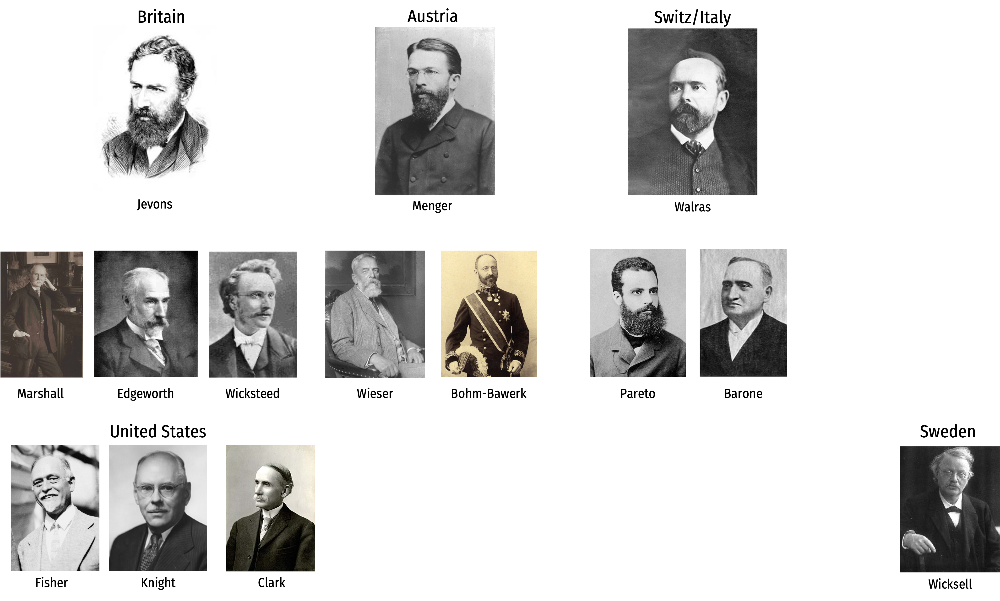
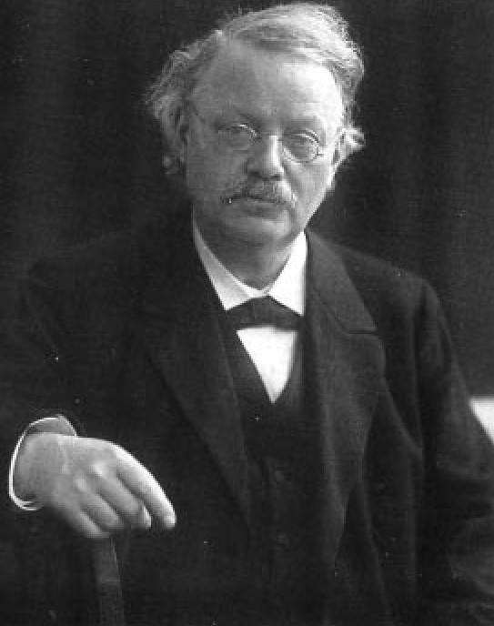
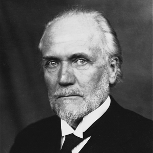
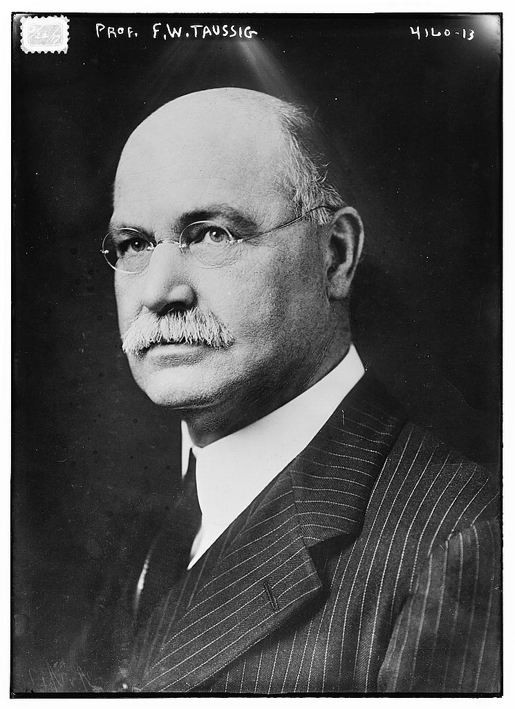

```{r setup, include=FALSE}
options(htmltools.dir.version = FALSE)
knitr::opts_chunk$set(echo=F,
                      message=F,
                      warning=F)
library(tidyverse)
library(ggrepel)
library(ggthemes)
set.seed(256)
update_geom_defaults("label", list(family = "Fira Sans Condensed"))
```

class: title-slide

# 3.2 — Marginal Productivity Theory

## ECON 452 • History of Economic Thought • Fall 2022

### Ryan Safner<br> Associate Professor of Economics <br> <a href="mailto:safner@hood.edu"><i class="fa fa-paper-plane fa-fw"></i>safner@hood.edu</a> <br> <a href="https://github.com/ryansafner/thoughtF22"><i class="fa fa-github fa-fw"></i>ryansafner/thoughtF22</a><br> <a href="https://thoughtF22.classes.ryansafner.com"> <i class="fa fa-globe fa-fw"></i>thoughtF22.classes.ryansafner.com</a><br>

---
class: inverse

# Outline

## [Second Generation Austrian Marginalists](#4)

## [Marginal Productivity Theory](#14)

## [The Product Exhaustion Debates & Marginal Productivity Theory](#33)

## [Implications & Criticisms of Marginal Productivity Theory](#72)

## [The Morality of Marginal Productivity](#86)
---

# Second-Generation Marginalists

.pull-left[
.center[

]
]

.pull-right[

.quitesmall[
- Primarily extended and applied Jevons, Menger, & Walras’ marginalist tendencies to more problems in economics
  - *especially*, the problem of pricing the factors of production

- In England: Alfred Marshall, Phillip Wicksteed, Francis Edgeworth, A.C. Pigou

- In Austria: Friedrich Wieser, Eugen von Böhm-Bawerk

- In Switz./Italy: Enrico Barone, Vilfredo Pareto

- In United States: John Bates Clark, Irving Fisher, Frank Knight, Frank Fetter, Frank Taussig

- In Sweden: Knut Wicksell, Gustav Cassel
]
]

---

# Second-Generation Marginalists

.center[

]

---

class: inverse, center, middle

# Second-Generation Austrian Marginalists

---


# Friedrich von Wieser

.left-column[
.center[


.smallest[
Friedrich von Wieser

1851—1926
]
]
]
.right-column[

- Student of Menger, ultimately replaced Menger as Professor of Political Economy at University of Vienna

- Coined the term “marginal utility” (*Grenznutzen*)

- Teacher to F.A. Hayek

- 1889, *Der natürliche Werth (Natural Value)*

- 1914, *Theorie der gesellschaftlichen Wirtschaft (Theory of Social Economy),*

]

---

# Friedrich von Wieser: Alternative Cost Theory

.left-column[
.center[


.smallest[
Friedrich von Wieser

1851—1926
]
]
]
.right-column[
- What role do costs of production (payments to factors) play in value of final goods?

- Costs are the values which are forgone in directing resources to a particular production process rather than other production processes

- In this sense, production costs are really a reflection of utilities elsewhere in the economy

- .hi-purple[Alternative cost theory] or .hi[opportunity cost]

]

---

# Friedrich von Wieser: Alternative Cost Theory

.left-column[
.center[


.smallest[
Friedrich von Wieser

1851—1926
]
]
]
.right-column[
- Beginnings of major disagreements:

- Jevons always thought costs were “real” in some sense, e.g. the *disutility* or pain of labor
  - utility of consumption vs. disutility of production; utility & disutility curves

- Marshall & Edgeworth would later argue you can derive an upward-sloping supply/cost curve for non-land factors by disutility of use

]

---

# Friedrich von Wieser: Imputation Theory

.left-column[
.center[


.smallest[
Friedrich von Wieser

1851—1926
]
]
]
.right-column[
- Menger had clear insights about capital and production: goods of higher order, their complementarity and substitutability, etc.

- If we all agree that prices of final goods reflect their marginal utility, how do we price factor services (land, labor, capital)?

- Wieser, using a legal term, this is a .hi-purple[“problem of imputation”]

]

---

# Friedrich von Wieser: Imputation Theory

.left-column[
.center[


.smallest[
Friedrich von Wieser

1851—1926
]
]
]
.right-column[
.smallest[
- Wieser’s solution was .hi-purple[linear programming] with simultaneous equations (no calculus)

- .hi-green[Example]: consider a three-good society, factors in each good’s production are $x$, $y$, and $z$, represented by three simultaneous equations:

$$\begin{align*}
x+y&=100\\
2x+3z&=290\\
4y+5z&=590\\
\end{align*}$$

- Solve for $x$, $y$, and $z$ (prices of each factor)

- Assumes prices for final goods are given, fixed production coefficients, and no substitution of factors
]

.source[Wieser, Friedrich von, 1893, *Natural Value* p.88]
]

---

# Eugen von Böhm-Bawerk

.left-column[
.center[


.smallest[
Eugen von Böhm-Bawerk

1851—1914
]
]
]
.right-column[

- Studied law at University of Vienna; exposed to Menger but never his direct student

- Friend & brother-in-law to Friedrich Wieser

- Became Minister of Finance of Austria-Hungary; amabassador to Germany

- Later became professor of political economy, teacher to Ludwig von Mises
]

---

# Eugen von Böhm-Bawerk

.left-column[
.center[


.smallest[
Eugen von Böhm-Bawerk

1851—1914
]
]
]
.right-column[
- Direct critique of Marxism: 1896, *Karl Marx and the Close of His System*

- Famously wrote on capital theory and interest theory
  - We will dig into this next week

- *Capital & Interest* 2 volumes:
   - 1884, *History and Critique of Interest Theories*
   - 1889, *Positive Theory of Capital*
]

---

# Eugen von Böhm-Bawerk

.left-column[
.center[


.smallest[
Eugen von Böhm-Bawerk

1851—1914
]
]
]

.right-column[
- Took a different approach to the imputation problem (factor pricing) than Wieser:

- Followed a phrase in Menger, “the loss principle” — applying to the price of the final good what would be lost if one of the factor services is withdrawn

- A good start, but in truth, marginal product operates at infinitesimally small changes (derivative)
]

---

# Eugen von Böhm-Bawerk: On Opportunity Cost

.left-column[
.center[


.smallest[
Eugen von Böhm-Bawerk

1851—1914
]
]
]

.right-column[
.smallest[
> “If in any branch of production the price sinks below the cost...men will withdraw from that branch and engage in some better paying branch of production. Conversely, if in one branch of production, the market price of the finished good is considerably higher than the value of the sacrificed or expended means of production, then will men be drawn from less profitable industries. They will press into the better paying branch of production, until through the increased supply, the price is again forced down to cost.

]

.source[Böhm-Bawerk, Eugen von, 1884, *Capital and Interest*]

]

---

# Eugen von Böhm-Bawerk: On Opportunity Cost

.left-column[
.center[


.smallest[
Eugen von Böhm-Bawerk

1851—1914
]
]
]

.right-column[

.quitesmall[
> “What determine the amount of this cost? .hi[The amount of the cost] is identical with the value of the productive power, and, as a rule, is determined by the money marginal utility of this productive power...The price of a definite specie of freely reproducible goods fixes itself in the long run at that point where the money marginal utility, for those who desire to purchase these products, .hi[intersects the money marginal utility of all those who desire to purchase in the other communicating branches of production.] The figure of the two blade of a pair of shears still holds good. One of the two blade, whose coming together determine the height of the price of any species of product, is in truth the marginal utility of this particular product. The other, which we are wont to call .hi["cost," is the marginal utility of the products of other communicating branches of production.] Or, according to Wieser, the marginal utility of "production related goods." .hi[It is, therefore, utility and not disutility which, as well on the side of supply as of demand, determine the height of the price.] This, too, even where the so-called law of cost plays its role in giving value to goods. .hi[Jevons, therefore, did not exaggerate the importance of the one side, but came very near the truth when he said "value depends entirely upon utility.”] (45)

]
.source[Böhm-Bawerk, Eugen von, 1884, *Capital and Interest*]
]

---

# Price is Determined at the Margin: B-B’s Example

.pull-left[
.center[


]
]

.pull-right[

- Imagine a small public horse market

- 3 people, .red[A], .red[B], and .red[C] each own 1 horse

- 3 people, .blue[D], .blue[E], and .blue[F] each are potentially interested in buying a horse
]

.source[This example is based on Eugen von Bohm-Bawerk’s famous example in *Capital and Interest* (1884)]

---

# Price is Determined at the Margin: B-B’s Example

.pull-left[
| Person | Reservation Price |
|--------|-------------------|
| .red[A] | Minimum WTA: $400 |
| .red[B] | Minimum WTA: $500 |
| .red[C] | Minimum WTA: $600 |
| .blue[D] | Maximum WTP: $600 |
| .blue[E] | Maximum WTP: $500 |
| .blue[F] | Maximum WTP: $400 |
]

.pull-right[

- Imagine a small public horse market

- 3 people, .red[A], .red[B], and .red[C] each own 1 horse

- 3 people, .blue[D], .blue[E], and .blue[F] each are potentially interested in buying a horse
]

---


# Price is Determined at the Margin: B-B’s Example

.pull-left[
| Person | Reservation Price |
|--------|-------------------|
| .red[A] | .red[Minimum WTA: $400] |
| B | Minimum WTA: $500 |
| C | Minimum WTA: $600 |
| .blue[D] | .blue[Maximum WTP: $600] |
| .blue[E] | .blue[Maximum WTP: $500] |
| .blue[F] | .blue[Maximum WTP: $400] |

.center[
**Price: $400**
]
]

.pull-right[

- Suppose .blue[Buyer F] announces she will pay **$400** for a horse

- Only .red[Seller A] is willing to sell at $400

- Buyers .blue[D], .blue[E], and .blue[F] are willing to buy at $400
  - .blue[D] and .blue[E] are willing to pay *more* than .blue[F] to obtain the 1 horse
  - A **shortage**: .blue[3 buyers] for .red[1 seller]!
  - They raise their bids *above* $400 to attract sellers
]

---

# Price is Determined at the Margin: B-B’s Example

.pull-left[
| Person | Reservation Price |
|--------|-------------------|
| .red[A] | .red[Minimum WTA: $400] |
| .red[B] | .red[Minimum WTA: $500] |
| .red[C] | .red[Minimum WTA: $600] |
| .blue[D] | .blue[Maximum WTP: $600] |
| E | Maximum WTP: $500 |
| F | Maximum WTP: $400 |

.center[
**Price: $600**
]
]

.pull-right[

- Suppose .red[Seller C] announces he will sell his horse for $600

- Only .blue[Buyer D] is willing to buy at $600

- Sellers .red[A], .red[B], and .red[C] are willing to sell at $600
  - .red[A] and .red[B] are willing to accept *less* than .red[C] to sell their horses
  - A **surplus**: .red[3 sellers] for .blue[1 buyer]!
  - They lower their asks *below* $600 to attract buyers
]

---

# Price is Determined at the Margin: B-B’s Example

.pull-left[
| Person | Reservation Price |
|--------|-------------------|
| .red[A] | .red[Minimum WTA: $400] |
| .red[B] | .red[Minimum WTA: $500] |
| C | Minimum WTA: $600 |
| .blue[D] | .blue[Maximum WTP: $600] |
| .blue[E] | .blue[Maximum WTP: $500] |
| F | Maximum WTP: $400 |

.center[
**Price: $500**
]
]

.pull-right[

- If the market price reaches $500 (through bids and asks changing):

- Sellers .red[A] and .red[B] sell their horses for $500 each
- Buyers .blue[D] and .blue[E] buy them at $500 each
]

---

# Price is Determined at the Margin: B-B’s Example

.pull-left[
| Person | Reservation Price |
|--------|-------------------|
| .red[A] | .red[Minimum WTA: $400] |
| .red[B] | .red[Minimum WTA: $500] |
| C | Minimum WTA: $600 |
| .blue[D] | .blue[Maximum WTP: $600] |
| .blue[E] | .blue[Maximum WTP: $500] |
| F | Maximum WTP: $400 |

.center[
**Price: $500**
]
]

.pull-right[

- At $500, .red[B] and .blue[E] are the .hi-purple[“marginal”] buyer and seller, the “last” ones that *just* got off the fence to exchange in the market
  - .red[B] has WTA *just* low enough to sell
  - .blue[E] has WTP *just* high enough to buy

- The marginal pair actually are the ones that “set” the market price!
]

---

# Price is Determined at the Margin: B-B’s Example

.pull-left[
| Person | Reservation Price |
|--------|-------------------|
| .red[A] | .red[Minimum WTA: $400] |
| .red[B] | .red[Minimum WTA: $500] |
| C | Minimum WTA: $600 |
| .blue[D] | .blue[Maximum WTP: $600] |
| .blue[E] | .blue[Maximum WTP: $500] |
| F | Maximum WTP: $400 |

.center[
**Price: $500**
]
]

.pull-right[

- Notice the most possible exchanges take place at a market price of $500
  - 2 horses get exchanged

- Any price *above* or *below* $500, only 1 horse would get exchanged
  - Also, at least one other buyer or seller would raise/lower their bid/ask
  
]

---

# Price is Determined at the Margin: B-B’s Example

.pull-left[
| Person | Reservation Price |
|--------|-------------------|
| .red[A] | .red[Minimum WTA: $400] |
| .red[B] | .red[Minimum WTA: $500] |
| C | Minimum WTA: $600 |
| .blue[D] | .blue[Maximum WTP: $600] |
| .blue[E] | .blue[Maximum WTP: $500] |
| F | Maximum WTP: $400 |

.center[
**Price: $500**
]
]

.pull-right[

- At $500, .red[C] and .blue[F] are the .hi-purple["excluded"] buyers and sellers
  - .red[C] has WTA *too high* to sell
  - .blue[F] has WTP *too low* to buy

]

---

# Price is Determined at the Margin: B-B’s Example

.pull-left[
| Person | Reservation Price |
|--------|-------------------|
| .red[A] | .red[Minimum WTA: $400] |
| .red[B] | .red[Minimum WTA: $500] |
| C | Minimum WTA: $600 |
| .blue[D] | .blue[Maximum WTP: $600] |
| .blue[E] | .blue[Maximum WTP: $500] |
| F | Maximum WTP: $400 |

.center[
**Price: $500**
]
]

.pull-right[

- At $500, .red[A] and .blue[D] are the .hi-purple["inframarginal"] buyers and sellers
  - .red[A] has WTA *lower* than market price, earns extra $100 surplus from exchange
  - .blue[D] has WTP *higher* than market price, earns extra $100 surplus from exchange
  
- These buyers and sellers benefit *the most* from exchange

]


---

class: inverse, center, middle

# Marginal Productivity Theory

---

# The Ricardian Roots of Marginal Productivity Theory

.left-column[
.center[


David Ricardo

1772-1823
]
]

.right-column[
.smaller[
- Ricardo’s theory of rent applied marginal analysis (“doses” of L+K) to a fixed factor (land), concluding the fixed factor earns a residual surplus (gap between AP>MP) of variable factor (L+K)

- .hi[Marginal productivity theory] both generalizes and repudaites Ricardian approach: .hi-purple[*any* _variable_ factor must earn a payment equal to its marginal product] (holding all other factors fixed)
    - i.e. nothing special about land — get the same results if it’s capital or labor that’s held fixed!
]
]

---

# Marginal Productivity Theory

.pull-left[
- Applying Ricardian logic *beyond* agriculture, we arrive at the modern .hi-purple[law of diminishing returns]
  - .hi-purple[“Law of variable proportions” or “variation of returns”]

- For *any* one variable factor (holding all others constant), increasing use will eventually yield a diminishing marginal product

]

.pull-right[
```{r}
prod_2=function(x){-0.5*x^3+6*x^2-x}

total<-ggplot(data.frame(x=c(0,10)), aes(x=x))+
  stat_function(fun=prod_2, geom="line", size=2, color="red")+
  geom_label(aes(x=9.5,y=prod_2(9.5)), color = "red", label="Total Product", size = 5)+
  geom_vline(xintercept=6, size=1.5, linetype="dashed")+
  geom_segment(x=4, xend=4, y=0, yend=prod_2(4), size=1, linetype="dotted")+
  geom_label(x=4.5,y=50, label="Stage I")+
  geom_vline(xintercept=8, size=1.5, linetype="dashed")+
  geom_label(x=7,y=50, label="Stage II")+
  geom_label(x=9,y=50, label="Stage III")+
    scale_x_continuous(breaks=seq(0,10,1),
                     limits=c(0,10),
                     expand=expand_scale(mult=c(0,0.1)))+
  scale_y_continuous(breaks=seq(0,120,20),
                     limits=c(0,120),
                     expand=expand_scale(mult=c(0,0.1)))+
  scale_colour_manual("I.C. equations", values = colors)+
  guides(color = F)+
  labs(x = "Input, (i)",
       y = "Output (q)",
       title = "Total Output")+
  theme_classic(base_family = "Fira Sans Condensed", base_size=20)

mp=function(x){-1.5*x^2+12*x-1}
ap=function(x){-0.5*x^2+6*x-1}

marginal<-ggplot(data.frame(x=c(0,10)), aes(x=x))+
  stat_function(fun=mp, geom="line", size=2, color="blue")+
  geom_label(aes(x=7.5,y=mp(7.5)), color = "blue", label=expression(MP[l]), size = 5)+
  stat_function(fun=ap, geom="line", size=2, color="purple")+
  geom_label(aes(x=9.5,y=ap(9.5)), color = "purple", label=expression(AP[l]), size = 5)+
  geom_vline(xintercept=6, size=1.5, linetype="dashed")+
  geom_segment(x=4, xend=4, y=0, yend=mp(4), size=1, linetype="dotted")+
  geom_label(x=4.5,y=8, label="Stage I")+
  geom_vline(xintercept=8, size=1.5, linetype="dashed")+
  geom_label(x=7,y=8, label="Stage II")+
  geom_label(x=9,y=8, label="Stage III")+
    scale_x_continuous(breaks=seq(0,10,1),
                     limits=c(0,10),
                     expand=expand_scale(mult=c(0,0.1)))+
  scale_y_continuous(breaks=seq(0,24,4),
                     limits=c(0,24),
                     expand=expand_scale(mult=c(0,0.1)))+
  scale_colour_manual("I.C. equations", values = colors)+
  guides(color = F)+
  labs(x = "Input, (i)",
       y = "Output per Factor Unit (q/i)",
       title = "Output per Input")+
  theme_classic(base_family = "Fira Sans Condensed", base_size=20)

library(patchwork)
total/marginal
```

]

---

# Diminishing Returns

.pull-left[
.smallest[
- .hi[Marginal product of factor i, `\\((MP_i)\\)`]: additional output produced by adding one more unit of factor $i$ (holding all others constant)
$$MP_i = \frac{\Delta q}{\Delta i}$$
  - $MP_i$ is slope of $TP$ at each value of $i$

- .hi[Average product of factor i `\\((AP_i)\\)`]: additional output produced by adding one more unit of factor $i$ (holding all others constant)
$$AP_i = \frac{q}{i}$$
  - $AP_i$ is slope of a ray from the origin to the production function at any quantity of $i$
]

]

.pull-right[
```{r}
total/marginal
```

]

---

# Derived Demand in Factor Markets

.pull-left[
- Demand for factors (e.g. labor) is a .hi-purple[“derived demand”]:
  - Firm only demands inputs to the extent they **contribute to producing sellable output**

- Firm faces a .hi-purple[tradeoff] when **hiring more labor**, as more labor $\Delta L$ creates:
  1. .hi[Marginal Benefit]: Increases output and thus revenue
  2. .hi[Marginal Cost]: Increases costs
]

.pull-right[
.center[

]
]

---

# Marginal Revenue Product (of Labor)

- Hiring more labor increases output (i.e. labor's .hi-purple[`\\(MP_L\\)`])
  - Recall: $MP_L=\frac{\Delta q}{\Delta L}$, where $q$ is units of output

--

- Additional output generates (i.e. labor's .hi-purple[`\\(MR(q)\\)`])
  - Recall: $MR(q)=\frac{\Delta R(q)}{\Delta q}$, where $R(q)$ is total revenue
--

- Hiring more labor, on the **margin**, generates a **benefit**, called the .hi[marginal revenue product of labor, `\\(MRP_L\\)`]:
$$MRP_L=MP_L* MR(q)$$
  - i.e. the number of new products a new worker makes times the revenue earned by selling the new products


---

# Marginal Revenue Product for *Competitive* Firms

.pull-left[

- This is the .hi-blue[Firm's Demand for Labor]:

$$MRP_L=MP_L* MR(q)$$

- For a firm in a .hi[competitive (output) market], firm's $MR(q)=p$, hence:

$$MRP_L=MP_L*p$$
where $p$ is the price of the firm's *output*

]

```{r, fig.retina=3}
library("mosaic")
Demand=function(x){10-2*x}
MC=function(x){2}

# make plot 

ggplot(data.frame(x=c(0,10)), aes(x=x))+
  
  # curves 
  stat_function(fun=Demand, geom="line", size=2, color="blue")+
  # surpluses
  #geom_polygon(data=CS, aes(x=x,y=y, fill="Consumer"), alpha=0.5)+ #CS

  # labels 
  #geom_text(aes(x=q_PC,y=w,label="N.E.",family = "Yanone Kaffeesatz Regular"),hjust=-0.1, vjust=-0.25, color="black")+
  annotate(geom = "label", x = 2, y = Demand(2), label = expression("Demand"==MRP[L]),
           color = "blue", size = 6) +
  scale_x_continuous(breaks = c(0),
                     labels = c(0),
                     expand=c(0,0))+
  scale_y_continuous(breaks = c(0,10),
                     labels = c(0,expression(choke)),
                     limits = c(0,10),
                     expand=c(0,0))+
  theme_classic(base_family = "Fira Sans Condensed", base_size=20)+
  labs(x = "Quantity of Labor (L)",
       y = "Price of Labor (w)")
```

---

# Marginal Revenue Product for *Competitive* Firms

.pull-left[

$$MRP_L=MP_L* p$$

- Marginal benefit of hiring labor, $MRP_L$ **falls** with more labor used
    - production exhibits **diminishing marginal returns to labor**!

- .hi[Choke price for labor demand]: price too high for firm to purchase any labor

]

```{r, fig.retina=3}
library("mosaic")
Demand=function(x){10-2*x}
MC=function(x){2}

# make plot 

ggplot(data.frame(x=c(0,10)), aes(x=x))+
  
  # curves 
  stat_function(fun=Demand, geom="line", size=2, color="blue")+
  # surpluses
  #geom_polygon(data=CS, aes(x=x,y=y, fill="Consumer"), alpha=0.5)+ #CS

  # labels 
  #geom_text(aes(x=q_PC,y=w,label="N.E.",family = "Yanone Kaffeesatz Regular"),hjust=-0.1, vjust=-0.25, color="black")+
  annotate(geom = "label", x = 2, y = Demand(2), label = expression("Demand"==MRP[L]),
           color = "blue", size = 6) +
  scale_x_continuous(breaks = c(0),
                     labels = c(0),
                     expand=c(0,0))+
  scale_y_continuous(breaks = c(0,10),
                     labels = c(0,expression(choke)),
                     limits = c(0,10),
                     expand=c(0,0))+
  theme_classic(base_family = "Fira Sans Condensed", base_size=20)+
  labs(x = "Quantity of Labor (L)",
       y = "Price of Labor (w)")
```

---

# A Competitive *Factor* Market

.pull-left[
```{r, fig.retina=3, fig.height=5}
demand<-function(x){10-x}
supply<-function(x){x}
supply_firm<-function(x){5}

ggplot(data.frame(x=c(0,10)), aes(x=x))+
  stat_function(fun=supply_firm, geom="line", size=2, color = "red")+
    geom_label(aes(x=9,y=supply_firm(9)), color = "red", label="Supply", size = 5)+
    scale_x_continuous(breaks=c(0),
                       labels=c(0),
                     limits=c(0,10),
                     expand=expand_scale(mult=c(0,0.1)))+
  scale_y_continuous(breaks=c(0,5),
                     labels=c(0,"w*"),
                     limits=c(0,10),                   
                     expand=expand_scale(mult=c(0,0.1)))+
  guides(fill=F)+
  labs(title = "Representative Firm",
       x = "Quantity of Labor (L)",
       y = "Price of Labor, (w)")+
  theme_classic(base_family = "Fira Sans Condensed", base_size=20)
```
]

.pull-right[
```{r, fig.retina=3, fig.height=5}
ggplot(data.frame(x=c(0,10)), aes(x=x))+
  stat_function(fun=demand, geom="line", size=2, color = "blue")+
    geom_label(aes(x=9,y=demand(9)), color = "blue", label="Demand", size = 5)+
  stat_function(fun=supply, geom="line", size=2, color = "red")+
    geom_label(aes(x=9,y=supply(9)), color = "red", label="Supply", size = 5)+
  geom_segment(x=5, xend=5, y=0, yend=5, size=1, linetype="dotted")+
  geom_segment(x=0, xend=5, y=5, yend=5, size=1, linetype="dotted")+
    scale_x_continuous(breaks=c(0,5),
                       labels=c(0,"L*"),
                     expand=expand_scale(mult=c(0,0.1)))+
  scale_y_continuous(breaks=c(0,5),
                     labels=c(0,"w*"),
                     limits=c(0,10),
                     expand=expand_scale(mult=c(0,0.1)))+
  guides(fill=F)+
  labs(title = "Labor Market",
       x = "Quantity of Labor (L)",
       y = "Price of Labor, (w)")+
  theme_classic(base_family = "Fira Sans Condensed", base_size=20)
```
]

- If the .hi[*factor* market is competitive], labor supply for an individual firm is *perfectly elastic* at the market price of labor $(w^*)$

---

# Labor Supply and Firm's Demand for Labor

.pull-left[

- We've seen a falling $MRP_L$, the marginal benefit of hiring labor

- .hi[Marginal cost of hiring labor], $w$, remains constant
  - so long as firm is not a big purchaser (has no market power) in the labor market 

]

.pull-right[

```{r, fig.retina=3}
ggplot(data.frame(x=c(0,10)), aes(x=x))+
  
  # curves 
  stat_function(fun=Demand, geom="line", size=2, color="blue")+
  stat_function(fun=MC, geom="line", size=2, color="red")+
  annotate(geom = "label", x = 2, y = Demand(2), label = expression("Demand"==MRP[L]),
           color = "blue", size = 6) +
  annotate(geom = "label", x = 8, y = 2, label = expression("Supply" == w), color="red", size=6)+
  scale_x_continuous(breaks = c(0),
                     labels = c(0),
                     expand=c(0,0))+
  scale_y_continuous(breaks = c(0,10),
                     labels = c(0,expression(choke)),
                     limits = c(0,10),
                     expand=c(0,0))+
  theme_classic(base_family = "Fira Sans Condensed", base_size=20)+
  labs(x = "Quantity of Labor (L)",
       y = "Price of Labor (w)")
```
]


---

# Labor Supply and Firm's Demand for Labor

.pull-left[
- At low amounts of labor, marginal benefit $(MRP_L) > w$ marginal cost

- Firm will hire more labor

]

.pull-right[

```{r, fig.retina=3}
ggplot(data.frame(x=c(0,10)), aes(x=x))+
  
  # curves 
  stat_function(fun=Demand, geom="line", size=2, color="blue")+
  stat_function(fun=MC, geom="line", size=2, color="red")+
    annotate(geom = "label", x = 2, y = Demand(2), label = expression("Demand"==MRP[L]),
           color = "blue", size = 6) +
  annotate(geom = "label", x = 8, y = 2, label = expression("Supply" == w), color="red", size=6)+
  annotate("segment", x = 1, xend = 3, y = 3, yend = 3, colour = "purple", size=2, alpha=1, arrow=arrow(length=unit(0.5,"cm"), ends="last", type="closed"))+
  scale_x_continuous(breaks = c(0),
                     labels = c(0),
                     expand=c(0,0))+
  scale_y_continuous(breaks = c(0,10),
                     labels = c(0,expression(choke)),
                     limits = c(0,10),
                     expand=c(0,0))+
  theme_classic(base_family = "Fira Sans Condensed", base_size=20)+
  labs(x = "Quantity of Labor (L)",
       y = "Price of Labor (w)")
```
]

---

# Labor Supply and Firm's Demand for Labor

.pull-left[

- At high amounts of labor, marginal benefit $(MRP_L) < w$ marginal cost

- Firm will hire less labor

]

.pull-right[

```{r, fig.retina=3}
ggplot(data.frame(x=c(0,10)), aes(x=x))+
  
  # curves 
  stat_function(fun=Demand, geom="line", size=2, color="blue")+
  stat_function(fun=MC, geom="line", size=2, color="red")+
  annotate("segment", x = 9, xend = 4, y = 3, yend = 3, colour = "purple", size=2, alpha=1, arrow=arrow(length=unit(0.5,"cm"), ends="last", type="closed"))+
    annotate(geom = "label", x = 2, y = Demand(2), label = expression("Demand"==MRP[L]),
           color = "blue", size = 6) +
  annotate(geom = "label", x = 8, y = 2, label = expression("Supply" == w), color="red", size=6)+
  scale_x_continuous(breaks = c(0),
                     labels = c(0),
                     expand=c(0,0))+
  scale_y_continuous(breaks = c(0,10),
                     labels = c(0,expression(choke)),
                     limits = c(0,10),
                     expand=c(0,0))+
  theme_classic(base_family = "Fira Sans Condensed", base_size=20)+
  labs(x = "Quantity of Labor (L)",
       y = "Price of Labor (w)")
```
]

---

# Labor Supply and Firm's Demand for Labor

.pull-left[

- Firm hires $L^*$ optimal amount of labor where $w=MRP_L$ 

- i.e. marginal cost of labor $=$ marginal benefit of labor

]

.pull-right[

```{r, fig.retina=3}
library("mosaic")
Demand=function(x){10-2*x}
MC=function(x){2}

# make plot 

ggplot(data.frame(x=c(0,10)), aes(x=x))+
  
  # curves 
  stat_function(fun=Demand, geom="line", size=2, color="blue")+
  stat_function(fun=MC, geom="line", size=2, color="red")+
  # surpluses
  #geom_polygon(data=CS, aes(x=x,y=y, fill="Consumer"), alpha=0.5)+ #CS

  # labels 
  geom_segment(aes(x=4,y=0),xend=4,yend=2,linetype=3)+
  geom_point(aes(x=4,y=2), color="black", size =3 )+ 
  #geom_text(aes(x=q_PC,y=w,label="N.E.",family = "Yanone Kaffeesatz Regular"),hjust=-0.1, vjust=-0.25, color="black")+
  annotate(geom = "label", x = 2, y = Demand(2), label = expression("Demand"==MRP[L]),
           color = "blue", size = 6) +
  annotate(geom = "label", x = 8, y = 2, label = expression("Supply" == w),
           color = "red", size = 6) +
  #annotate(geom = "label", x = 1.3, y = 5, label = "Consumer Surplus",
  #         color = "blue", size = 4.5) +
  scale_x_continuous(breaks = c(0,4),
                     labels = c(0,expression(L^{"*"})),
                     expand=c(0,0))+
  scale_y_continuous(breaks = c(0,2,10),
                     labels = c(0,expression(w^{"*"}),expression(choke)),
                     limits = c(0,10),
                     expand=c(0,0))+
  theme_classic(base_family = "Fira Sans Condensed", base_size=20)+
  labs(x = "Quantity of Labor (L)",
       y = "Price of Labor (w)")
```
]

---

# Labor Supply and Firm's Demand for Labor

.pull-left[
```{r, fig.retina=3, fig.height=5}
ggplot(data.frame(x=c(0,10)), aes(x=x))+
  stat_function(fun=supply_firm, geom="line", size=2, color = "red")+
    geom_label(aes(x=9,y=supply_firm(9)), color = "red", label="Supply", size = 5)+
    stat_function(fun=Demand, geom="line", size=2, color="blue")+
    geom_label(aes(x=2,y=Demand(2)), color = "blue", label=expression(Demand==MRP[L]), size = 5)+
    geom_segment(aes(x=2.5,y=0),xend=2.5,yend=5,linetype=3)+
  scale_x_continuous(breaks = c(0,2.5),
                     labels = c(0,expression(L[1])),
                     expand=c(0,0))+
  scale_y_continuous(breaks = c(0,5,10),
                     labels = c(0,expression(w[1]),expression(choke)),
                     limits = c(0,10),
                     expand=c(0,0))+
  guides(fill=F)+
  labs(title = "Representative Firm",
       x = "Quantity of Labor (L)",
       y = "Price of Labor, (w)")+
  theme_classic(base_family = "Fira Sans Condensed", base_size=20)
```
]

.pull-right[
```{r, fig.retina=3, fig.height=5}
ggplot(data.frame(x=c(0,10)), aes(x=x))+
  stat_function(fun=demand, geom="line", size=2, color = "blue")+
    geom_label(aes(x=9,y=demand(9)), color = "blue", label="Demand", size = 5)+
  stat_function(fun=supply, geom="line", size=2, color = "red")+
    geom_label(aes(x=9,y=supply(9)), color = "red", label="Supply", size = 5)+
  geom_segment(x=5, xend=5, y=0, yend=5, size=1, linetype="dotted")+
  geom_segment(x=0, xend=5, y=5, yend=5, size=1, linetype="dotted")+
    scale_x_continuous(breaks=c(0,5),
                       labels=c(0,expression(L[1])),
                     expand=expand_scale(mult=c(0,0.1)))+
  scale_y_continuous(breaks=c(0,5),
                     labels=c(0,expression(w[L])),
                     limits=c(0,10),
                     expand=expand_scale(mult=c(0,0.1)))+
  guides(fill=F)+
  labs(title = "Labor Market",
       x = "Quantity of Labor (L)",
       y = "Price of Labor, (w)")+
  theme_classic(base_family = "Fira Sans Condensed", base_size=20)
```
]


---

# Labor Supply and Firm's Demand for Labor

.pull-left[
```{r, fig.retina=3, fig.height=5}
supply_firm2=function(x){6}

ggplot(data.frame(x=c(0,10)), aes(x=x))+
  stat_function(fun=supply_firm, geom="line", size=2, color = "red")+
    geom_label(aes(x=9,y=supply_firm(9)), color = "red", label="Supply", size = 5)+
    stat_function(fun=supply_firm2, geom="line", size=2, color = "darkred")+
    geom_label(aes(x=9,y=supply_firm2(9)), color = "darkred", label="Supply 2", size = 5)+

    stat_function(fun=Demand, geom="line", size=2, color="blue")+
    geom_label(aes(x=4,y=Demand(4)), color = "blue", label=expression(Demand==MRP[L]), size = 5)+
    geom_segment(aes(x=2.5,y=0),xend=2.5,yend=5,linetype=3)+
  
      geom_segment(aes(x=2,y=0),xend=2,yend=6,linetype=3)+

    annotate("segment", x = 2.5, xend = 2, y = 3, yend = 3, colour = "purple", size=2, alpha=1, arrow=arrow(length=unit(0.5,"cm"), ends="last", type="closed"))+

  annotate("segment", x = 1.5, xend = 1.5, y = 5, yend = 6, colour = "purple", size=2, alpha=1, arrow=arrow(length=unit(0.5,"cm"), ends="last", type="closed"))+

  scale_x_continuous(breaks = c(0,2,2.5),
                     labels = c(0,expression(L[2]), expression(L[1])),
                     expand=c(0,0))+
  scale_y_continuous(breaks = c(0,5,6,10),
                     labels = c(0,expression(w[1]),expression(w[2]),expression(choke)),
                     limits = c(0,10),
                     expand=c(0,0))+
  guides(fill=F)+
  labs(title = "Representative Firm",
       x = "Quantity of Labor (L)",
       y = "Price of Labor, (w)")+
  theme_classic(base_family = "Fira Sans Condensed", base_size=20)
```
]

.pull-right[
```{r, fig.retina=3, fig.height=5}
supply_low<-function(x){x+2}

ggplot(data.frame(x=c(0,10)), aes(x=x))+
  stat_function(fun=demand, geom="line", size=2, color = "blue")+
    geom_label(aes(x=9,y=demand(9)), color = "blue", label="Demand", size = 5)+
  stat_function(fun=supply, geom="line", size=2, color = "red")+
    geom_label(aes(x=9,y=supply(9)), color = "red", label="Supply", size = 5)+
    stat_function(fun=supply_low, geom="line", size=2, color = "darkred")+
    geom_label(aes(x=7,y=supply_low(7)), color = "darkred", label="Supply 2", size = 5)+

  geom_segment(x=5, xend=5, y=0, yend=5, size=1, linetype="dotted")+
  geom_segment(x=0, xend=5, y=5, yend=5, size=1, linetype="dotted")+
  
  geom_segment(x=4, xend=4, y=0, yend=6, size=1, linetype="dotted")+
  geom_segment(x=0, xend=4, y=6, yend=6, size=1, linetype="dotted")+

    scale_x_continuous(breaks=c(0,4,5),
                       labels=c(0,expression(L[2]),expression(L[1])),
                     expand=expand_scale(mult=c(0,0.1)))+
  scale_y_continuous(breaks=c(0,5,6),
                     labels=c(0,expression(w[1]),expression(w[2])),
                     limits=c(0,10),
                     expand=expand_scale(mult=c(0,0.1)))+
  guides(fill=F)+
  
  annotate("segment", x = 5, xend = 4, y = 3, yend = 3, colour = "purple", size=2, alpha=1, arrow=arrow(length=unit(0.5,"cm"), ends="last", type="closed"))+

    annotate("segment", x = 2, xend = 2, y = 5, yend = 6, colour = "purple", size=2, alpha=1, arrow=arrow(length=unit(0.5,"cm"), ends="last", type="closed"))+

  labs(title = "Labor Market",
       x = "Quantity of Labor (L)",
       y = "Price of Labor, (w)")+
  theme_classic(base_family = "Fira Sans Condensed", base_size=20)
```
]

- If market supply of labor decreases, firms hire fewer workers, at higher wages (and vice versa)

---

# Multiple Inputs and Cost Minimization

.pull-left[
.quitesmall[
- But firms produce with many factors, what is the more general rule for hiring the optimal combination of factors?

- Assume three factors: land, labor, capital

- Optimal hiring condition is the .hi-purple[equimarginal rule] (Gossen’s Second Law} again:

$$\frac{MP_l}{p_l}  =  \frac{MP_k}{p_k} = \frac{MP_t}{p_t} = \cdots = \frac{MP_n}{p_n}$$

- Cost of production is minimized where the **marginal product per dollar spent** is **equalized** across all $n$ possible inputs
  - the “last dollar spent” on each input provides the same marginal product
]
]

.pull-right[
.center[

]
]

---

class: inverse, center, middle

# The Product Exhaustion Debates & Marginal Productivity Theory

---

# John Bates Clark

.left-column[
.center[


.smallest[
John Bates Clark

1847—1938
]
]
]
.right-column[
.smallest[

- Initially a German Historicist (studied under Karl Knies) in Germany; a Christian socialist

- Became professor at Columbia, independently derived his own version of marginal utility theory

- First to formulate & popularize .hi[marginal productivity theory], virtues of market competition; opponent to American Institutionalists (see later)

- 1886, *The Philosophy of Wealth*

- 1889, “Possibility of a Scientific Law of Wages” paper at AEA; generalized in 1899 *The Distribution of Wealth*
]
]
---

# The Product Exhaustion Debate

.pull-left[

- Ricardian rent theory defined rent as a residual, will always adjust to fill the gap between output price and wages & profits
  - output price = wages & profits + rent

- Thus, the payments to all factors of production (land, labor, capital)  .hi-purple[“fully exhaust the product”]
  - i.e. the sum of factor payments (costs to firm) equals the price
]

.pull-right[
.center[

]
]
---

# The Product Exhaustion Debate

.pull-left[

- Ricardian rent theory defined rent as a residual, will always adjust to fill the gap between output price and wages & profits
  - output price = wages & profits + rent

- Thus, the payments to all factors of production (land, labor, capital)  .hi-purple[“fully exhaust the product”]
  - i.e. the sum of factor payments (costs to firm) equals the price
]

.pull-right[
.center[

]
]
---


# Product Exhaustion Debate

- In competitive markets, each factor is paid its marginal (revenue) product (shown above)

--

- .hi[Product exhaustion debate]: .hi-purple[does the sum of these marginal products exactly equal the market price of the output?]

--

$$Q=^{?}MP_L \, L + MP_K \, K + MP_T \, T$$
--

$$pQ=^{?}(P*MP_L) \, L + (p*MP_K) \, K + (p*MP_T) \, T$$
--

$$pQ=^{?}(MRP_L) \, L + (MRP_K) \, K + (MRP_T) \, T$$
--

- The claim that it *does* is the essence of .hi[marginal productivity theory]

---

# John Bates Clark: Marginal Productivity Theory

.left-column[
.center[


.smallest[
John Bates Clark

1847—1938
]
]
]

.right-column[

- Clark famously argued that on a competitive market, each factor is paid its marginal product, and that this exactly exhausts the product

$$Q=MP_L \times L + MP_K \times K + MP_T \times T$$

- Offered little *proof* that this is true
]

---

# Phillip Wicksteed

.left-column[
.center[


.smallest[
Phillip Wicksteed

1844—1927
]
]
]
.right-column[

- A British economist and unitarian minister

- Learned economics from Jevons, and got inspired to write about political economy after reading Henry George

- 1894, *An Essay on the Co-Ordination of the Laws of Distribution*
  - tries to solve the product exhaustion problem of marginal productivity theory

- 1910, *The Common Sense of Political Economy: Including a Study of the Human Basis of Economic Law*
  - one of the greatest books popularizing marginalism 
]

---

# *Proving* Product Exhaustion...Sort Of

.left-column[
.center[


.smallest[
Phillip Wicksteed

1844—1927
]
]
]

.right-column[
.smallest[
- Uses Euler’s Theorem of homogeneous functions to **prove** product exhaustion under specific conditions:
  - production functions must be linearly homogenous (of degree 1)

$$c^{n}Y =f(c^{n}L,c^{n}K,c^{n}T): n=1$$
  - we would say: .hi-purple[“constant returns to scale”]

- Heavily criticized for this!
]
]

---


# Returns to Scale

.pull-left[
.quitesmall[
- The .hi[returns to scale] of production: change in output when **all** inputs are increased .hi-turquoise[at the same rate] (scale)
]
]

.pull-right[

]

---

# Returns to Scale

.pull-left[
.quitesmall[
- The .hi[returns to scale] of production: change in output when **all** inputs are increased .hi-turquoise[at the same rate] (scale)

- .hi-purple[Constant returns to scale]: output increases at .hi-turquoise[same proportionate rate] to inputs change
    - e.g. double all inputs, output doubles
]
]

.pull-right[

]

---

# Returns to Scale

.pull-left[
.quitesmall[
- The .hi[returns to scale] of production: change in output when **all** inputs are increased .hi-turquoise[at the same rate] (scale)

- .hi-purple[Constant returns to scale]: output increases at .hi-turquoise[same proportionate rate] to inputs change
    - e.g. double all inputs, output doubles

- .hi-purple[Increasing returns to scale]: output increases .hi-turquoise[more than proportionately] to inputs change
    - e.g. double all inputs, output *more than* doubles
]
]

.pull-right[

]

---

# Returns to Scale

.pull-left[
.quitesmall[
- The .hi[returns to scale] of production: change in output when **all** inputs are increased .hi-turquoise[at the same rate] (scale)

- .hi-purple[Constant returns to scale]: output increases at .hi-turquoise[same proportionate rate] to inputs change
    - e.g. double all inputs, output doubles

- .hi-purple[Increasing returns to scale]: output increases .hi-turquoise[more than proportionately] to inputs change<sup>.magenta[†]</sup>
    - e.g. double all inputs, output *more than* doubles

- .hi-purple[Decreasing returns to scale]: output increases .hi-turquoise[less than proportionately] to inputs change
    - e.g. double all inputs, output *less than* doubles
]
]

.pull-right[

]

.footnote[<sup>.magenta[†]</sup> See my new newsletter [Increasing Returns](https://increasingreturns.substack.com) for more on the importance of this idea
]

---

# Constant Returns to Scale

.pull-left[
.smallest[
- .hi-purple[Constant returns to scale]: doubling all inputs $\implies$ double output
$$f(cl,ck,ct)=cf(l,k,t) \quad \forall c>1$$

- .hi-purple[Constant economies of scale]: average and marginal costs (are equal and) do not vary with output

- Total revenues are completely exhausted by the payments to factors (costs to firm)
]
]

.pull-right[
```{r}
crs_prod=function(x){x}

crs_q<-ggplot(data.frame(x=c(0,10)), aes(x=x))+
  stat_function(fun=crs_prod, geom="line", size=2, color="red")+
  geom_label(aes(x=2.5,y=crs_prod(2.5)), color = "red", label="Total Product", size = 5)+
  # first dotted lines
  geom_segment(x=1, xend=1, y=0, yend=1, linetype="dotted",size=1)+
  geom_segment(x=0, xend=1, y=1, yend=1, linetype="dotted",size=1)+
  # second dotted lines
  geom_segment(x=2, xend=2, y=0, yend=2, linetype="dotted",size=1)+
  geom_segment(x=0, xend=2, y=2, yend=2, linetype="dotted",size=1)+
    scale_x_continuous(breaks=c(0,1,2),
                       labels=c(0,"l","2l"),
                     limits=c(0,3),
                     expand=expand_scale(mult=c(0,0.1)))+
  scale_y_continuous(breaks=c(0,1,2),
                     labels=c(0,"f(l)", "f(2l)"),
                     limits=c(0,3),
                     expand=expand_scale(mult=c(0,0.1)))+
  guides(color = F)+
  labs(x = "Input, Labor (l)",
       y = "Output (q)",
       title = "Constant Returns")+
  theme_classic(base_family = "Fira Sans Condensed", base_size=14)

crs_cost=function(x){x}

crs_tc<-ggplot(data.frame(x=c(0,10)), aes(x=x))+
  stat_function(fun=crs_cost, geom="line", size=2, color="red")+
  #geom_label(aes(x=2.5,y=crs_prod(2.5)), color = "red", label="Total Product", size = 5)+
    scale_x_continuous(breaks=c(0),
                       labels=c(0),
                     limits=c(0,3),
                     expand=expand_scale(mult=c(0,0.1)))+
  scale_y_continuous(breaks=c(0),
                     labels=c(0),
                     limits=c(0,3),
                     expand=expand_scale(mult=c(0,0.1)))+
  guides(color = F)+
  labs(x = "Output (q)",
       y = "Total Costs C(q)",
       title = "Total Costs")+
  theme_classic(base_family = "Fira Sans Condensed", base_size=14)

crs_mc=function(x){2}

crs_mc<-ggplot(data.frame(x=c(0,10)), aes(x=x))+
  stat_function(fun=crs_mc, geom="line", size=2, color="red")+
  geom_label(aes(x=2.5,y=2), color = "red", label="MC(q)=AC(q)", size = 5)+
    scale_x_continuous(breaks=c(0),
                       labels=c(0),
                     limits=c(0,3),
                     expand=expand_scale(mult=c(0,0.1)))+
  scale_y_continuous(breaks=c(0),
                     labels=c(0),
                     limits=c(0,3),
                     expand=expand_scale(mult=c(0,0.1)))+
  guides(color = F)+
  labs(x = "Output (q)",
       y ="Costs per Unit",
       title = "Per Unit Costs")+
  theme_classic(base_family = "Fira Sans Condensed", base_size=14)

library(patchwork)
crs_q+(crs_tc/crs_mc)
```

]

---

# Decreasing Returns to Scale

.pull-left[
.smallest[
- .hi-purple[Decreasing returns to scale]: doubling all inputs $\implies$ *less* than double output
$$f(cl,ck,ct)<cf(l,k,t) \quad \forall c>1$$

- .hi-purple[Diseconomies of scale]: average and marginal costs are increasing with output
  - AC < MC $\implies$ marginal cost pricing is always profitable
  - Total Costs < Total Revenues $\implies \pi > 0$

- Total revenues are *not* exhausted by the payments to factors (costs to firm); residual **profits** leftover!

]
]
.pull-right[
```{r}
library(mosaic)
drs_prod=function(x){sqrt(x)}

drs_q<-ggplot(data.frame(x=c(0,10)), aes(x=x))+
  stat_function(fun=drs_prod, geom="line", size=2, color="red")+
  geom_abline(intercept=0, slope=1, size=1, linetype="dashed")+
  geom_label(aes(x=2.5,y=drs_prod(2.5)), color = "red", label="Total Product", size = 5)+
  # first dotted lines
  geom_segment(x=1, xend=1, y=0, yend=1, linetype="dotted",size=1)+
  geom_segment(x=0, xend=1, y=1, yend=1, linetype="dotted",size=1)+
  # second dotted lines
  geom_segment(x=2, xend=2, y=0, yend=2, linetype="dotted",size=1)+
  geom_segment(x=0, xend=2, y=2, yend=2, linetype="dotted",size=1)+
  # function dotted lines
  geom_segment(x=2, xend=2, y=0, yend=drs_prod(2), linetype="dotted",size=1)+
  geom_segment(x=0, xend=2, y=drs_prod(2), yend=drs_prod(2), linetype="dotted",size=1)+
    scale_x_continuous(breaks=c(0,1,2),
                       labels=c(0,"l","2l"),
                     limits=c(0,3),
                     expand=expand_scale(mult=c(0,0.1)))+
  scale_y_continuous(breaks=c(0,1,drs_prod(2),2),
                     labels=c(0,"f(l)", "f(2l)", "2f(l)"),
                     limits=c(0,3),
                     expand=expand_scale(mult=c(0,0.1)))+
  guides(color = F)+
  labs(x = "Input, Labor (l)",
       y = "Output (q)",
       title = "Decreasing Returns")+
  theme_classic(base_family = "Fira Sans Condensed", base_size=14)

drs_cost=function(x){x^{1.5}}

drs_tc<-ggplot(data.frame(x=c(0,10)), aes(x=x))+
  stat_function(fun=drs_cost, geom="line", size=2, color="red")+
  #geom_label(aes(x=2.5,y=crs_prod(2.5)), color = "red", label="Total Product", size = 5)+
    scale_x_continuous(breaks=c(0),
                       labels=c(0),
                     limits=c(0,3),
                     expand=expand_scale(mult=c(0,0.1)))+
  scale_y_continuous(breaks=c(0),
                     labels=c(0),
                     limits=c(0,3),
                     expand=expand_scale(mult=c(0,0.1)))+
  guides(color = F)+
  labs(x = "Output (q)",
       y = "Total Costs C(q)",
       title = "Total Costs")+
  theme_classic(base_family = "Fira Sans Condensed", base_size=14)

drs_mc=function(x){1.5*x^{0.5}}
drs_ac=function(x){x^{0.5}}

drs_mc2<-ggplot(data.frame(x=c(0,10)), aes(x=x))+
  stat_function(fun=drs_mc, geom="line", size=2, color="red")+
  geom_label(aes(x=2,y=drs_mc(2)), color = "red", label="MC(q)", size = 5)+
  stat_function(fun=drs_ac, geom="line", size=2, color="orange")+
  geom_label(aes(x=2,y=drs_ac(2)), color = "orange", label="AC(q)", size = 5)+
    scale_x_continuous(breaks=c(0),
                       labels=c(0),
                     limits=c(0,3),
                     expand=expand_scale(mult=c(0,0.1)))+
  scale_y_continuous(breaks=c(0),
                     labels=c(0),
                     limits=c(0,3),
                     expand=expand_scale(mult=c(0,0.1)))+
  guides(color = F)+
  labs(x = "Output (q)",
       y ="Costs per Unit",
       title = "Per Unit Costs")+
  theme_classic(base_family = "Fira Sans Condensed", base_size=14)

drs_q+(drs_tc/drs_mc2)
```

]

---

# Increasing Returns to Scale

.pull-left[
.smallest[
- .hi-purple[Increasing returns to scale]: doubling all inputs $\implies$ *more* than double output
$$f(cl,ck,ct)>cf(l,k,t) \quad \forall c>1$$

- .hi-purple[Economies of scale]: average and marginal costs are decreasing with output
  - AC > MC $\implies$ marginal cost pricing is always loss-inducing
  - Total Costs > Total Revenues $\implies \pi < 0$

- Total revenues are *insufficient* to cover the payments to factors (costs to firm); losses!

]
]

.pull-right[
```{r}
library(mosaic)
irs_prod=function(x){x^{1.5}}

irs_q<-ggplot(data.frame(x=c(0,10)), aes(x=x))+
  stat_function(fun=irs_prod, geom="line", size=2, color="red")+
  geom_abline(intercept=0, slope=1, size=1, linetype="dashed")+
  geom_label(aes(x=2.5,y=irs_prod(2.5)), color = "red", label="Total Product", size = 5)+
  # first dotted lines
  geom_segment(x=1, xend=1, y=0, yend=1, linetype="dotted",size=1)+
  geom_segment(x=0, xend=1, y=1, yend=1, linetype="dotted",size=1)+
  # second dotted lines
  geom_segment(x=2, xend=2, y=0, yend=2, linetype="dotted",size=1)+
  geom_segment(x=0, xend=2, y=2, yend=2, linetype="dotted",size=1)+
  # function dotted lines
  geom_segment(x=2, xend=2, y=0, yend=irs_prod(2), linetype="dotted",size=1)+
  geom_segment(x=0, xend=2, y=irs_prod(2), yend=irs_prod(2), linetype="dotted",size=1)+
    scale_x_continuous(breaks=c(0,1,2),
                       labels=c(0,"l","2l"),
                     limits=c(0,3),
                     expand=expand_scale(mult=c(0,0.1)))+
  scale_y_continuous(breaks=c(0,1,2, irs_prod(2)),
                     labels=c(0,"f(l)", "2f(l)", "f(2l)"),
                     limits=c(0,3),
                     expand=expand_scale(mult=c(0,0.1)))+
  guides(color = F)+
  labs(x = "Input, Labor (l)",
       y = "Output (q)",
       title = "Increasing Returns")+
  theme_classic(base_family = "Fira Sans Condensed", base_size=14)

irs_cost=function(x){x^{0.5}}

irs_tc<-ggplot(data.frame(x=c(0,10)), aes(x=x))+
  stat_function(fun=irs_cost, geom="line", size=2, color="red")+
  #geom_label(aes(x=2.5,y=crs_prod(2.5)), color = "red", label="Total Product", size = 5)+
    scale_x_continuous(breaks=c(0),
                       labels=c(0),
                     limits=c(0,3),
                     expand=expand_scale(mult=c(0,0.1)))+
  scale_y_continuous(breaks=c(0),
                     labels=c(0),
                     limits=c(0,3),
                     expand=expand_scale(mult=c(0,0.1)))+
  guides(color = F)+
  labs(x = "Output (q)",
       y = "Total Costs C(q)",
       title = "Total Costs")+
  theme_classic(base_family = "Fira Sans Condensed", base_size=14)

irs_mc=function(x){0.5*x^{-0.5}}
irs_ac=function(x){1/x^{0.5}}

irs_mc2<-ggplot(data.frame(x=c(0,10)), aes(x=x))+
  stat_function(fun=irs_mc, geom="line", size=2, color="red")+
  geom_label(aes(x=2.5,y=irs_mc(2.5)), color = "red", label="MC(q)", size = 5)+
    stat_function(fun=irs_ac, geom="line", size=2, color="orange")+
  geom_label(aes(x=2.5,y=irs_ac(2.5)), color = "orange", label="AC(q)", size = 5)+
    scale_x_continuous(breaks=c(0),
                       labels=c(0),
                     limits=c(0,3),
                     expand=expand_scale(mult=c(0,0.1)))+
  scale_y_continuous(breaks=c(0),
                     labels=c(0),
                     limits=c(0,3),
                     expand=expand_scale(mult=c(0,0.1)))+
  guides(color = F)+
  labs(x = "Output (q)",
       y ="Costs per Unit",
       title = "Per Unit Costs")+
  theme_classic(base_family = "Fira Sans Condensed", base_size=14)

irs_q+(irs_tc/irs_mc2)
```

]

---

# Criticisms of Wicksteed

.left-column[
.center[


.smaller[
Francis Ysidro Edgeworth

1845-1926
]
]
]

.right-column[

> “This is certainly a remarkable discovery; for the relation between product and factors is to be considered to hold good irrespectively of the play of the market...There is a magnificence in this generalization which recalls the youth of philosophy. Justice is a perfect cube, said the ancient sage; and rational conduct is a homogeneous function, adds the modern savant.”

.source[Edgeworth, Francis Ysidro, 1904, "The Theory of Distribution," *Quarterly Journal of Economics* 18, p.149-219.]
]

---

# Criticisms of Wicksteed

.left-column[
.center[


.smallest[
Sir John Hicks

1904-1989

Economics Nobel 1972
]
]
]

.right-column[

> “Where Wicksteed went wrong was his assumption that he could argue from the shape of the curve at one particular point to the general shape of the curve.”

.source[Edgeworth, Francis Ysidro, 1904, "The Theory of Distribution," *Quarterly Journal of Economics* 18, p.149-219.]
]

---

# Knut Wicksell

.left-column[
.center[


.smallest[
Knut Wicksell

1851—1926
]
]
]

.right-column[

- Swedish economist at University of Stockholm

- Another supposed independent discoverer of marginal productivity theory

- Made key contributions to capital and interest theory, influence Austrian & Keynesian schools of macroeconomics
  - (we'll explore more next class)

- 1898, *Interest and Prices*

]

---

# Wicksell and Product Exhaustion

.left-column[
.center[


.smallest[
Knut Wicksell

1851—1926
]
]
]

.right-column[
.smallest[
- Most economists believed that an industry would always be either constant, increasing, or decreasing returns

- Wicksell showed that most .hi-purple[firms actually go through all three phases of returns to scale]
  - developing a .hi-purple[long-run U-shaped average cost curve] for a firm
  - would take a few decades for neoclassical economists to derive and understand shape of AC curve

]
]

---

# Wicksell and Product Exhaustion

.left-column[
.center[


.smallest[
Knut Wicksell

1851—1926
]
]
]

.right-column[
- Thus, it is *not* necessary (as Wicksteed did) to assume constant returns to prove product exhaustion

- Competition would ensure that in the long run, firms are producing at their least-cost combination
  - $p = MC = AC_{min}$
  - $\pi = 0$
  - “product exhaustion”
]

---

# Long Run Costs & Scale Economies 

.pull-left[

- .hi[Minimum Efficient Scale]: $q$ with the lowest $AC(q)$
  - “optimal firm size”

]

.pull-right[

```{r, fig.retina=3}
ac_mes<-function(x){(x-5)^2+4}
fills <- tibble(x = seq(0,10,0.01),
                y = ac_mes(x))

ggplot(data.frame(x=c(0,10)), aes(x=x))+
  #geom_ribbon(data = fills %>% filter(x < 5), aes(ymax = y, ymin = 0), fill = "green", alpha = 0.5)+
  #geom_ribbon(data = fills %>% filter(x > 5), aes(ymax = y, ymin = 0), fill = "red", alpha = 0.5)+
  stat_function(fun=ac_mes, geom="line", size=2, color="orange")+
  geom_label(x=8, y=ac_mes(8), color="orange", size=6, label="AC(q)")+
  geom_segment(x=5, xend=5, y=0, yend=4, linetype="dotted", size =1)+
    scale_x_continuous(breaks=NULL,
                     limits=c(0,10),
                     expand=expand_scale(mult=c(0,0.1)))+
  scale_y_continuous(breaks=NULL,
                     limits=c(0,20),
                     expand=expand_scale(mult=c(0,0.1)),
                     labels = scales::dollar)+
  #geom_text(x=3, y=4, size=6, label="Economies \n of Scale", color="white")+
  #geom_text(x=7.5, y=4, size=6, label="Diseconomies \n of Scale", color="white")+
  scale_x_continuous(breaks = c(5),
                     labels = c("MES"),
                     limits = c(1.5, 8.5),
                     expand = c(0,0))+
  labs(x = "Output, q",
       y = "Costs per Unit")+
  theme_classic(base_family = "Fira Sans Condensed", base_size=16)+
  theme(legend.position = "bottom",
        axis.title.x = element_text(hjust = 1))
```
]

---

# Long Run Costs & Scale Economies 

.pull-left[

- .hi[Minimum Efficient Scale]: $q$ with the lowest $AC(q)$
  - “optimal firm size”

- .hi-green[Economies of Scale]: $\uparrow q$, $\downarrow AC(q)$

]

.pull-right[

```{r, fig.retina=3}
ggplot(data.frame(x=c(0,10)), aes(x=x))+
  geom_ribbon(data = fills %>% filter(x < 5), aes(ymax = y, ymin = 0), fill = "green", alpha = 0.5)+
 # geom_ribbon(data = fills %>% filter(x > 5), aes(ymax = y, ymin = 0), fill = "red", alpha = 0.5)+
  stat_function(fun=ac_mes, geom="line", size=2, color="orange")+
  geom_label(x=8, y=ac_mes(8), color="orange", size=6, label="AC(q)")+
  geom_segment(x=5, xend=5, y=0, yend=4, linetype="dotted", size =1)+
    scale_x_continuous(breaks=NULL,
                     limits=c(0,10),
                     expand=expand_scale(mult=c(0,0.1)))+
  scale_y_continuous(breaks=NULL,
                     limits=c(0,20),
                     expand=expand_scale(mult=c(0,0.1)),
                     labels = scales::dollar)+
  geom_text(x=3, y=4, size=6, label="Economies \n of Scale", color="white")+

  #geom_text(x=7.5, y=4, size=6, label="Diseconomies \n of Scale", color="white")+
  scale_x_continuous(breaks = c(5),
                     labels = c("MES"),
                     limits = c(1.5, 8.5),
                     expand = c(0,0))+
  labs(x = "Output, q",
       y = "Costs per Unit")+
  theme_classic(base_family = "Fira Sans Condensed", base_size=16)+
  theme(legend.position = "bottom",
        axis.title.x = element_text(hjust = 1))
```
]

---

# Long Run Costs & Scale Economies 

.pull-left[

- .hi[Minimum Efficient Scale]: $q$ with the lowest $AC(q)$
  - “optimal firm size”

- .hi-green[Economies of Scale]: $\uparrow q$, $\downarrow AC(q)$

- .hi-red[Diseconomies of Scale]: $\uparrow q$, $\uparrow AC(q)$

]

.pull-right[

```{r, fig.retina=3}
ggplot(data.frame(x=c(0,10)), aes(x=x))+
  geom_ribbon(data = fills %>% filter(x < 5), aes(ymax = y, ymin = 0), fill = "green", alpha = 0.5)+
  geom_ribbon(data = fills %>% filter(x > 5), aes(ymax = y, ymin = 0), fill = "red", alpha = 0.5)+
  stat_function(fun=ac_mes, geom="line", size=2, color="orange")+
  geom_label(x=8, y=ac_mes(8), color="orange", size=6, label="AC(q)")+
  geom_segment(x=5, xend=5, y=0, yend=4, linetype="dotted", size =1)+
    scale_x_continuous(breaks=NULL,
                     limits=c(0,10),
                     expand=expand_scale(mult=c(0,0.1)))+
  scale_y_continuous(breaks=NULL,
                     limits=c(0,20),
                     expand=expand_scale(mult=c(0,0.1)),
                     labels = scales::dollar)+
  geom_text(x=3, y=4, size=6, label="Economies \n of Scale", color="white")+

  geom_text(x=7.5, y=4, size=6, label="Diseconomies \n of Scale", color="white")+
  scale_x_continuous(breaks = c(5),
                     labels = c("MES"),
                     limits = c(1.5, 8.5),
                     expand = c(0,0))+
  labs(x = "Output, q",
       y = "Costs per Unit")+
  theme_classic(base_family = "Fira Sans Condensed", base_size=16)+
  theme(legend.position = "bottom",
        axis.title.x = element_text(hjust = 1))
```
]


---

# Wicksell and Product Exhaustion

.pull-left[
.smallest[
- Think about what you learn in microeconomics

- In the long run, as profits attract entrants and losses force exits, price settles on the break-even point, where profit is 0
  - $p=MC=AC_{min}$
  - factors are paid their opportunity costs (marginal products); nothing leftover

- We are gearing towards the origins of the .hi[perfect competition model]
]
]
.pull-right[
```{r}
mc<-function(x){2*x}
ac<-function(x){x+9/x}
avc<-function(x){x}

ggplot(data.frame(x=c(0,10)), aes(x=x))+
  stat_function(fun=mc, geom="line", size=2, color = "red")+
    geom_label(aes(x=9.5,y=mc(9.5)), color = "red", label="MC(q)", size = 4)+
  stat_function(fun=ac, geom="line", size=2, color = "orange")+
    geom_label(aes(x=9.5,y=ac(9.5)), color = "orange", label="AC(q)", size = 4)+
  # break even line
  geom_hline(yintercept=6, size=1, color="blue")+
  geom_label(x=9,y=6, label="P=MR=AR", size =5, color="blue")+
  geom_segment(x = 3, y = 6, xend = 3, yend = 0, linetype = "dotted")+
    scale_x_continuous(breaks=c(0,3),
                       labels = c(0,"q*"),
                     limits=c(0,10),
                     expand=expand_scale(mult=c(0,0.1)))+
  scale_y_continuous(breaks=c(0,6),
                     labels=c("0", expression(p==AC[min])),
                     limits=c(0,20),
                     expand=expand_scale(mult=c(0,0.1)))+
  labs(x = "Output",
       y = "Price")+
  theme_classic(base_family = "Fira Sans Condensed", base_size=20)
```

]

---

class: inverse, center, middle

# Implications & Criticisms of Marginal Productivity Theory

---

# Implications of Marginal Productivity Theory

.left-column[
.center[


.smallest[
John Bates Clark

1847—1938
]
]
]

.right-column[

- Several flaws with marginal productivity theory as a theory of distribution

- MPT is primarily .hi-purple[a theory of factor pricing], not about .hi-turquoise[distribution of relative shares]

- It’s even an incomplete theory of factor pricing!
  - Considers only *demand* side of factor market (firms), not the supply side!

- Assumes competitive output and input markets
  - Labor unions, monopsony power, bargaining, etc.
]

---

# Implications of Marginal Productivity Theory

.pull-left[

- Factor employment is determined by supply & demand of factor, where demand is driven by the factor’s marginal revenue product
  - if market price is above equilibrium (e.g. $w_2)$, a surplus (unemployment) of that factor

- Prices will adjust downwards to equilibrium
]

.pull-right[
```{r}
ggplot(data.frame(x=c(0,10)), aes(x=x))+
  stat_function(fun=demand, geom="line", size=2, color = "blue")+
    geom_label(aes(x=9,y=demand(9)), color = "blue", label="Demand", size = 5)+
  stat_function(fun=supply, geom="line", size=2, color = "red")+
    geom_label(aes(x=9,y=supply(9)), color = "red", label="Supply", size = 5)+
  geom_segment(x=5, xend=5, y=0, yend=5, size=1, linetype="dotted")+
  geom_segment(x=0, xend=5, y=5, yend=5, size=1, linetype="dotted")+
  geom_hline(yintercept=8,size=1,linetype="dashed")+
  geom_segment(x=2, xend=2, y=0, yend=8, size=1, linetype="dotted")+
  geom_segment(x=8, xend=8, y=0, yend=8, size=1, linetype="dotted")+
  annotate("segment", x = 2, xend = 8, y = 9, yend = 9, colour = "purple", size=2, alpha=1, arrow=arrow(length=unit(0.5,"cm"), ends="both", type="closed"))+
  geom_label(x=5,y=9,color="purple",label="Surplus (Unemployment)")+
    scale_x_continuous(breaks=c(0,2,5,8),
                       labels=c(0,expression(q[d]),"L*",expression(q[s])),
                     expand=expand_scale(mult=c(0,0.1)))+
  scale_y_continuous(breaks=c(0,5,8),
                     labels=c(0,"w*",expression(w[2])),
                     limits=c(0,10),
                     expand=expand_scale(mult=c(0,0.1)))+
  guides(fill=F)+
  labs(title = "Labor Market",
       x = "Quantity of Labor (L)",
       y = "Price of Labor, (w)")+
  theme_classic(base_family = "Fira Sans Condensed", base_size=20)
```
]

---

# Implications of Marginal Productivity Theory

.pull-left[
.smallest[
- What implications does this have for macroeconomic policy?

- Applied to the entire economy, implies that (non-frictional) unemployment is due to above-equilibrium factor prices
  - markets will correct this by adjusting prices downwards

- Anticipating Keynes:
  - but is it that easy to lower wages??
  - if workers have less income, will that affect aggregate demand?
]
]

.pull-right[
```{r}
ggplot(data.frame(x=c(0,10)), aes(x=x))+
  stat_function(fun=demand, geom="line", size=2, color = "blue")+
    geom_label(aes(x=9,y=demand(9)), color = "blue", label="Demand", size = 5)+
  stat_function(fun=supply, geom="line", size=2, color = "red")+
    geom_label(aes(x=9,y=supply(9)), color = "red", label="Supply", size = 5)+
  geom_segment(x=5, xend=5, y=0, yend=5, size=1, linetype="dotted")+
  geom_segment(x=0, xend=5, y=5, yend=5, size=1, linetype="dotted")+
  geom_hline(yintercept=8,size=1,linetype="dashed")+
  geom_segment(x=2, xend=2, y=0, yend=8, size=1, linetype="dotted")+
  geom_segment(x=8, xend=8, y=0, yend=8, size=1, linetype="dotted")+
  annotate("segment", x = 2, xend = 8, y = 9, yend = 9, colour = "purple", size=2, alpha=1, arrow=arrow(length=unit(0.5,"cm"), ends="both", type="closed"))+
  geom_label(x=5,y=9,color="purple",label="Surplus (Unemployment)")+
    scale_x_continuous(breaks=c(0,2,5,8),
                       labels=c(0,expression(q[d]),"L*",expression(q[s])),
                     expand=expand_scale(mult=c(0,0.1)))+
  scale_y_continuous(breaks=c(0,5,8),
                     labels=c(0,"w*",expression(w[2])),
                     limits=c(0,10),
                     expand=expand_scale(mult=c(0,0.1)))+
  guides(fill=F)+
  labs(title = "Labor Market",
       x = "Quantity of Labor (L)",
       y = "Price of Labor, (w)")+
  theme_classic(base_family = "Fira Sans Condensed", base_size=20)
```
]

---

# Implications of Marginal Productivity Theory

.left-column[
.center[


.smallest[
John Bates Clark

1847—1938
]
]
]

.right-column[
.smallest[
- MPT describes the outcome to which we are always *approaching* (i.e. perfect competition), it is an equilibrium state of rest
  - *actual* prices in real world are not equilibrium prices, we are not in perfect competition

- In *long run equilibrium* in *perfect competition*, factor prices are paid their marginal products
  - $p = MC$, all factors are paid opportunity costs, firms break even and “exhaust the product” $AR(q)=AC(q)$

]
]

---

# Misconceptions About Marginal Productivity Theory

1. Mistaken interpretation that MPT says factor prices are *determined* by their marginal products
  - i.e. wage is determined by $MP_L$
  - A lot of Clark’s tone seems to imply this

--

- In truth, MPT says the *opposite!*: the quantity of factors employed (and thus their $MP$'s) depends on factor prices!
  - Factor prices are determined by supply & demand, period.

--

- MPT is a description of factor markets *in equilibrium*: factors are paid their marginal products
  - In essence, factor payments are a *measure* of $MP$ in equilibrium

---

# Misconceptions About Marginal Productivity Theory

.left-column[
.center[


.smallest[
Alfred Marshall

1842-1924
]
]
]

.right-column[
.smaller[
> “This [marginal productivity] doctrine has sometimes been put forward as a theory of wages. But there is no valid ground for any such pretension. The doctrine that the earnings of a worker tend to be equal to the net product of his work, has by itself no real meaning; since in order to estimate net product, we have to take for granted all the expenses of production of the commodity on which he works, other than his own wages. But though this objection is valid against a claim that it contains a theory of wages; it is not valid against a claim that the doctrine throws into clear light the action of one of the causes that govern wages,” (p.429-30).

]
.source[Marshall, Alfred, 1980, *Principles of Economics*]
]

---

# You Can't Easily Measure Marginal Product!

.left-column[
.center[


.smallest[
Gustav Cassel

1886-1945
]
]
]

.right-column[
> “[M]arginal productivity itself is not an objectively ascertained factor in the pricing problem, but is in fact one of the unknowns in the problem...[A factor's] marginal productivity, then, cannot be defined as anything other than [its] price, for this price represents precisely the contribution of the labour in question to the price of the product. The statement that wages are determined by the marginal productivity of labour thus loses all independent meaning,” (pp.312-313).


.source[Cassel, Gustav, 1918, *The Theory of Social Economy*]
]

---

# You Can't Easily Measure Marginal Product!

.left-column[
.center[


.smallest[
George Bernard Shaw

1856-1950
]
]
]

.right-column[
> “[T]hat of giving to every person exactly what he or she has made by his or her labor, seems fair; but when we try to put it into practice we discover, first, that it is quite impossible to find out how much each person has produced,” (p.21).

.source[Shaw, George Bernard, 1928, *The Intelligent Woman's Guide to Socialism and Capitalism*]
]

---

# You Can't Easily Measure Marginal Product!

.left-column[
.center[



.smallest[
Frank Taussig

1859-1940
]
]
]

.right-column[
> “there is no separate product of the tool on the one hand and of the labor using the tool on the other...We can disengage no concretely separable product of labor and capital.”

.source[Taussig, Frank, 1926, *Wages and Capital*]
]

---

# You Can't Easily Measure Marginal Product!

.left-column[
.center[

]
.smallest[
L: Armen Alchian (1914-2013)

R: Harold Demsetz (1930-2019)

]
]
.right-column[

.smallest[

"[A firm] is a .hi[team] use of inputs and a centralized position of some party in the contractual arrangements of all other inputs. It is the .hi[centralized contractual agent in a team productive process]," (p.778).

]
.source[Alchian, Armen A and Harold Demsetz, 1972, "Production, Information Costs, and Economic Organization," *American Economic Review* 62: 777-795]

]

---

# You Can't Easily Measure Marginal Product!

.left-column[
.center[

]
.smallest[
L: Armen Alchian (1914-2013)

R: Harold Demsetz (1930-2019)

]
]
.right-column[

.smallest[

"Two men jointly lift heavy cargo into trucks. Solely by observing the total marginal productivity and making pay-weight loaded per day, it is impossible to determine each person's marginal productivity...In team production, marginal products of cooperative team members are not so directly and separably (i.e., cheaply) observable. What a team offers to the market can be taken as the marginal product of the team but not of the team members. .hi[The costs of metering or ascertaining the marginal products of the team's members is what calls forth new organizations and procedures]," (pp.778).

]
.source[Alchian, Armen A and Harold Demsetz, 1972, "Production, Information Costs, and Economic Organization," *American Economic Review* 62: 777-795]

]

---

class: inverse, center, middle

# The Morality of Marginal Productivity

---

# John Bates Clark: The Morality of Marginal Productivity

.left-column[
.center[


.smallest[
John Bates Clark

1847—1938
]
]
]

.right-column[

- Clark didn't just argue that factors *are* all paid their marginal products, but that this is a **natural law** and a **moral virtue** of markets
  - Each factor is paid for its contribution to society

- Factor prices (and presumably distribution of income) are not only efficient, they are *just*
]

---

# John Bates Clark: The Morality of Marginal Productivity

.left-column[
.center[


.smallest[
John Bates Clark

1847—1938
]
]
]

.right-column[

> “If each productive function is paid for according to the amount of its product, then each man get what he himself produces. If he works, he gets what he creates by working; if he provides capital, he gets what his capital produces; and if, further, he renders service by coordinating labor and capital, he gets the product that can be separately traced to that function. Only in one of these ways can a man produce anything. If he receives all that he brings into existence through any one of these three functions, he receives all that he creates at all,” (p.7)

.source[Clark, John Bates, 1899, *The Distribution of Wealth: A theory of wages, interest and profits*]
]

---

# John Bates Clark: The Morality of Marginal Productivity

.left-column[
.center[


.smallest[
John Bates Clark

1847—1938
]
]
]

.right-column[
.smaller[
- Meant this as a critique of both Karl Marx and Henry George

- Georgists believed rent was undeserved, unearned income of landowners: should go to government

- Marxists believed profit was exploitative and undeserved (surplus value): belonged to workers

- Clark’s *Distribution of Wealth* argues that marginal productivity theory shows that under competitive markets, each factor is paid its just due
  - Labor *and* land *and* capital are *all* necessary for production, and are paid for their productive contributions
]
]
---

# John Bates Clark: The Morality of Marginal Productivity

.left-column[
.center[


.smallest[
John Bates Clark

1847—1938
]
]
]

.right-column[

- Heavily criticized for this normative theory
  - Problems: not perfectly competitive, monopolies, labor unions, etc.
  - His student, Thorstein Veblen reached the opposite conclusion!

- A scarce factor (talent, etc) will command higher prices (and reap economic rents), might be efficient, but is that *moral*? 

- Hume’s is-ought gap
]

---

# More Misconceptions

.pull-left[
.smallest[
- It sounds like Clark is referring to **each individual** worker (including the **_infra_**marginal workers!) being paid their marginal product

- But this is only true for the *marginal* workers — they “set” the equilibrium wage for *all* equivalent workers

- Recall .hi-red[market supply] is the minimum willingness of factor owners to accept, the minimum price necessary to bring a resource to market

- *Inframarginal* workers earn surplus (.red[rents]): difference between equilibrium wage and minimum WTA

]
]
.pull-right[
.center[

]
]